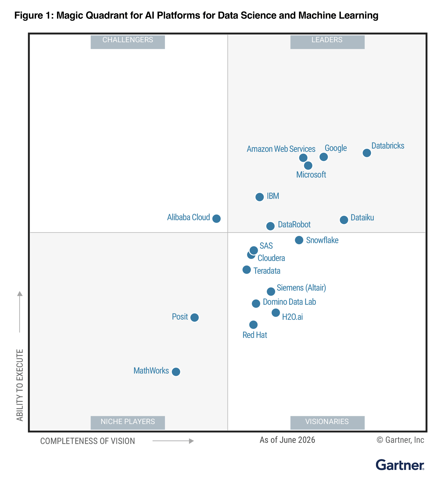

🏠 [목차](../README.md) | [다음: 워크스페이스 콘솔 & 계정 콘솔](./02-consoles.md) ➡️

# 01. Databricks 소개

> **이 실습에서 배우는 것** — Databricks가 어떤 회사인지(설립·연혁), 시장에서 어느 정도 위치인지(최근 투자·기업가치, Gartner 평가)를 큰 그림으로 이해합니다. 강사 발표자료의 앞부분 3장을 셀프 스터디용으로 요약한 **읽기 자료**입니다.

| 항목 | 내용 |
|---|---|
| 예상 소요 시간 | 약 10분 (읽기 자료) |
| 난이도 | 입문 |
| 사전 준비 | 없음 (실습 없이 읽기만 해도 됩니다) |
| 필요 권한 | 없음 |

## 학습 목표

- Databricks의 **설립 배경과 주요 연혁**을 연도별로 큰 흐름으로 설명할 수 있습니다.
- **레이크하우스(Lakehouse)** 가 무엇인지 한두 문장으로 말할 수 있습니다.
- Databricks의 **최근 투자 규모와 기업가치**를 출처와 함께 대략적으로 파악합니다.
- Databricks가 **Gartner Magic Quadrant(매직 쿼드런트)** 에서 어떤 위치인지 이해합니다.

## 개념 먼저 이해하기

### 레이크하우스(Lakehouse)란?

**레이크하우스(Lakehouse)** 는 저렴하고 유연하게 대용량 데이터를 담는 **데이터 레이크(Data Lake)** 의 장점과, 빠르고 안정적으로 분석하는 **데이터 웨어하우스(Data Warehouse)** 의 장점을 하나로 합친 데이터 관리 구조입니다. 예전에는 원본 데이터는 데이터 레이크에, 정제된 분석용 데이터는 데이터 웨어하우스에 **따로 보관**해서 시스템을 두 벌씩 운영해야 했습니다. 레이크하우스는 이 둘을 **하나의 개방형 저장소** 위에서 통합해, BI(비즈니스 인텔리전스) 리포트부터 머신러닝·AI까지 **같은 데이터로** 처리할 수 있게 합니다. Databricks는 2020년에 이 '레이크하우스'라는 개념을 처음 제시한 회사이며, 이 아이디어가 오늘날 회사 전체의 핵심입니다.

> 💡 **초심자 비유**: 데이터 레이크는 물건을 값싸게 쌓아 두는 '대형 창고', 데이터 웨어하우스는 잘 진열된 '백화점 매장'입니다. 레이크하우스는 **창고의 저렴함**과 **매장의 편리함**을 한 건물에서 동시에 누리는 방식입니다.

---

## 1️⃣ 설립 · 연혁

Databricks는 **2013년**에 설립되었습니다. 창업 멤버는 미국 **UC Berkeley의 AMPLab** 연구실에서 오픈소스 분산 처리 엔진 **Apache Spark** 를 만든 연구진 7명입니다. 대표적으로 현 CEO **Ali Ghodsi(알리 고드시)**, **Matei Zaharia(마테이 자하리아, Spark 창시자)**, **Ion Stoica**, **Reynold Xin**, **Patrick Wendell** 등이 있습니다. 즉, Databricks는 "학교 연구실에서 시작한 오픈소스 프로젝트가 회사가 된" 대표적인 사례입니다.

Databricks는 이후에도 데이터·AI 분야의 핵심 오픈소스를 잇달아 만들어 왔습니다. 아래 표로 큰 흐름을 정리했습니다.

| 연도 | 주요 이정표 | 한 줄 설명 |
|---|---|---|
| 2009년경 | **Apache Spark** 시작 (UC Berkeley AMPLab) | 대용량 데이터 분산 처리 엔진. Databricks의 뿌리 |
| **2013년** | **Databricks 설립** | Spark 창시자들이 창업 |
| 2018년 | **MLflow** 공개 | 머신러닝 실험·모델을 관리하는 오픈소스 |
| 2019년 | **Delta Lake** 공개 | 데이터 레이크에 신뢰성(트랜잭션)을 더한 오픈소스 저장 포맷 |
| 2020년 | **'레이크하우스(Lakehouse)' 개념** 제창, **Redash 인수** | 데이터 레이크+웨어하우스 통합 아이디어 · SQL 시각화/대시보드 기반 확보 |
| 2021년 | **Unity Catalog** 발표, **Databricks SQL** 도입 | 데이터·AI 통합 거버넌스와 SQL 분석 기능 |
| 2023년 | **MosaicML 인수**(약 13억 달러, $1.3B) | 생성형 AI(LLM) 역량 강화(→ Mosaic AI) |
| 2024년 | **DBRX** 공개, **Unity Catalog 오픈소스화**, **AI/BI**(Genie), **Tabular 인수**($1B+) | 본격 AI 시대 대응 · Apache Iceberg **창시자**들 합류(Delta·Iceberg 통합) |
| 2025년 | **Neon 인수**(약 10억 달러, $1B) → **Lakebase**(Neon 기반 서버리스 Postgres), **Agent Bricks**, **Databricks One** | 인수한 Neon을 기반으로 운영 DB(**Lakebase**)까지 확장 |
| 2026년 | **Panther 인수**(AI 보안 SOC → Lakewatch), Gartner **AI/DSML Platforms MQ 리더** | 데이터+AI에 **보안**까지 확장 |

*📸 캡처 안내: 2013년 설립부터 2025년까지의 주요 이정표(Spark → MLflow → Delta Lake → Lakehouse → Unity Catalog → DBRX/AI-BI → Lakebase)를 연도순으로 배열한 타임라인 그림. 발표자료 슬라이드의 연혁 장표를 캡처하거나 별도 다이어그램으로 제작합니다.*

> 💡 창업자·설립 연도·오픈소스(Apache Spark, Delta Lake, MLflow, Unity Catalog) 정보는 Databricks 공식 소개 페이지와 English Wikipedia에서 확인했습니다(아래 **공식 문서 링크** 섹션 참고).

---

## 2️⃣ 최근 투자 · 기업가치

Databricks는 아직 **상장하지 않은(비상장) 회사**이지만, 대규모 투자 유치와 높은 기업가치로 잘 알려져 있습니다. 특히 2024년 말부터 2025년 사이에 기업가치가 크게 뛰었습니다.

| 시점 | 라운드 | 조달액(약) | 기업가치(약) | 출처 |
|---|---|---|---|---|
| 2023년 9월 | 시리즈 I | 5억 달러 | 430억 달러 | Wikipedia |
| **2024년 12월** | **시리즈 J** | **100억 달러** | **620억 달러** | Wikipedia |
| **2025년 9월** | **시리즈 K** | **약 10억 달러** | **1,000억 달러+** | TechCrunch(2025-09-08) |
| 2025년 12월 | 시리즈 L | 약 40억 달러 | 약 1,340억 달러 | Wikipedia |
| 2026년 | 후속 라운드(보도) | 약 50억 달러 | 약 1,900억 달러 | Wikipedia |

핵심만 짚으면 다음과 같습니다.

- **2024년 12월 (시리즈 J)**: 약 **100억 달러**를 조달하며 기업가치 **약 620억 달러**를 기록했습니다.
- **2025년 9월 (시리즈 K)**: 약 **10억 달러** 규모의 추가 투자로 기업가치가 **1,000억 달러(약 100 Billion)** 를 넘어섰습니다. 이때 발표된 **연간 반복 매출(ARR)** 은 약 **40억 달러** 수준이며, 이 라운드는 Thrive Capital과 Insight Partners가 공동 주도했습니다. *(출처: [TechCrunch, 2025-09-08](https://techcrunch.com/2025/09/08/databricks-confirms-new-100b-valuation-on-4b-arr/) — 직접 확인함)*
- **그 이후(위키피디아 집계 기준)**: 2025년 12월 시리즈 L로 약 40억 달러를 조달해 기업가치가 **약 1,340억 달러**로 올랐고, 2026년에는 후속 라운드로 **약 1,900억 달러** 수준까지 보도되었습니다.

> ⚠️ **수치 읽는 법 / 주의**: 투자·기업가치 수치는 **발표·보도 시점 기준**이며 계속 갱신됩니다. 위 표에서 시리즈 K(1,000억 달러)는 TechCrunch 기사로 직접 확인한 값이고, 시리즈 L 이후 수치는 English Wikipedia의 정리를 인용한 것입니다. **가장 정확한 최신치는 Databricks 공식 뉴스룸**에서 확인하세요(아래 링크). 확인되지 않은 숫자는 이 교재에 싣지 않았습니다.

---

## 3️⃣ Gartner Magic Quadrant 위치

**가트너(Gartner)** 는 세계적인 IT 자문·리서치 기관입니다. **Magic Quadrant(매직 쿼드런트, MQ)** 는 특정 시장의 주요 기업(벤더)들을 **'실행 능력(Ability to Execute)'** 과 **'비전의 완성도(Completeness of Vision)'** 두 축으로 평가해, 아래 4개 사분면 중 하나에 배치한 그림입니다.

| 사분면 | 의미 |
|---|---|
| **Leaders(리더)** | 실행력·비전 모두 우수한 시장 선도 기업 (오른쪽 위) |
| Challengers(챌린저) | 실행력은 좋지만 비전이 상대적으로 약함 |
| Visionaries(비저너리) | 비전은 앞서지만 실행력이 상대적으로 약함 |
| Niche Players(니치 플레이어) | 특정 영역에 집중 |

즉 **오른쪽 위 'Leaders' 사분면**에 위치할수록 시장을 이끄는 기업으로 평가받는다는 뜻입니다.

### Databricks의 위치 (확인된 사실)

Databricks는 여러 Gartner Magic Quadrant 부문에서 **Leader(리더)** 로 선정되었습니다.

- **AI Platforms for Data Science and Machine Learning (2026년 6월)** — Leaders 사분면에서 **2년 연속** '실행 능력 최상(highest in execution) + 비전 최우(furthest in vision)'로 평가 *(출처: [Databricks 공식 블로그](https://www.databricks.com/blog/databricks-positioned-highest-execution-and-furthest-vision-second-consecutive-year-gartner) — 직접 확인함)*

**Cloud Database Management Systems** 부문에서도:

- **2025년 판** — 2025년 11월 21일 발표, **5년 연속 Leader** 선정 *(출처: [Databricks 공식 블로그](https://www.databricks.com/blog/databricks-named-leader-2025-gartner-magic-quadrant-cloud-database-management-systems) — 직접 확인함)*
- **2024년 판** — 2024년 12월 18일 발표, **4년 연속 Leader** 선정 *(출처: [Databricks 공식 블로그](https://www.databricks.com/blog/databricks-named-leader-2024-gartner-magic-quadrant-cloud-database-management-systems) — 직접 확인함)*

*출처: Gartner, "Magic Quadrant for AI Platforms for Data Science and Machine Learning" (2026년 6월) — Databricks 공식 블로그 게재본 인용(© Gartner, Inc.). Databricks는 Leaders 사분면 최상단 우측(실행 능력 최상·비전 최우)에 위치하며, Snowflake는 Visionaries 사분면에 있습니다.*

> 💡 **참고**: 위 **AI/DSML Platforms MQ**와 **Cloud DBMS MQ**는 서로 다른 평가 부문입니다. 순위·수치는 매년 갱신되므로 최신 정보는 [Databricks 뉴스룸](https://www.databricks.com/company/newsroom)에서 확인하세요.

---

## 자주 겪는 문제 / 팁 💡

- **"Databricks가 정확히 무슨 회사인가요?"** → 한마디로 **데이터와 AI를 한 곳에서 다루는 '데이터 인텔리전스 플랫폼'** 회사입니다. 뿌리는 Apache Spark(오픈소스), 핵심 아이디어는 레이크하우스입니다.
- **숫자(기업가치·투자액)는 시험 대상이 아닙니다.** 완전 초심자는 "2013년 설립 / Spark에서 출발 / 레이크하우스 / 최근 기업가치 1,000억 달러대 / Gartner MQ 리더" 정도의 **큰 그림**만 기억하면 충분합니다.
- **최신 정보가 궁금하면** 아래 공식 뉴스룸·블로그를 확인하세요. 투자·순위 정보는 자주 바뀝니다.

## 공식 문서 링크 📚

**회사·소개**
- [Databricks 공식 사이트](https://www.databricks.com)
- [Databricks 회사 소개(About)](https://www.databricks.com/company/about-us)
- [Databricks 뉴스룸(보도자료·최신 소식)](https://www.databricks.com/company/newsroom)

**핵심 개념·제품 문서 (AWS 기준)**
- [Databricks 문서 홈](https://docs.databricks.com/aws/en/)
- [레이크하우스란? (What is a data lakehouse?)](https://docs.databricks.com/aws/en/lakehouse/)
- [Unity Catalog란? (What is Unity Catalog?)](https://docs.databricks.com/aws/en/data-governance/unity-catalog/)

**대표 오픈소스 프로젝트**
- [Apache Spark](https://spark.apache.org/)
- [Delta Lake](https://delta.io/)
- [MLflow](https://mlflow.org/)

**Gartner Magic Quadrant (Cloud DBMS) 관련 발표**
- [Databricks, 2025 Gartner MQ(Cloud DBMS) Leader 선정](https://www.databricks.com/blog/databricks-named-leader-2025-gartner-magic-quadrant-cloud-database-management-systems)
- [Databricks, 2024 Gartner MQ(Cloud DBMS) Leader 선정](https://www.databricks.com/blog/databricks-named-leader-2024-gartner-magic-quadrant-cloud-database-management-systems)

**투자·기업가치 인용 출처**
- [TechCrunch: Databricks $100B 기업가치 확인 (2025-09-08)](https://techcrunch.com/2025/09/08/databricks-confirms-new-100b-valuation-on-4b-arr/)
- [Wikipedia: Databricks (연혁·투자 타임라인, 2026-09-11 확인)](https://en.wikipedia.org/wiki/Databricks)

## 다음 단계 ➡️

- [02. 워크스페이스 콘솔 & 계정 콘솔](./02-consoles.md) — 실제 Databricks 화면을 열어 메뉴를 살펴보고, UI를 한국어로 바꿔 봅니다.

---

🏠 [목차](../README.md) | [다음: 워크스페이스 콘솔 & 계정 콘솔](./02-consoles.md) ➡️
