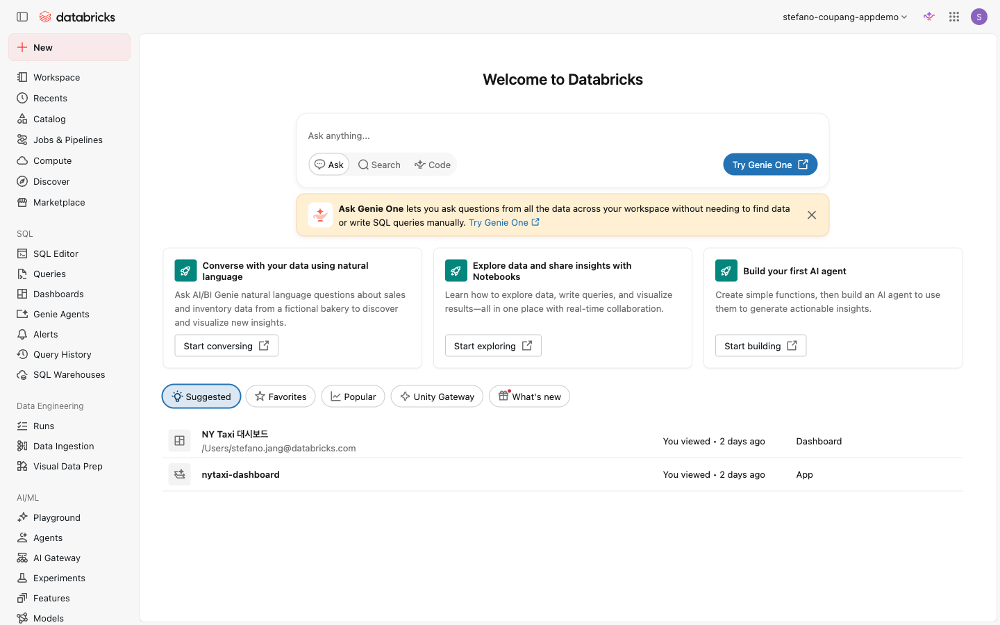
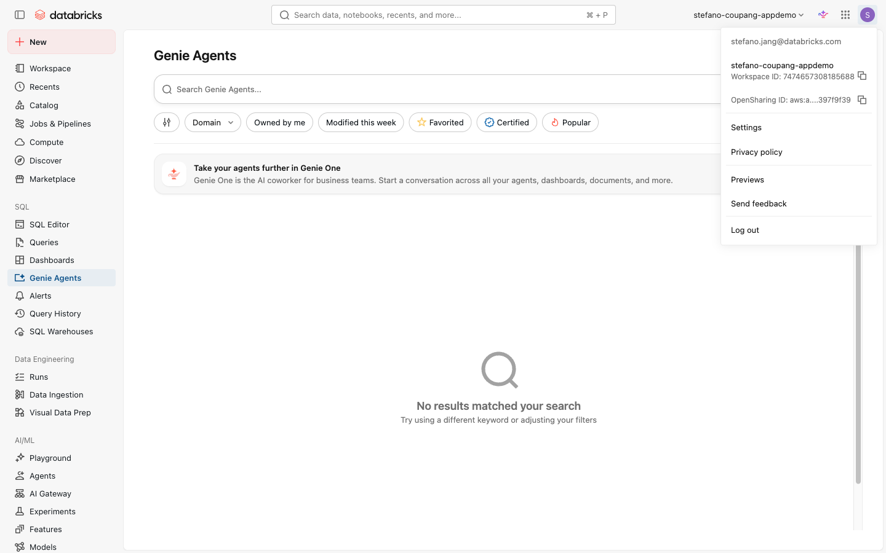
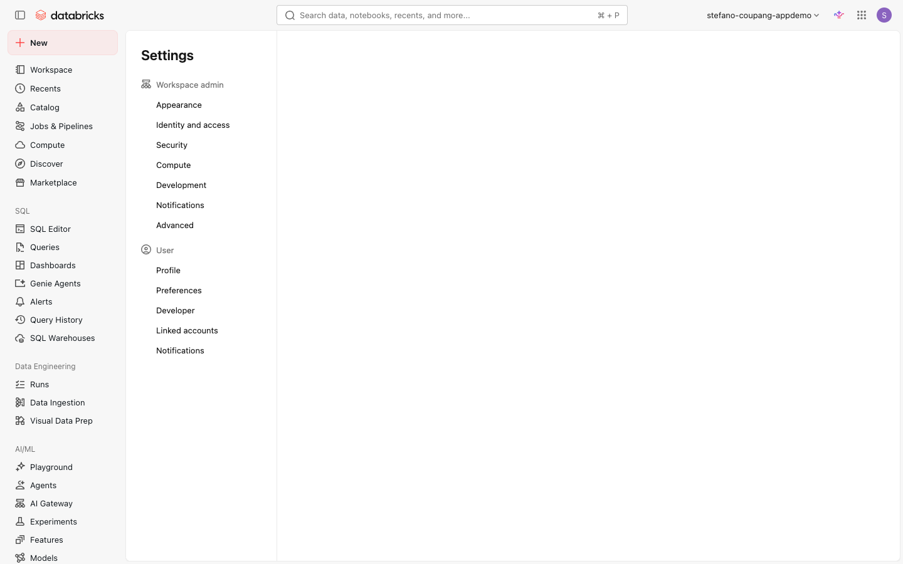
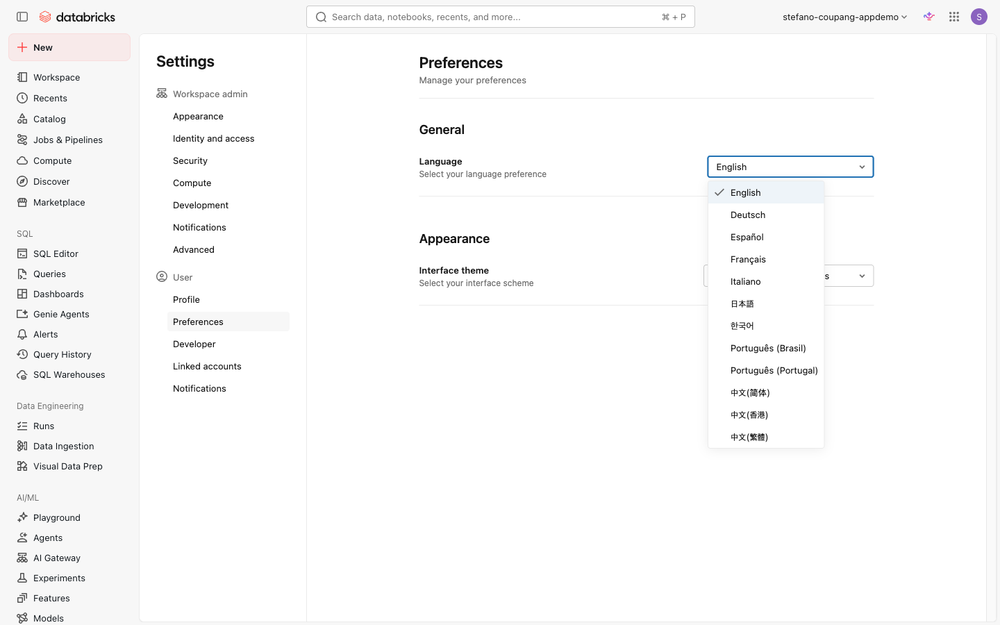
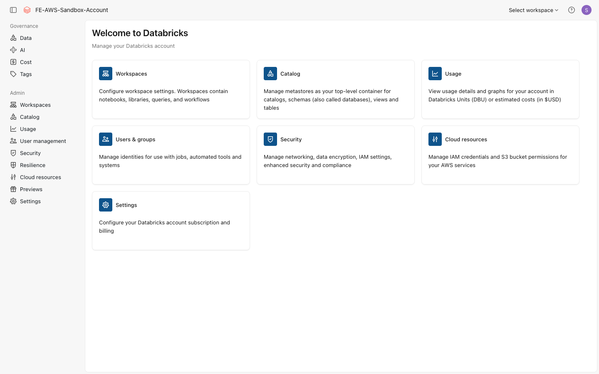

⬅️ [이전: Databricks 소개](./01-databricks-intro.md) | 🏠 [목차](../README.md) | [다음: 관리자 역할](./03-admin-roles.md) ➡️

# 02. 워크스페이스 콘솔 & 계정 콘솔

> **이 실습에서 배우는 것** — Databricks 워크스페이스 UI의 주요 메뉴를 살펴보고, 화면 언어를 한국어로 변경합니다. 그리고 계정 전체를 관리하는 계정 콘솔(Account Console)이 무엇인지 이해합니다.

| 항목 | 내용 |
|---|---|
| 예상 소요 시간 | 약 15분 |
| 난이도 | 입문 |
| 사전 준비 | 워크스페이스 로그인 완료 (`https://fe-sandbox-stefano-coupang-appdemo.cloud.databricks.com`) |
| 필요 권한 | 없음 (일반 사용자) |

## 학습 목표

- 워크스페이스 좌측 사이드바의 주요 메뉴를 이름과 기능 단위로 파악합니다.
- 우측 상단 사용자 메뉴에서 UI 언어를 한국어로 변경할 수 있습니다.
- 계정 콘솔(Account Console)의 역할과 워크스페이스 콘솔과의 차이를 설명할 수 있습니다.
- 계정 콘솔에 접속하는 방법을 이해합니다.

## 개념 먼저 이해하기

### 워크스페이스 콘솔 vs 계정 콘솔

Databricks에는 두 가지 관리 화면이 있습니다.

| 구분 | 워크스페이스 콘솔 | 계정 콘솔 |
|---|---|---|
| **URL** | `https://<workspace>.cloud.databricks.com` | `https://accounts.cloud.databricks.com` |
| **관리 대상** | 특정 워크스페이스 | 전체 Databricks 계정 |
| **주요 기능** | 노트북·SQL·작업(Job)·데이터 탐색 등 일상 업무 | 워크스페이스 생성·사용자·그룹·메타스토어 관리 |
| **사용 권한** | 일반 사용자 / 워크스페이스 관리자 | 계정 관리자(Account Admin) |

> 💡 **초심자 비유**: **워크스페이스 콘솔**은 실제 업무를 처리하는 '사무실', **계정 콘솔**은 사무실 건물 전체를 운영하는 '빌딩 관리실'입니다.

---

## 따라 하기 (Step-by-step)

### 1단계: 워크스페이스에 로그인합니다

1. 브라우저에서 다음 URL을 엽니다.
   ```
   https://fe-sandbox-stefano-coupang-appdemo.cloud.databricks.com
   ```
2. 이메일과 비밀번호(또는 SSO)를 입력하여 로그인합니다.


*📸 캡처 안내: 로그인 화면 전체. 이메일 입력란이 보이도록 캡처. 개인 이메일·비밀번호를 입력하기 전 빈 상태로 촬영하거나, 입력 후라면 마스킹 처리 후 캡처.*

---

### 2단계: 워크스페이스 좌측 사이드바 주요 메뉴 살펴보기

로그인 후 화면 왼쪽에 사이드바가 나타납니다. 초심자가 자주 사용하는 주요 메뉴는 다음과 같습니다.

| 메뉴 이름 | 기능 요약 |
|---|---|
| **새로 만들기 (New)** | 노트북·쿼리·파이프라인 등 새 리소스를 빠르게 생성합니다. |
| **작업공간 (Workspace)** | 노트북·파일·폴더를 탐색하고 관리하는 파일 브라우저입니다. |
| **최근 (Recents)** | 최근에 열었던 노트북·쿼리·대시보드를 바로 다시 엽니다. |
| **카탈로그 (Catalog)** | Unity Catalog 기반 데이터(테이블·볼륨·스키마 등)를 탐색합니다. |
| **작업 & 파이프라인 (Jobs & Pipelines)** | ETL 작업과 스트리밍 파이프라인을 만들고 실행합니다. |
| **SQL 편집기 (SQL Editor)** | SQL 쿼리를 작성·실행하고 결과를 확인합니다. |
| **대시보드 (Dashboards)** | Lakeview 대시보드를 만들고 팀과 공유합니다. |
| **컴퓨트 (Compute)** | 클러스터와 SQL 웨어하우스를 생성·관리합니다. |
| **마켓플레이스 (Marketplace)** | 공개 데이터셋·솔루션 가속기를 탐색하고 설치합니다. |

> 💡 사이드바 항목 중 자물쇠(🔒) 아이콘이 보이는 메뉴는 현재 계정에 해당 권한(entitlement)이 없음을 의미합니다.


*📸 캡처 안내: 로그인 직후 왼쪽 사이드바 전체가 보이도록 캡처. New·Workspace·Catalog·Jobs & Pipelines·SQL Editor·Dashboards·Compute·Marketplace 등 각 아이콘과 이름이 식별되어야 합니다.*

---

### 3단계: UI 언어를 한국어로 변경하기

Databricks 워크스페이스 UI는 한국어를 포함한 다국어를 지원합니다. 아래 절차대로 언어를 한국어로 바꿀 수 있습니다.

1. 화면 **오른쪽 상단**의 본인 **사용자 아이콘(이니셜 또는 프로필 사진)**을 클릭합니다.

   
   *📸 캡처 안내: 우측 상단 사용자 아이콘 클릭 후 드롭다운 메뉴가 펼쳐진 상태. "Settings" 항목이 목록에 보여야 합니다.*

2. 드롭다운 메뉴에서 **Settings(설정)**를 클릭합니다.

3. 설정(Settings) 화면이 열리면, 왼쪽 메뉴에서 **Preferences(환경 설정)** 탭을 클릭합니다.

   
   *📸 캡처 안내: Settings 화면에서 왼쪽 사이드바의 "Preferences" 탭이 선택된 상태. Language(언어) 항목이 화면에 보여야 합니다.*

4. **Language(언어)** 항목을 찾아 드롭다운을 클릭한 뒤, **한국어**를 선택합니다.

   
   *📸 캡처 안내: Language 드롭다운이 펼쳐진 상태에서 "한국어" 항목이 목록에 보이도록 캡처.*

5. 저장(Save) 또는 확인 버튼이 있다면 클릭합니다. 페이지가 새로고침되면서 UI가 한국어로 전환됩니다.

   
   *📸 캡처 안내: 언어 변경 후 워크스페이스 왼쪽 사이드바 메뉴들이 한국어("카탈로그", "컴퓨트" 등)로 표시된 화면 전체.*

> 💡 **팁**: 언어를 변경해도 노트북 내용·데이터·쿼리 결과에는 영향이 없습니다. UI 레이블만 바뀝니다.

---

### 4단계: 계정 콘솔(Account Console) 접속하기

계정 콘솔은 워크스페이스와 별개의 관리 화면입니다. **계정 관리자(Account Admin)** 권한이 있어야 설정을 변경할 수 있지만, 링크를 통해 화면 구조를 살펴보는 것은 누구나 가능합니다.

1. 새 브라우저 탭을 열고 다음 URL로 이동합니다.
   ```
   https://accounts.cloud.databricks.com
   ```
2. 로그인하면 계정 콘솔 홈 화면이 나타납니다. 왼쪽 사이드바에서 주요 메뉴를 확인합니다.

   | 메뉴 | 기능 |
   |---|---|
   | **워크스페이스 (Workspaces)** | 계정에 속한 워크스페이스 목록 조회 및 신규 생성 |
   | **사용자 관리 (User Management)** | 계정 수준 사용자·그룹·서비스 주체 관리 및 역할 부여 |
   | **카탈로그 (Catalog)** | Unity Catalog 메타스토어 생성 및 워크스페이스 연결 |
   | **클라우드 리소스 (Cloud Resources)** | AWS S3·IAM 등 클라우드 인프라 자격증명 설정 |
   | **설정 (Settings)** | 계정 이름·계정 ID·언어·이메일 알림 환경 설정 |

   
   *📸 캡처 안내: `https://accounts.cloud.databricks.com` 로그인 직후 첫 화면. 왼쪽 사이드바와 주요 메뉴가 모두 보이도록. 계정 ID 등 민감 정보는 마스킹 처리 후 캡처.*

3. 계정 콘솔에서는 노트북 실행·SQL 쿼리 등 워크스페이스 단위의 일상 업무는 수행할 수 없습니다. 어디까지나 **계정 전체 수준의 관리** 화면입니다.

---

## 자주 겪는 문제 / 팁 💡

- **언어 변경 후 일부 메뉴가 영어로 표시**: Databricks는 지속적으로 한국어 번역을 추가하고 있어, 최신 기능 일부는 아직 영어로 표시될 수 있습니다. 정상 동작입니다.
- **계정 콘솔에서 설정 변경 불가**: 계정 관리자(Account Admin) 권한이 없으면 계정 콘솔 내 설정을 수정할 수 없습니다. 화면은 볼 수 있지만 변경 작업은 담당 관리자에게 요청하세요.
- **사이드바 메뉴가 보이지 않음**: 화면이 좁을 때 사이드바가 자동으로 접힐 수 있습니다. 좌측 상단의 햄버거(≡) 아이콘을 클릭하면 다시 펼 수 있습니다.
- **워크스페이스 URL과 계정 콘솔 URL 혼동**: 워크스페이스 URL은 조직마다 다르지만, 계정 콘솔은 항상 `https://accounts.cloud.databricks.com`으로 고정입니다.

## 공식 문서 링크 📚

- [워크스페이스 UI 탐색 가이드 (Navigate the Analytics and AI workspace UI)](https://docs.databricks.com/aws/en/workspace/navigate-workspace)  
  — 사이드바 메뉴 구성 및 언어 변경 방법 포함
- [계정 관리 (Manage your Databricks account)](https://docs.databricks.com/aws/en/admin/account-settings/)  
  — 계정 콘솔 접속, 계정 ID 확인, 언어·이메일 설정

## 다음 단계 ➡️

- [다음 실습: 관리자 역할 이해하기](./03-admin-roles.md)
