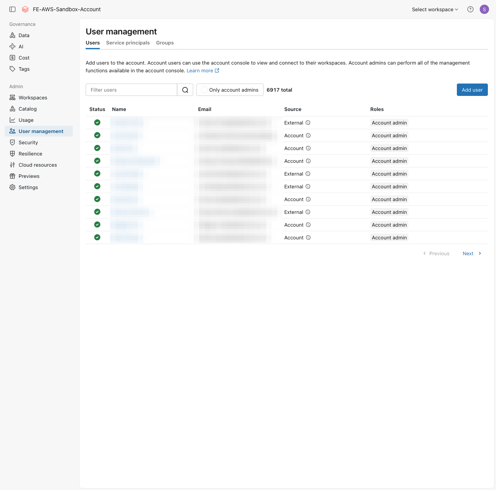
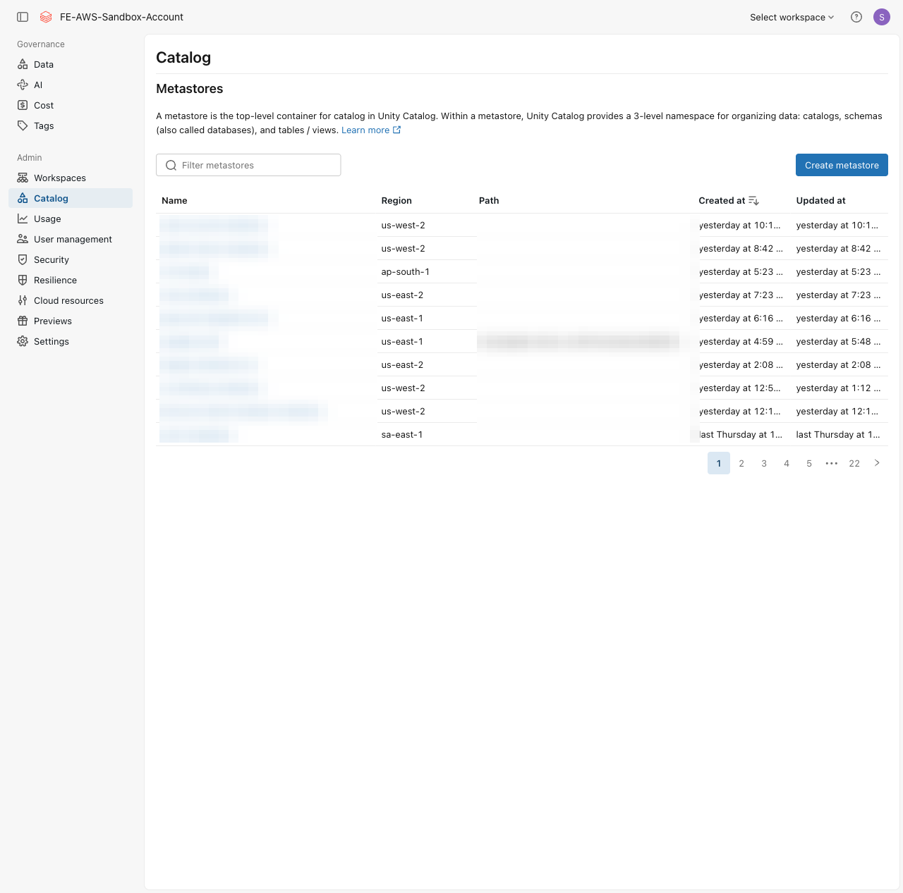

⬅️ [이전: 워크스페이스 콘솔 & 계정 콘솔](./02-consoles.md) | 🏠 [목차](../README.md) | [다음: 그룹 관리](./04-groups.md) ➡️

# 03. 관리자 역할 (Admin Roles)

> **이 실습에서 배우는 것** — Databricks의 세 가지 관리자 역할(계정 관리자·메타스토어 관리자·워크스페이스 관리자)의 권한 범위와 계층 관계를 비교하고, UI에서 역할을 확인하는 방법을 익힙니다.

| 항목 | 내용 |
|---|---|
| 예상 소요 시간 | 약 20분 |
| 난이도 | 입문 |
| 사전 준비 | 02 실습 완료 (워크스페이스 및 계정 콘솔 접속 확인) |
| 필요 권한 | 일부 단계는 계정 관리자 또는 워크스페이스 관리자 권한 보유자의 도움이 필요합니다. |

## 학습 목표

- 계정 관리자·메타스토어 관리자·워크스페이스 관리자의 역할과 권한 범위를 구분할 수 있습니다.
- 세 역할의 계층 관계를 이해합니다.
- 계정 콘솔 및 워크스페이스 UI에서 각 관리자 역할을 확인하는 방법을 알 수 있습니다.

## 개념 먼저 이해하기

### 왜 관리자 역할이 중요한가?

Databricks는 기업용 데이터 플랫폼입니다. 수십~수천 명의 사용자가 동시에 사용하는 환경에서 잘못된 설정이나 권한 남용이 발생하지 않도록, **관리자 역할을 계층적으로 분리**합니다.

```
계정 관리자 (Account Admin)
    │  전체 계정 범위 — 워크스페이스 생성, 사용자 관리, 메타스토어 생성·연결
    │
    ├─ 메타스토어 관리자 (Metastore Admin)
    │      Unity Catalog 범위 — 데이터 거버넌스, 카탈로그·외부 위치 관리
    │
    └─ 워크스페이스 관리자 (Workspace Admin)
           워크스페이스 범위 — 멤버십, 컴퓨트 정책, 보안 설정
```

> 💡 **비유**: 계정 관리자는 '본사 IT 총책임자', 메타스토어 관리자는 '데이터 거버넌스 담당자', 워크스페이스 관리자는 '특정 사무실의 로컬 IT 담당자'에 해당합니다.

---

### 세 가지 관리자 역할 비교

| 항목 | 계정 관리자<br>(Account Admin) | 메타스토어 관리자<br>(Metastore Admin) | 워크스페이스 관리자<br>(Workspace Admin) |
|---|---|---|---|
| **관리 범위** | 전체 Databricks 계정 | 특정 Unity Catalog 메타스토어 | 특정 워크스페이스 |
| **주요 권한** | 워크스페이스 생성, 계정 수준 사용자·그룹 관리, 메타스토어 생성·연결, 클라우드 자격증명 설정, 다른 관리자 역할 부여 | 카탈로그·외부 위치(External Location)·스토리지 자격증명 생성, 모든 보안 개체의 소유권 이전, 메타스토어 삭제 | 워크스페이스 멤버십 관리, 컴퓨트 정책 설정, 워크스페이스 수준 기능 활성화·비활성화, 접근 제어(ACL) 구성 |
| **관리 위치** | 계정 콘솔<br>(`accounts.cloud.databricks.com`) | 계정 콘솔 → 카탈로그(Catalog) → 메타스토어 | 워크스페이스 → Settings → Identity and access |
| **할당 대상** | 사용자, 서비스 주체 | 사용자, **그룹**, 서비스 주체 | 사용자, 서비스 주체 (**그룹 불가**) |
| **필수 여부** | 필수 (계정당 최소 1명) | 선택 (권장) | 필수 (워크스페이스마다 최소 1명) |
| **계층 위치** | 최상위 | 데이터 거버넌스 계층 | 워크스페이스 계층 |

> 💡 **참고**: 2023년 11월 8일 이후에 생성된 워크스페이스에서는 워크스페이스 관리자가 메타스토어 수준의 일부 권한(`CREATE CATALOG`, `CREATE EXTERNAL LOCATION`, `CREATE STORAGE CREDENTIAL`)을 자동으로 부여받습니다.

---

### 역할별 상세 설명

#### 계정 관리자 (Account Admin)

계정 관리자는 Databricks 계정 전체를 관리하는 최고 관리자입니다.

- 새 워크스페이스를 만들고 기본 설정을 구성합니다.
- 계정 수준에서 사용자·그룹·서비스 주체를 추가하거나 제거합니다.
- Unity Catalog 메타스토어를 생성하고 워크스페이스에 연결합니다.
- 다른 사용자에게 계정 관리자 역할을 부여하거나 회수합니다.
- AWS 스토리지 자격증명 등 클라우드 리소스를 구성합니다.

#### 메타스토어 관리자 (Metastore Admin)

메타스토어 관리자는 Unity Catalog의 데이터 거버넌스를 담당합니다. 하나의 메타스토어는 클라우드 리전당 하나씩 생성되며, 여러 워크스페이스가 같은 메타스토어를 공유할 수 있습니다.

- 카탈로그(Catalog)·외부 위치(External Location)·스토리지 자격증명을 생성합니다.
- 메타스토어 내 모든 보안 개체의 권한을 관리하거나 소유권을 이전합니다.
- 메타스토어를 삭제할 수 있습니다(신중하게 사용해야 합니다).

#### 워크스페이스 관리자 (Workspace Admin)

워크스페이스 관리자는 특정 워크스페이스 내에서 사용자·컴퓨트·보안을 관리합니다.

- 워크스페이스에 사용자를 추가하고 제거합니다.
- 클러스터·SQL 웨어하우스의 정책을 설정하여 리소스 사용을 제한합니다.
- 노트북 파일 브라우저 등 워크스페이스 수준 기능을 활성화하거나 비활성화합니다.
- 객체 수준 접근 제어(ACL)를 활성화합니다.

---

## 따라 하기 (Step-by-step)

### 1단계: 계정 콘솔에서 계정 관리자 확인하기

1. 브라우저에서 `https://accounts.cloud.databricks.com`으로 이동하여 로그인합니다.
2. 왼쪽 사이드바에서 **User Management(사용자 관리)** → **Users(사용자)**를 클릭합니다.

   
   *📸 캡처 안내: 계정 콘솔의 User Management > Users 화면. 사용자 목록과 "Account admin" 배지 또는 열이 보이도록 캡처. 이메일 주소는 마스킹 처리.*

3. 사용자 목록에서 **Account admin** 배지 또는 체크 표시가 있는 사용자를 찾습니다.

4. 특정 사용자의 이름을 클릭하면 해당 사용자에게 부여된 역할 상세 내용을 확인할 수 있습니다.

   
   *📸 캡처 안내: 특정 사용자 상세 화면에서 "Account admin" 역할이 활성화(체크 또는 토글 ON)된 상태. 이름·이메일은 마스킹 처리.*

---

### 2단계: 워크스페이스 관리자 확인하기 (워크스페이스 콘솔)

1. 워크스페이스(`https://fe-sandbox-stefano-coupang-appdemo.cloud.databricks.com`)에 로그인합니다.
2. 오른쪽 상단 **사용자 아이콘** → **Settings(설정)**를 클릭합니다.
3. 왼쪽 메뉴에서 **Identity and access** → **Users**를 클릭합니다.

   
   *📸 캡처 안내: 워크스페이스 Settings > Identity and access > Users 화면. 사용자 목록과 "Workspace admin" 열(또는 배지)이 보이도록 캡처. 이메일 마스킹.*

4. 사용자 목록에서 **Workspace admin** 열에 체크 표시 또는 배지가 있는 사용자를 확인합니다.

---

### 3단계: 메타스토어 관리자 확인하기 (계정 콘솔)

1. 계정 콘솔(`https://accounts.cloud.databricks.com`)의 왼쪽 사이드바에서 **Catalog(카탈로그)** 또는 **Data**를 클릭합니다.
2. **Metastores(메타스토어)** 항목을 클릭합니다.

   
   *📸 캡처 안내: 계정 콘솔의 메타스토어 목록 화면. 메타스토어 이름·리전·연결된 워크스페이스 수가 보이도록 캡처.*

3. 사용 중인 메타스토어 이름을 클릭합니다.

4. 메타스토어 상세 화면에서 **Admins(관리자)** 탭을 클릭하면 현재 메타스토어 관리자로 지정된 사용자 또는 그룹을 확인할 수 있습니다.

   
   *📸 캡처 안내: 메타스토어 상세 화면의 Admins 탭. 메타스토어 관리자(사용자 또는 그룹 이름)가 보이도록 캡처. 이름은 마스킹 처리.*

---

### 4단계: (참고) 워크스페이스 관리자 역할 부여 방법

> ⚠️ 이 단계는 **계정 관리자** 또는 기존 **워크스페이스 관리자** 권한이 필요합니다. 실습에서는 실제로 변경하지 않고 UI 경로만 확인합니다.

1. 워크스페이스 **Settings(설정)** → **Identity and access** → **Users**로 이동합니다.
2. 역할을 부여할 사용자의 이름을 클릭합니다.
3. **Workspace admin** 토글 또는 체크박스를 **ON**으로 변경합니다.
4. **Save(저장)**를 클릭합니다.

   
   *📸 캡처 안내: 사용자 상세 화면에서 "Workspace admin" 토글이 활성화된 상태. 이름·이메일 마스킹. 실제로 변경하지 말고 UI 상태만 캡처.*

---

## 자주 겪는 문제 / 팁 💡

- **계정 관리자가 한 명도 없으면?**: 계정 생성 시 가입한 최초 사용자가 자동으로 계정 관리자가 됩니다. 퇴사 등으로 관리자가 없어진 경우 Databricks 지원팀(support.databricks.com)에 문의해야 합니다.
- **워크스페이스 관리자를 그룹으로 지정할 수 없는 이유**: Databricks 정책상 워크스페이스 관리자 역할은 개별 사용자 또는 서비스 주체에게만 부여됩니다. 그룹에는 지정할 수 없습니다.
- **메타스토어 관리자 없이도 됩니까?**: 선택 사항이지만, Unity Catalog를 실제 운영 환경에서 사용하려면 메타스토어 관리자를 지정하는 것을 강력히 권장합니다.
- **계정 관리자가 모든 데이터에 자동으로 접근 가능한가?**: 계정 관리자는 계정 콘솔을 통해 광범위한 **구성 권한**을 갖지만, 개별 워크스페이스 내 데이터(테이블·볼륨 등)에 대한 **접근 권한**은 별도로 부여해야 합니다.
- **여러 역할 동시 보유 가능**: 한 사람이 계정 관리자이면서 동시에 메타스토어 관리자 및 워크스페이스 관리자가 될 수 있습니다.

## 공식 문서 링크 📚

- [Databricks 관리 개요 (Databricks administration overview)](https://docs.databricks.com/aws/en/admin/admin-concepts)  
  — 계정 관리자·메타스토어 관리자·워크스페이스 관리자의 계층 구조와 권한 정리
- [Unity Catalog 관리자 권한 (Admin privileges in Unity Catalog)](https://docs.databricks.com/aws/en/data-governance/unity-catalog/manage-privileges/admin-privileges)  
  — 세 관리자 역할의 Unity Catalog 내 상세 권한 설명
- [계정 관리 (Manage your Databricks account)](https://docs.databricks.com/aws/en/admin/account-settings/)  
  — 계정 콘솔에서 사용자·역할 관리 방법
- [워크스페이스 관리 (Manage your workspace)](https://docs.databricks.com/aws/en/admin/workspace-settings/)  
  — 워크스페이스 설정 및 워크스페이스 관리자 관련 항목

## 다음 단계 ➡️

- [다음 실습: 그룹 관리](./04-groups.md)
