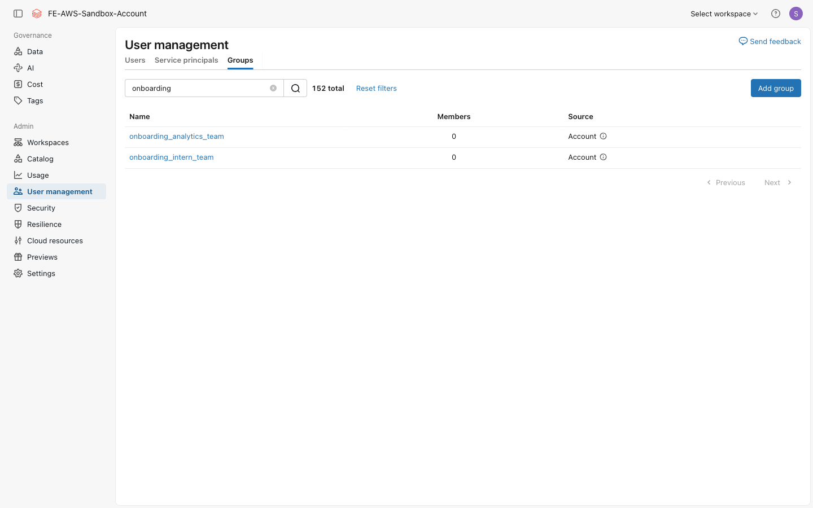
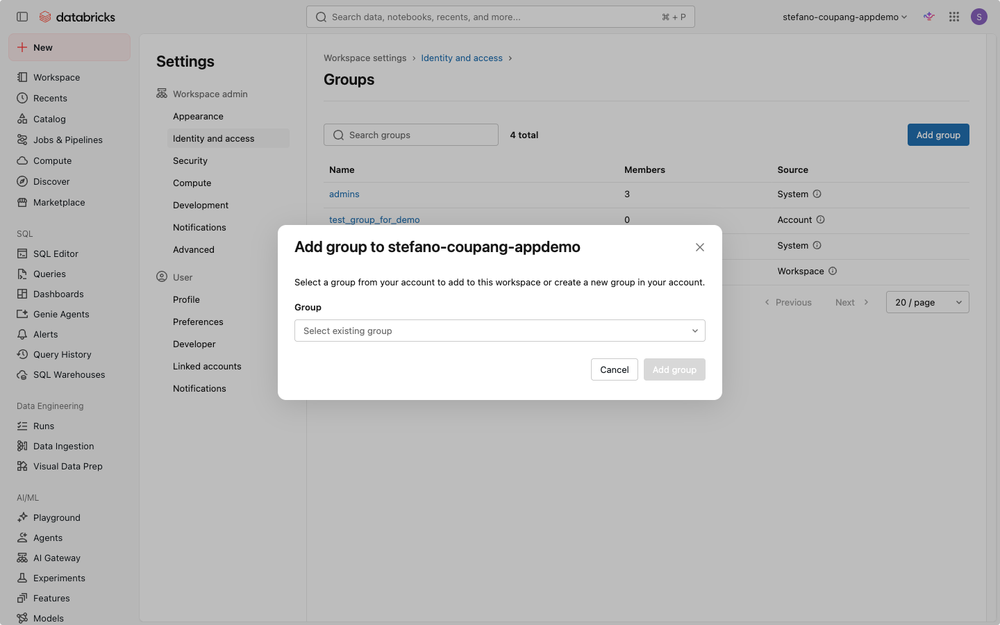

⬅️ [이전: 관리자 역할](./03-admin-roles.md) | 🏠 [목차](../README.md) | [다음: 컴퓨트 유형](./05-compute.md) ➡️

---

# 04. 그룹 관리

> **이 실습에서 배우는 것** — Databricks에서 그룹(Group)을 만들고 멤버를 추가한 뒤, 그룹 관리를 팀 리드에게 위임하고, 특정 그룹에만 권한을 부여하여 데이터 접근을 세밀하게 제어하는 방법을 익힙니다.

> **📝 용어 해석 안내**: 이 문서의 "배타적 그룹 활용" 섹션은 원문 요청의 '베타적그룹'을 *"특정 그룹에만 권한을 부여하고 나머지 그룹은 배제하는 최소 권한 원칙 적용"*으로 해석하였습니다.

| 항목 | 내용 |
|---|---|
| 예상 소요 시간 | 약 20분 |
| 난이도 | 초급 |
| 사전 준비 | 03 실습 완료, 계정 콘솔(`accounts.cloud.databricks.com`) 접근 가능 |
| 필요 권한 | **계정 관리자(Account Admin)** — 계정 레벨 그룹 생성·워크스페이스 할당에 필요 |

---

## 학습 목표

- 계정 레벨 그룹(Account Group)과 워크스페이스 로컬 그룹(Workspace-local Group)의 차이를 설명할 수 있다.
- 계정 콘솔에서 계정 레벨 그룹을 생성하고 멤버를 추가할 수 있다.
- 그룹에 **관리(Manage) 권한**을 위임하여 팀 리드가 그룹을 직접 관리하게 할 수 있다.
- 그룹을 워크스페이스에 할당할 수 있다.
- 특정 그룹에만 권한을 부여하는 **최소 권한 원칙**을 이해하고 적용할 수 있다.

---

## 개념 먼저 이해하기

### 그룹(Group)이란?

그룹은 여러 사용자·서비스 주체(Service Principal)를 하나로 묶은 컬렉션입니다.  
개별 사용자에게 권한을 일일이 부여하는 대신, **그룹에 한 번만 권한을 부여하면** 그룹의 모든 멤버가 해당 권한을 갖게 됩니다.

```
[기존 방식]
관리자 → 사용자 A에게 테이블 SELECT 부여
관리자 → 사용자 B에게 테이블 SELECT 부여
관리자 → 사용자 C에게 테이블 SELECT 부여
         사람이 늘수록 관리가 복잡해짐 ❌

[그룹 방식]
관리자 → analytics_team 그룹에 테이블 SELECT 부여  ✅
        새 팀원은 그룹에만 추가하면 됨 ✅
```

### 계정 레벨 그룹 vs 워크스페이스 로컬 그룹

| 구분 | 계정 레벨 그룹 | 워크스페이스 로컬 그룹 |
|---|---|---|
| 관리 위치 | 계정 콘솔 (`accounts.cloud.databricks.com`) | 워크스페이스 **Admin Settings** |
| 사용 범위 | 계정 전체 — 여러 워크스페이스에 할당 가능 | 생성된 워크스페이스 하나에서만 유효 |
| Unity Catalog 지원 | ✅ 지원 | ❌ 미지원 |
| Databricks 권장 여부 | ✅ **권장** | ⚠️ 레거시 — 신규 환경에서 사용 지양 |

> **📌 중요**: Databricks는 계정 레벨 그룹 사용을 권장합니다. 워크스페이스 로컬 그룹은 Unity Catalog 권한 관리를 지원하지 않는 레거시 기능이므로, 이 실습에서는 계정 레벨 그룹만 사용합니다.

### 그룹 소스(Group Source) 유형

| 소스 | 설명 |
|---|---|
| **계정 그룹 (Account Groups)** | 계정 콘솔에서 직접 생성. 이 실습의 주요 대상 |
| **외부 그룹 (External Groups)** | Microsoft Entra ID, Okta 등 외부 IdP와 SCIM으로 동기화 |
| **시스템 그룹 (System Groups)** | Databricks가 자동으로 유지 관리 (예: `account users`, `workspace admins`) |
| **워크스페이스 로컬 그룹** | 레거시 — 단일 워크스페이스 내에서만 유효 |

### 그룹 권한 유형

그룹 자체에 부여할 수 있는 권한(Permission)은 두 가지입니다.

| 권한 | 설명 |
|---|---|
| **Can manage** | 그룹 멤버 추가·제거, 그룹 권한 설정 가능. 팀 리드에게 위임할 때 사용 |
| **Can assume** | RBAC(역할 기반 접근 제어)에서 해당 그룹의 역할(Role)을 가정할 수 있음 |

---

## 따라 하기 (Step-by-step)

> 아래 실습은 **계정 콘솔**에서 진행합니다.  
> 계정 콘솔 URL: **`https://accounts.cloud.databricks.com`**

### 1단계: 계정 콘솔에서 그룹 생성

1. 브라우저에서 `https://accounts.cloud.databricks.com` 을 열고 로그인합니다.
2. 왼쪽 사이드바에서 **User Management** 아이콘(사람 모양)을 클릭합니다.
3. 화면 상단의 탭 중 **Groups** 를 클릭합니다.

   
   *그룹 목록 화면 — admins·users 등 계정에 정의된 그룹과 각 그룹의 멤버 수·소스(System/Account), 우측 상단 "Add group" 버튼.*

4. 오른쪽 상단의 **Add Group** 버튼을 클릭합니다.
5. **Group name** 입력란에 `onboarding_analytics_team` 을 입력합니다.

   
   *계정 콘솔의 "Add group" 다이얼로그 — "New group name"에 `onboarding_analytics_team`을 입력하고 "Add group"으로 생성합니다. (배경 그룹 목록의 이름은 마스킹 처리.)*

6. **Add** 버튼을 클릭하여 그룹을 생성합니다.

> ✅ 성공하면 그룹 목록에 `onboarding_analytics_team` 이 나타납니다.

---

### 2단계: 그룹에 멤버 추가

1. 그룹 목록에서 `onboarding_analytics_team` 이름을 클릭하여 상세 페이지로 이동합니다.
2. **Members** 탭을 클릭합니다.
3. **Add members** 버튼을 클릭합니다.

4. 검색창에 추가할 사용자의 이름 또는 이메일 주소를 입력하고, 목록에서 선택합니다.
5. **Add** 버튼을 클릭하면 멤버가 추가됩니다.

> 💡 **그룹 안에 그룹(중첩 그룹)도 추가할 수 있습니다.** 검색창에서 다른 그룹 이름을 검색하여 추가하면 됩니다. 단, 워크스페이스 로컬 그룹은 계정 레벨 그룹의 멤버가 될 수 없습니다.

> ⏱️ **전파 지연**: 멤버를 추가한 직후 모든 시스템에 반영되기까지 수 분이 소요될 수 있습니다.

---

### 3단계: 그룹 관리자(Manager) 위임

그룹의 **Manage** 권한을 특정 사용자에게 부여하면, 해당 사용자가 계정 관리자(Admin)가 아니더라도 그룹 멤버를 직접 추가·제거할 수 있습니다. 팀 리드에게 그룹 관리를 위임할 때 유용합니다.

1. `onboarding_analytics_team` 그룹 상세 페이지에서 **Permissions** 탭을 클릭합니다.

2. **Grant permissions** 버튼을 클릭합니다.
3. 검색창에서 그룹 관리자로 위임할 **사용자** 이름 또는 이메일을 검색하고 선택합니다.
4. 권한 드롭다운에서 **Can manage** 를 선택합니다.
5. **Add** 버튼을 클릭합니다.

> ✅ 이제 해당 사용자는 이 그룹의 Members 탭에서 직접 멤버를 관리할 수 있습니다.

---

### 4단계: 워크스페이스에 그룹 할당

계정 레벨에서 만든 그룹을 특정 워크스페이스에 연결해야, 그 워크스페이스에서 해당 그룹을 사용할 수 있습니다.

1. 계정 콘솔 왼쪽 사이드바에서 **Workspaces** 아이콘을 클릭합니다.
2. 워크스페이스 목록에서 실습에 사용할 워크스페이스(예: `coupang-appdemo`)를 클릭합니다.

3. 상단 탭에서 **Permissions** 탭을 클릭합니다.

4. **Add permissions** 버튼을 클릭합니다.
5. 검색창에 `onboarding_analytics_team` 을 입력하고, 목록에서 선택합니다.
6. 권한 드롭다운에서 **User** 를 선택합니다. (워크스페이스 일반 사용자 권한)

   | Entitlement | 의미 |
   |---|---|
   | **User** | 워크스페이스에 로그인하여 데이터와 컴퓨트를 사용 가능 |
   | **Workspace admin** | 워크스페이스 관리자 권한 (멤버에게 부여 주의) |
   | **Allow cluster creation** | 클러스터를 직접 생성할 수 있는 추가 권한 |

7. **Save** 버튼을 클릭합니다.

> ✅ 이제 `onboarding_analytics_team` 소속 사용자들이 이 워크스페이스에 로그인할 수 있습니다.

---

### 5단계: 배타적 그룹 활용 — 최소 권한 원칙 적용

**최소 권한 원칙(Principle of Least Privilege)**이란, 업무에 꼭 필요한 권한만 부여하고 나머지는 배제하는 보안 원칙입니다. Unity Catalog에서는 **명시적으로 권한을 부여받지 않은 사용자는 어떤 데이터에도 접근할 수 없습니다**. 즉, 권한을 부여하지 않는 것 자체가 배제(exclusion)입니다.

#### 시나리오 예시

아래 시나리오에서 민감한 매출 데이터는 `onboarding_analytics_team` 그룹만 볼 수 있고, 인턴 그룹(`onboarding_intern_team`)은 접근할 수 없습니다.

```
카탈로그: main
└── 스키마: onboarding_training
    └── 테이블: sales_summary  ← 민감 데이터 포함

그룹 A: onboarding_analytics_team  → SELECT 권한 부여 ✅ (접근 허용)
그룹 B: onboarding_intern_team     → 권한 미부여 ❌  (접근 차단)
```

이 권한 부여의 실제 SQL 예시는 **[06 실습](./06-tables-volumes-rbac-abac.md)** 의 RBAC 섹션에서 다룹니다.

#### 최소 권한 원칙 요약표

| 원칙 | 설명 |
|---|---|
| **그룹 단위 권한 부여** | 개별 사용자가 아닌 그룹에 권한을 부여하여 관리 단순화 |
| **필요한 권한만 부여** | SELECT만 필요하면 MODIFY는 부여하지 않음 |
| **명시적 허용만 유효** | Unity Catalog에서 명시적 허용 없이 기본 접근 불가 |
| **정기적 권한 검토** | 불필요해진 권한은 `REVOKE`로 즉시 회수 |
| **역할 계층 활용** | `admin` → `analyst` → `viewer` 등 역할 계층으로 권한 구조화 |

> 💡 **팁**: Unity Catalog에서는 `GRANT USE CATALOG`, `GRANT USE SCHEMA`, `GRANT SELECT ON TABLE` 순서로 **계층적으로** 권한을 부여해야 합니다. 상위 객체(카탈로그, 스키마)에 `USE` 권한이 없으면 하위 객체(테이블)의 `SELECT` 권한이 있어도 접근할 수 없습니다.

---

## 자주 겪는 문제 / 팁 💡

- **계정 콘솔 접근 불가**: 계정 콘솔(`accounts.cloud.databricks.com`)은 **계정 관리자(Account Admin)** 만 접근할 수 있습니다. 권한이 없으면 03 실습의 관리자 역할 안내를 참고하세요.
- **그룹이 워크스페이스에 보이지 않음**: 계정 콘솔에서 그룹을 워크스페이스에 할당(4단계)하지 않으면 워크스페이스의 권한 설정 화면에서 그룹을 검색해도 나타나지 않습니다.
- **워크스페이스 로컬 그룹 혼동**: 워크스페이스 내 **Admin Settings > Groups**에서 만든 그룹은 워크스페이스 로컬 그룹(레거시)입니다. Unity Catalog 권한 부여에 사용할 수 없으므로, 반드시 **계정 콘솔**에서 계정 레벨 그룹을 생성하세요.
- **전파 지연**: 멤버 추가 또는 워크스페이스 할당 후 실제 반영까지 수 분이 소요될 수 있습니다.
- **`admins` 그룹에 하위 그룹 불가**: Databricks 기본 `admins` 시스템 그룹에는 다른 그룹(child group)을 멤버로 추가할 수 없습니다.
- **SCIM 연동 환경**: 외부 IdP(Microsoft Entra ID, Okta 등)와 SCIM으로 그룹을 동기화하는 환경에서는 콘솔에서 직접 만든 그룹과 충돌이 생길 수 있습니다. SCIM 연동 시 그룹 관리 정책을 미리 정리하세요.

---

## 공식 문서 링크 📚

- [그룹 개요 (Groups)](https://docs.databricks.com/aws/en/admin/users-groups/groups) — 계정·외부·시스템·로컬 그룹 유형 설명
- [그룹 관리 (Manage groups)](https://docs.databricks.com/aws/en/admin/users-groups/manage-groups) — 그룹 생성·멤버 추가·워크스페이스 할당·권한 관리
- [사용자·서비스 주체·그룹 관리 개요](https://docs.databricks.com/aws/en/admin/users-groups/) — Databricks Identity 관리 전반

---

## 다음 단계 ➡️

- [05. 컴퓨트 유형](./05-compute.md) — All-Purpose Cluster, SQL Warehouse, 서버리스 클러스터의 차이와 선택 기준을 알아봅니다.
