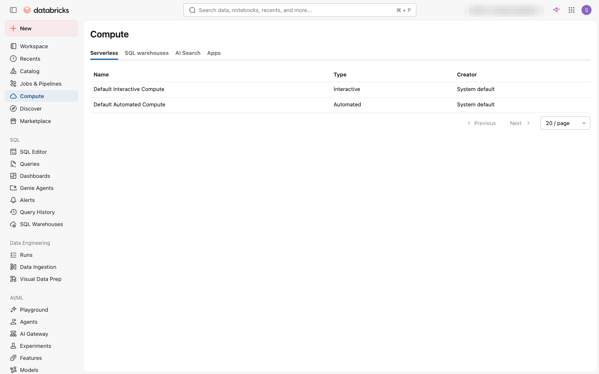
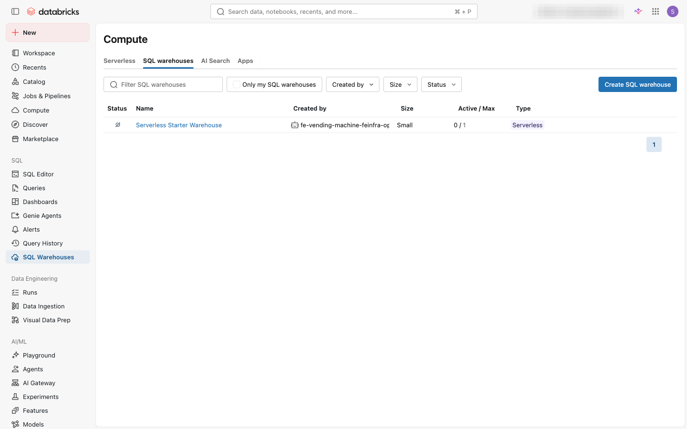
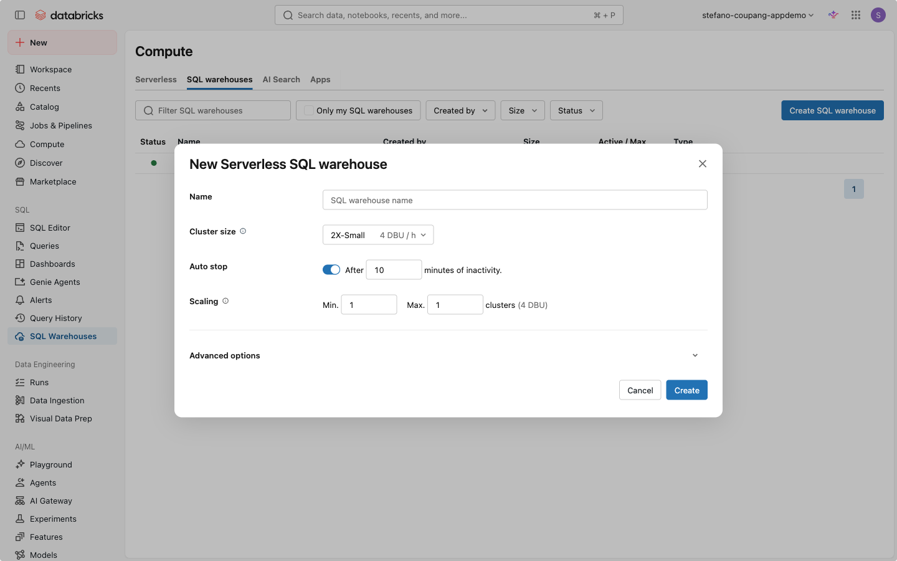

⬅️ [이전: 그룹 관리](./04-groups.md) | 🏠 [목차](../README.md) | [다음: 테이블·Volume·RBAC/ABAC](./06-tables-volumes-rbac-abac.md) ➡️

---

# 05. 컴퓨트(Compute) 유형 이해 및 실습

> **이 실습에서 배우는 것** — Databricks에서 제공하는 다양한 컴퓨트 유형을 이해하고, All-Purpose 클러스터와 SQL Warehouse(서버리스)를 직접 생성·시작·중지하는 방법을 익힙니다.

| 항목 | 내용 |
|---|---|
| 예상 소요 시간 | 약 30분 |
| 난이도 | 초급 |
| 사전 준비 | 워크스페이스 로그인, 앞 실습(04. 그룹 관리) 완료 |
| 필요 권한 | 워크스페이스 관리자 또는 클러스터 생성 권한 |

---

## 학습 목표

- Databricks 컴퓨트의 종류(All-Purpose · Jobs · SQL Warehouse · 서버리스)를 설명할 수 있다.
- 각 컴퓨트 유형의 용도·과금 방식·시작 속도 차이를 비교할 수 있다.
- UI에서 All-Purpose 클러스터를 오토스케일·자동 종료 옵션과 함께 생성할 수 있다.
- UI에서 SQL Warehouse(서버리스)를 생성하고 시작·중지할 수 있다.
- 비용을 절약하기 위한 자동 종료 등의 설정 방법을 설명할 수 있다.

---

## 개념 먼저 이해하기

### Databricks 컴퓨트란?

Databricks에서 코드를 실행하거나 SQL 쿼리를 수행하려면 반드시 **컴퓨트(Compute)** 자원이 필요합니다. 컴퓨트는 쉽게 말해 "작업을 처리할 서버(CPU·메모리)"를 말하며, 작업의 성격에 따라 최적화된 유형을 선택합니다.

> **비유**: 마치 이사할 때 소형차(짐이 적을 때), 5톤 트럭(짐이 많을 때), 렌터카(잠깐 쓸 때)를 상황에 맞게 고르는 것처럼, Databricks도 작업 목적에 따라 컴퓨트 유형을 선택합니다.

---

### 컴퓨트 유형 비교표

Databricks는 크게 네 가지 컴퓨트 계열을 제공합니다.

| 유형 | 대표 용도 | 과금 방식 | 시작 속도 | 동시 사용자 | 대표 사용 사례 |
|---|---|---|---|---|---|
| **All-Purpose Compute** (대화형 클러스터) | 탐색·개발·노트북 실행 | 실행 시간 기준 (DBU/시간) | 약 2~5분 | 여럿이 공유 가능 | 노트북 개발, EDA(탐색적 데이터 분석) |
| **Jobs Compute** (작업 클러스터) | 자동화 배치 파이프라인 | 작업 실행 시간 기준 | 약 3~5분 | 작업 전용 (1:1) | 스케줄 ETL, 야간 배치 |
| **SQL Warehouse – Classic** | SQL 분석 (기본) | 사용 시간 기준 (DBU/시간) | 약 4분 | 다수 동시 지원 | 기본 BI 연결 |
| **SQL Warehouse – Pro** | SQL 분석 (고급 최적화) | 사용 시간 기준 | 약 4분 | 다수 동시 지원 | Predictive IO 활용 BI |
| **SQL Warehouse – Serverless** | SQL 분석 (최고 성능) | 사용 초 단위 기준 | **2~6초** | 다수 동시 지원 | 대시보드, AI/BI, 즉각 쿼리 |
| **서버리스 컴퓨트** (노트북·잡·파이프라인) | 관리형 서버리스 실행 환경 | 사용 시간 기준 (초 단위) | **수 초** | 작업별 분리 | 서버리스 노트북, 서버리스 워크플로 |

> **참고**: SQL Warehouse 유형별 상세 차이는 [SQL warehouse types 공식 문서](https://docs.databricks.com/aws/en/compute/sql-warehouse/warehouse-types) 에서 확인하세요.

---

### 유형별 상세 설명

#### All-Purpose Compute (대화형 클러스터)
노트북에서 Python·SQL·Scala·R을 대화형으로 실행할 때 사용합니다. 팀원 여럿이 하나의 클러스터를 공유할 수 있으며, **오토스케일(Autoscale)** 기능으로 워커 수를 자동 조절합니다. 개발 중에는 자주 사용하지만, 비용이 높으므로 **자동 종료(Auto Termination)** 설정이 필수입니다.

#### Jobs Compute (작업 클러스터)
Lakeflow Job(워크플로)을 실행할 때 자동으로 생성되고, 작업이 끝나면 자동으로 삭제됩니다. 별도로 생성하거나 관리할 필요 없이 Job 설정 시 지정합니다. All-Purpose보다 저렴한 DBU 요율이 적용됩니다.

#### SQL Warehouse (DBSQL)
SQL 쿼리와 BI 도구(Tableau, Power BI 등) 연결에 최적화된 컴퓨트입니다. 세 가지 유형이 있습니다.

- **Classic**: 기본형. Photon 엔진만 지원. 시작까지 약 4분.
- **Pro**: Classic + Predictive IO 지원. 더 빠른 집계 쿼리.
- **Serverless**: 가장 빠른 시작(2~6초). Photon + Predictive IO + Intelligent Workload Management 모두 지원. **Databricks에서 권장하는 유형.**

#### 서버리스 컴퓨트 (Serverless Compute)
노트북, 워크플로(Jobs), Lakeflow 파이프라인에서 사용할 수 있는 **Databricks 관리형 컴퓨트**입니다. 사용자가 클러스터를 직접 생성·관리할 필요 없이 자동으로 프로비저닝됩니다. 빠른 시작과 자동 스케일링이 특징입니다.

---

### ⚠️ 'Lakehouse RT' 명칭에 대한 안내

> **가정 명시**: 원본 교육 요구사항에는 "all purpose vs dbsql vs lakehouse rt"라고 표기되어 있습니다. 그러나 현재(2025년 기준) Databricks 공식 제품 라인업에는 'Lakehouse RT'라는 명칭의 제품이 존재하지 않습니다. 이 문서에서는 **'서버리스/실시간(Real-Time) 계열'**, 즉 SQL Warehouse Serverless 및 서버리스 컴퓨트(노트북·잡·파이프라인용)를 포괄하는 개념으로 해석하여 작성하였습니다.
>
> 'Lakebase'(Postgres 기반 OLTP 데이터베이스)는 컴퓨트 유형이 아닌 **별도 제품**이므로 이 문서의 범위에 포함하지 않습니다.
>
> 내용에 이견이 있으면 강사에게 문의하세요.

---

### 어떤 컴퓨트를 써야 할까?

```
📝 작업 유형 결정 흐름

SQL 쿼리 / BI 대시보드를 실행하고 싶다면
    └─▶ SQL Warehouse (서버리스 권장)

Python / Spark 코드를 노트북에서 대화형으로 실행하고 싶다면
    └─▶ All-Purpose Compute
         (단, 서버리스 노트북 기능이 활성화된 경우 서버리스 컴퓨트 우선 권장)

자동화 Job (스케줄 배치)을 실행하고 싶다면
    └─▶ Jobs Compute (Job 설정 시 자동 관리)
         (서버리스 워크플로 지원 시 서버리스 컴퓨트 권장)
```

---

## 따라 하기 (Step-by-step)

이번 실습에서는 다음 두 가지를 생성합니다.

1. **All-Purpose 클러스터** — 최소 사양 + 오토스케일 + 자동 종료
2. **SQL Warehouse (서버리스)** — 기본 설정으로 생성

---

### 1단계: 컴퓨트 메뉴로 이동하기

1. 워크스페이스([https://fe-sandbox-stefano-coupang-appdemo.cloud.databricks.com](https://fe-sandbox-stefano-coupang-appdemo.cloud.databricks.com))에 로그인합니다.
2. 왼쪽 사이드바에서 **컴퓨트(Compute)** 아이콘을 클릭합니다.

<!-- 스크린샷 예정: ../assets/screenshots/05-compute/01-sidebar-compute.png (컴퓨트 메뉴 이동) -->
*📸 캡처 안내: 왼쪽 사이드바에서 컴퓨트(Compute) 아이콘이 강조된 상태와 오른쪽에 열리는 컴퓨트 목록 화면 전체를 캡처합니다.*

3. 컴퓨트 목록 페이지가 열립니다. 상단에 **All-Purpose Compute**, **Job Compute**, **SQL Warehouses** 탭이 보입니다.


*컴퓨트 페이지 상단 탭(Serverless · SQL warehouses · AI Search · Apps)과 기본 서버리스 컴퓨트(Default Interactive/Automated Compute) 목록. (워크스페이스 구성에 따라 탭 이름·구성은 달라질 수 있습니다.)*

---

### 2단계: All-Purpose 클러스터 생성하기

1. **All-Purpose Compute** 탭이 선택된 상태에서 오른쪽 상단의 **클러스터 만들기(Create compute)** 버튼을 클릭합니다.

<!-- 스크린샷 예정: ../assets/screenshots/05-compute/03-create-compute-button.png (클러스터 만들기 버튼) -->
*📸 캡처 안내: 컴퓨트 목록 페이지 우상단의 "Create compute" 버튼이 보이도록 캡처합니다.*

2. 클러스터 생성 폼이 열립니다. 아래 설정값을 입력합니다.

   | 설정 항목 | 권장 값 | 설명 |
   |---|---|---|
   | **클러스터 이름(Cluster name)** | `onboarding-cluster` | 팀에서 구분하기 쉬운 이름 |
   | **Cluster mode** | `Single user` 또는 `No isolation shared` | 실습용은 No isolation shared 가능 |
   | **Databricks Runtime** | `최신 LTS 버전` (예: `15.4 LTS`) | ML 작업 불필요 시 일반 Runtime 선택 |
   | **Enable autoscaling** | ✅ 체크 | 워커 수 자동 조절 |
   | **Minimum workers** | `1` | 최소 워커 수 |
   | **Maximum workers** | `2` | 실습용 최소 사양 (비용 절감) |
   | **Auto termination** | ✅ 체크, **30분** 입력 | 30분 유휴 시 자동 종료 |
   | **Worker type** | `m5.xlarge` (기본값) | AWS 기준 기본 인스턴스 |
   | **Driver type** | 워커와 동일(기본값) | |

<!-- 스크린샷 예정: ../assets/screenshots/05-compute/04-cluster-create-form.png (클러스터 생성 폼 - 기본 설정) -->
*📸 캡처 안내: 클러스터 생성 폼 전체가 보이도록 스크롤하여 캡처합니다. 클러스터 이름, Autoscaling 체크, Min/Max workers, Auto termination 값이 모두 보여야 합니다.*

3. **오토스케일(Autoscaling)** 설정을 확인합니다. `Enable autoscaling` 체크박스가 체크되면 **Min workers**와 **Max workers** 입력창이 나타납니다.

<!-- 스크린샷 예정: ../assets/screenshots/05-compute/05-autoscaling-settings.png (오토스케일 설정) -->
*📸 캡처 안내: Autoscaling 체크박스가 체크된 상태와 Min workers(1), Max workers(2) 입력창을 확대 캡처합니다.*

4. **Auto termination** 설정을 확인합니다. `Terminate after` 옵션에 **30** 분을 입력합니다.

   > 💡 **비용 절약 핵심**: 자동 종료를 설정하지 않으면 클러스터가 계속 실행되어 비용이 청구됩니다. **실습 환경에서는 반드시 30분 이내로 설정하세요.**

<!-- 스크린샷 예정: ../assets/screenshots/05-compute/06-auto-termination.png (자동 종료 설정) -->
*📸 캡처 안내: Auto termination 섹션에서 "30분" 이 입력된 상태를 확대 캡처합니다.*

5. 설정을 모두 확인한 후 오른쪽 상단 또는 하단의 **클러스터 만들기(Create compute)** 버튼을 클릭합니다.

6. 클러스터 생성이 시작되면 목록에서 클러스터 이름 옆에 **Pending → Starting → Running** 순서로 상태가 변합니다. 보통 **2~5분** 정도 소요됩니다.

<!-- 스크린샷 예정: ../assets/screenshots/05-compute/07-cluster-starting.png (클러스터 시작 중 상태) -->
*📸 캡처 안내: 클러스터 목록에서 방금 생성한 클러스터가 "Starting" 또는 "Pending" 상태로 표시된 화면을 캡처합니다.*

<!-- 스크린샷 예정: ../assets/screenshots/05-compute/08-cluster-running.png (클러스터 실행 중 상태) -->
*📸 캡처 안내: 클러스터 상태가 녹색 "Running"으로 바뀐 화면을 캡처합니다.*

---

### 3단계: All-Purpose 클러스터 시작·중지하기

클러스터를 수동으로 중지하거나 다시 시작하는 방법을 알아봅니다.

#### 클러스터 중지(Terminate)

1. 컴퓨트 목록에서 중지할 클러스터 이름을 클릭합니다.
2. 클러스터 상세 화면 오른쪽 상단의 **종료(Terminate)** 버튼을 클릭합니다.
3. 확인 팝업에서 **확인** 을 클릭합니다.
4. 클러스터 상태가 **Terminating → Terminated** 로 변합니다.

<!-- 스크린샷 예정: ../assets/screenshots/05-compute/09-terminate-cluster.png (클러스터 종료 버튼) -->
*📸 캡처 안내: 클러스터 상세 페이지 우상단의 "Terminate" 버튼이 보이도록 캡처합니다.*

#### 클러스터 재시작(Restart / Start)

1. 컴퓨트 목록에서 **Terminated** 상태인 클러스터 이름 오른쪽의 ▶ 아이콘 또는 **시작(Start)** 버튼을 클릭합니다.
2. 클러스터가 다시 **Starting → Running** 상태로 전환됩니다.

> **참고**: 클러스터가 **Terminated** 상태일 때는 비용이 청구되지 않습니다. 사용하지 않을 때는 반드시 종료해 두세요.

<!-- 스크린샷 예정: ../assets/screenshots/05-compute/10-start-cluster.png (클러스터 시작 버튼) -->
*📸 캡처 안내: 컴퓨트 목록에서 Terminated 상태 클러스터 행의 시작(Start) 버튼 또는 삼각형 재생 아이콘을 확대 캡처합니다.*

---

### 4단계: SQL Warehouse (서버리스) 생성하기

1. 컴퓨트 페이지 상단 탭에서 **SQL Warehouses** 탭을 클릭합니다.


*컴퓨트 > "SQL warehouses" 탭 — "Serverless Starter Warehouse"(Small · Serverless) 목록과 우측 "Create SQL warehouse" 버튼.*

2. 오른쪽 상단의 **SQL Warehouse 만들기(Create SQL warehouse)** 버튼을 클릭합니다.

<!-- 스크린샷 예정: ../assets/screenshots/05-compute/12-create-warehouse-button.png (SQL Warehouse 만들기 버튼) -->
*📸 캡처 안내: SQL Warehouses 목록 페이지 우상단의 "Create SQL warehouse" 버튼을 캡처합니다.*

3. SQL Warehouse 생성 폼에서 아래 설정값을 입력합니다.

   | 설정 항목 | 권장 값 | 설명 |
   |---|---|---|
   | **이름(Name)** | `onboarding-warehouse` | 식별하기 쉬운 이름 |
   | **Cluster size** | `2X-Small` | 실습용 최소 사양 |
   | **Auto stop** | ✅ 체크, **10분** 입력 | 유휴 10분 후 자동 중지 |
   | **Scaling** | Min: `1`, Max: `1` | 실습용 단일 클러스터 |
   | **Type** | `Serverless` | 계정에서 활성화된 경우 기본값 |

   > **참고**: `Type` 항목에서 `Serverless`가 기본으로 선택되어 있으면 그대로 둡니다. 서버리스가 비활성화된 경우 `Pro`를 선택하세요.


*"New Serverless SQL warehouse" 생성 폼 — Name·Cluster size(2X-Small)·Auto stop(10분)·Scaling(Min/Max)·Advanced options와 Create/Cancel 버튼.*

4. **만들기(Create)** 버튼을 클릭합니다.

5. SQL Warehouse가 생성되면 자동으로 시작됩니다. 목록에서 상태가 **Starting → Running** 으로 바뀝니다. 서버리스의 경우 **2~6초** 내에 Running 상태가 됩니다.

<!-- 스크린샷 예정: ../assets/screenshots/05-compute/14-warehouse-running.png (SQL Warehouse 실행 중) -->
*📸 캡처 안내: SQL Warehouses 목록에서 방금 생성한 Warehouse가 녹색 "Running" 상태로 표시된 화면을 캡처합니다.*

---

### 5단계: SQL Warehouse 시작·중지하기

#### SQL Warehouse 중지

1. SQL Warehouses 목록에서 중지할 Warehouse 행의 오른쪽 **⋮(더보기)** 메뉴를 클릭합니다.
2. **중지(Stop)** 를 선택합니다.
3. Warehouse 상태가 **Stopping → Stopped** 로 바뀝니다.

   또는 Warehouse 이름을 클릭하여 상세 페이지로 이동한 뒤 **중지(Stop)** 버튼을 클릭해도 됩니다.

<!-- 스크린샷 예정: ../assets/screenshots/05-compute/15-warehouse-stop.png (SQL Warehouse 중지) -->
*📸 캡처 안내: SQL Warehouse 목록에서 더보기(⋮) 메뉴를 클릭했을 때 Stop 옵션이 보이는 화면을 캡처합니다.*

#### SQL Warehouse 시작

1. SQL Warehouses 목록에서 **Stopped** 상태인 Warehouse 행의 **시작(Start)** 버튼 또는 **▶** 아이콘을 클릭합니다.
2. 서버리스 Warehouse는 몇 초 내에 다시 **Running** 상태가 됩니다.

<!-- 스크린샷 예정: ../assets/screenshots/05-compute/16-warehouse-start.png (SQL Warehouse 시작) -->
*📸 캡처 안내: Stopped 상태인 SQL Warehouse의 Start 버튼이 보이는 목록 화면을 캡처합니다.*

---

## 자주 겪는 문제 / 팁 💡

- **클러스터 생성 권한이 없는 경우**: 워크스페이스 관리자에게 클러스터 생성 정책(Cluster Policy) 할당을 요청하세요. 정책이 없으면 Create compute 버튼이 비활성화될 수 있습니다.

- **SQL Warehouse에서 Serverless 옵션이 없는 경우**: 계정 콘솔([https://accounts.cloud.databricks.com](https://accounts.cloud.databricks.com))에서 서버리스 기능이 활성화되어 있는지 확인하세요. 활성화가 필요하면 계정 관리자에게 문의합니다.

- **클러스터가 10분 이상 Starting 상태인 경우**: 인스턴스 타입 가용성 문제일 수 있습니다. 클러스터를 종료 후 Worker type을 다른 인스턴스(예: `m5.xlarge` → `m4.xlarge`)로 변경하여 재시도합니다.

- **자동 종료 설정을 빠뜨렸을 때**: 클러스터 상세 페이지 → **편집(Edit)** 버튼 → Auto termination 값 수정 → **확인(Confirm)** 후 저장합니다. 클러스터를 재시작해야 적용됩니다.

- **All-Purpose vs Jobs Compute 비용 차이**: Jobs Compute는 동일 인스턴스 기준 DBU 단가가 All-Purpose보다 낮습니다. 반복 실행하는 배치 작업은 Jobs Compute를 사용하면 비용을 절약할 수 있습니다.

- **SQL Warehouse Auto Stop**: SQL Warehouse도 유휴 상태가 지속되면 자동 중지됩니다. 기본값은 10분이며, 쿼리가 없는 동안에는 과금이 중단됩니다.

---

## 비용 절약 체크리스트 ✅

| 설정 | 권장값 | 효과 |
|---|---|---|
| All-Purpose 클러스터 Auto termination | 30분 이내 | 유휴 시 자동 종료로 낭비 방지 |
| SQL Warehouse Auto stop | 10분 이내 | 사용하지 않을 때 자동 중지 |
| Max workers | 실습은 2 이하 | 불필요한 워커 프로비저닝 방지 |
| SQL Warehouse Cluster size | 2X-Small | 실습·소규모 쿼리에 충분 |
| Jobs Compute 사용 | 배치 작업 전환 | All-Purpose 대비 DBU 단가 절감 |
| 서버리스 컴퓨트 우선 사용 | 가능 시 권장 | 초 단위 과금, 대기 비용 없음 |

---

## 공식 문서 링크 📚

아래 링크는 모두 WebFetch로 실제 접근을 확인한 공식 문서입니다.

- [컴퓨트 개요 (Compute overview)](https://docs.databricks.com/aws/en/compute/index.html) — Databricks 컴퓨트 유형 전체 설명
- [컴퓨트 구성 참조 (Compute configuration reference)](https://docs.databricks.com/aws/en/compute/configure.html) — All-Purpose 클러스터 생성 및 모든 설정 옵션
- [클래식 컴퓨트 관리 (Manage classic compute)](https://docs.databricks.com/aws/en/compute/clusters-manage.html) — 클러스터 시작·중지·편집·권한 관리
- [SQL Warehouse 만들기 (Create a SQL warehouse)](https://docs.databricks.com/aws/en/compute/sql-warehouse/create) — SQL Warehouse 생성 단계별 가이드
- [SQL Warehouse 유형 (SQL warehouse types)](https://docs.databricks.com/aws/en/compute/sql-warehouse/warehouse-types) — Classic·Pro·Serverless 비교 (시작 속도, 지원 기능 등)
- [서버리스 컴퓨트 연결 (Connect to serverless compute)](https://docs.databricks.com/aws/en/compute/serverless.html) — 노트북·잡·파이프라인용 서버리스 컴퓨트 안내
- SQL Warehouse 유형별 상세 비교: 공식 문서에서 **"SQL warehouse types"** 로 검색

---

## 다음 단계 ➡️

컴퓨트 생성이 완료되었습니다. 이제 생성된 클러스터와 SQL Warehouse를 활용하여 데이터를 다루어 볼 차례입니다.

- [다음 실습: 테이블·Volume·RBAC/ABAC](./06-tables-volumes-rbac-abac.md) ➡️
- [이전 실습: 그룹 관리](./04-groups.md) ⬅️
