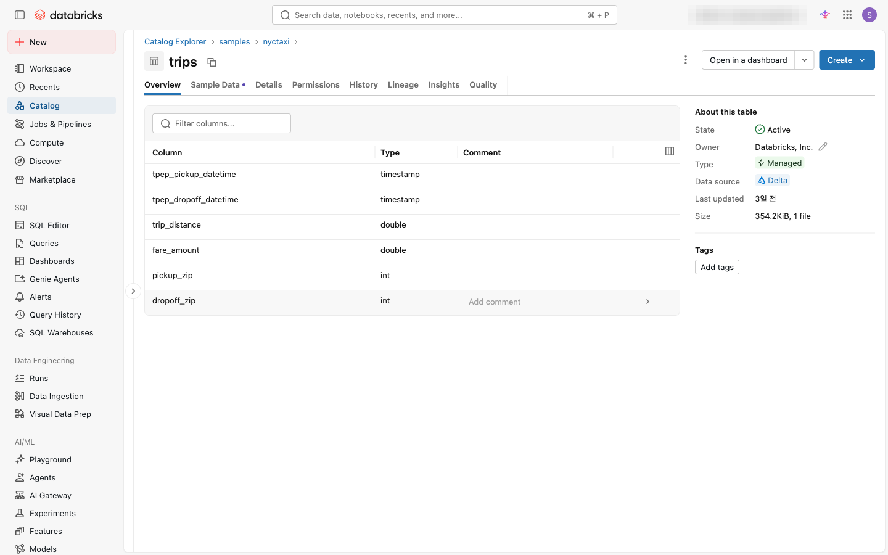
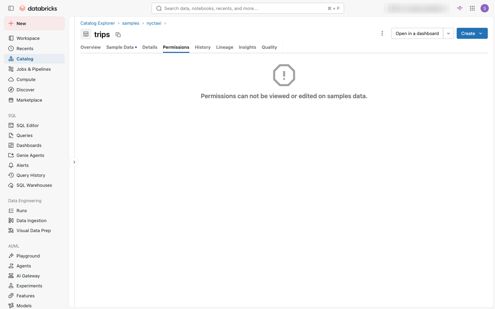
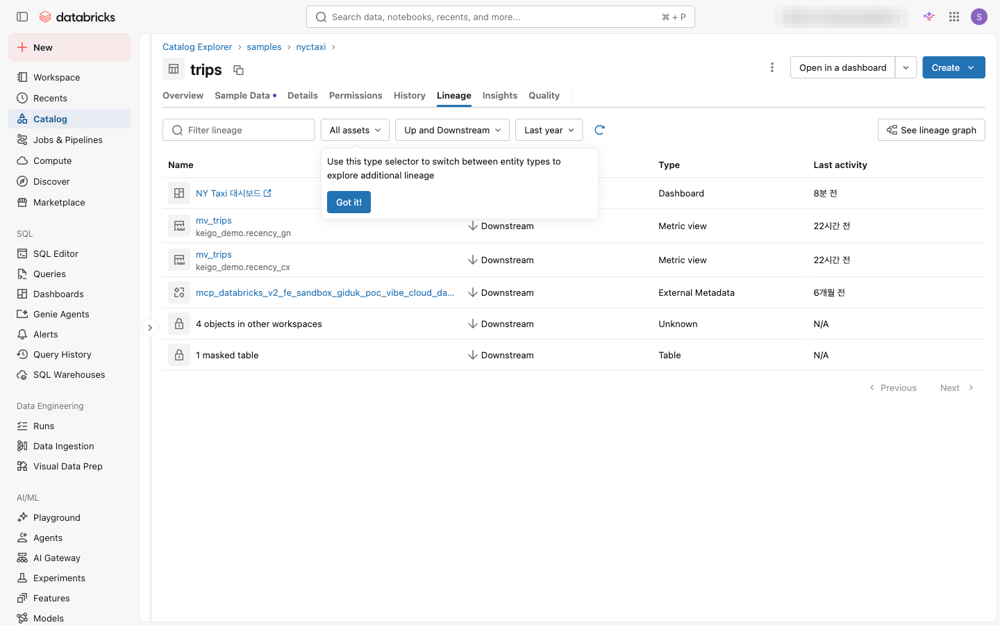

⬅️ [이전: 컴퓨트 유형](./05-compute.md) | 🏠 [목차](../README.md) | [다음: 노트북 & S3 파일 읽기](./07-notebooks.md) ➡️

---

# 06. 테이블 · Volume · RBAC/ABAC

> **이 실습에서 배우는 것** — Unity Catalog의 3단계 네임스페이스를 이해하고, 관리형 테이블과 Volume을 직접 만들어 봅니다. 그런 다음 그룹에 권한을 부여(RBAC)하고, 행 필터·열 마스킹을 통한 세밀한 접근 제어(ABAC)까지 경험합니다.

| 항목 | 내용 |
|---|---|
| 예상 소요 시간 | 약 35분 |
| 난이도 | 초급 ~ 중급 |
| 사전 준비 | 04 실습 완료(그룹 `onboarding_analytics_team` 생성됨), SQL 웨어하우스 사용 가능 |
| 필요 권한 | 카탈로그에 `CREATE SCHEMA` 권한, Unity Catalog 활성화된 워크스페이스 |

---

## 학습 목표

- Unity Catalog의 3단계 네임스페이스(카탈로그 · 스키마 · 테이블/볼륨)를 설명할 수 있다.
- SQL을 사용하여 관리형 테이블(Managed Table)을 생성하고 데이터를 삽입할 수 있다.
- UI와 SQL로 관리형 볼륨(Managed Volume)을 생성하고 파일을 업로드할 수 있다.
- UI Permissions 탭과 SQL `GRANT/REVOKE`로 그룹에 권한을 부여·회수할 수 있다.
- 행 필터(Row Filter)와 열 마스킹(Column Mask)으로 테이블 레벨의 세밀한 접근 제어를 구현할 수 있다.

---

## 개념 먼저 이해하기

### Unity Catalog 3단계 네임스페이스

Unity Catalog는 데이터 객체를 아래와 같은 3단계 계층으로 관리합니다.

```
카탈로그(Catalog)
└── 스키마(Schema, 데이터베이스라고도 부름)
    ├── 테이블(Table)
    ├── 뷰(View)
    ├── 볼륨(Volume)
    └── 함수(Function)
```

객체 전체 이름은 항상 `<카탈로그>.<스키마>.<객체>` 형식으로 표현합니다.  
예: `main.onboarding_training.sales_summary`

| 계층 | 역할 | 예시 |
|---|---|---|
| **카탈로그(Catalog)** | 최상위 네임스페이스. 부서·프로젝트 단위로 구성 | `main`, `samples` |
| **스키마(Schema)** | 관련 객체를 묶는 컨테이너. 데이터베이스와 동일 개념 | `onboarding_training`, `nyctaxi` |
| **테이블/볼륨** | 실제 데이터를 담는 객체 | `sales_summary`, `uploads` |

### 테이블 유형

| 유형 | 설명 | 권장 용도 |
|---|---|---|
| **관리형 테이블 (Managed Table)** | Databricks가 데이터 파일과 메타데이터를 모두 관리. 테이블 삭제 시 데이터도 삭제됨 | 기본값. 대부분의 경우 권장 |
| **외부 테이블 (External Table)** | 외부 저장소(S3, ADLS 등)의 기존 데이터를 등록. 테이블 삭제 시 실제 데이터는 유지됨 | 기존 데이터를 그대로 활용할 때 |

> **💡 이 실습에서는 관리형 테이블을 사용합니다.** 관리형 테이블은 Unity Catalog의 기본값이자 권장 방식입니다.

### 볼륨(Volume)이란?

볼륨(Volume)은 **비정형 파일**(CSV, JSON, 이미지, PDF 등)을 Unity Catalog에서 관리하는 저장소 단위입니다.  
`/Volumes/<카탈로그>/<스키마>/<볼륨>/<경로>` 형식의 경로로 접근합니다.

| 유형 | 설명 |
|---|---|
| **관리형 볼륨 (Managed Volume)** | Unity Catalog의 관리 스토리지에 생성. 가장 간단한 방법 |
| **외부 볼륨 (External Volume)** | 기존 클라우드 저장소 경로(S3 버킷 등)를 등록 |

### RBAC vs ABAC

| 구분 | RBAC (역할 기반 접근 제어) | ABAC (속성 기반 접근 제어) |
|---|---|---|
| 기준 | 사용자/그룹의 **역할(Role)** | 데이터나 사용자의 **속성(Attribute)/태그(Tag)** |
| 예시 | `analysts` 그룹에 테이블 SELECT 권한 부여 | '서울' 지역 데이터는 서울 팀만 볼 수 있도록 행 필터 적용 |
| 유연성 | 역할 단위의 굵직한 제어 | 행(Row)·열(Column) 단위의 세밀한 제어 |
| Databricks 구현 | `GRANT/REVOKE` SQL + UI Permissions 탭 | 행 필터 함수 + 열 마스킹 함수 (SQL UDF) |

> **📌 ABAC 기능 상태 (2025년 기준)**
> - **행 필터(Row Filter)**: ✅ GA (정식 출시)
> - **열 마스킹(Column Mask)**: ✅ GA (정식 출시)
> - **카탈로그/스키마 레벨 ABAC 정책**: ✅ GA (정식 출시)
> - **DENY 정책**: ⚠️ Beta (공개 프리뷰)

---

## 따라 하기 (Step-by-step)

> **실습 환경**: 아래 SQL은 워크스페이스의 **SQL 편집기(SQL Editor)** 또는 **노트북**에서 실행합니다.  
> 왼쪽 사이드바에서 **SQL Editor** 아이콘을 클릭하여 접근할 수 있습니다.

> **⚠️ 카탈로그 이름 먼저 확인·교체**: 아래 SQL 예시는 Unity Catalog 기본 카탈로그인 `main` 을 사용합니다. **본인이 `CREATE SCHEMA` 권한을 가진 카탈로그명으로 바꿔서 실행하세요.** 왼쪽 사이드바의 **카탈로그(Catalog)** 아이콘에서 접근 가능한 카탈로그를 확인할 수 있고, `main`이 없거나 권한이 없으면 워크스페이스/메타스토어 관리자에게 카탈로그 생성 또는 권한을 요청하세요.

---

### 1단계: 실습 카탈로그·스키마 준비

먼저 실습에 사용할 스키마(데이터베이스)를 만듭니다.

```sql
-- 스키마가 없으면 새로 생성 (이미 있으면 무시)
CREATE SCHEMA IF NOT EXISTS main.onboarding_training
COMMENT '온보딩 실습용 스키마';
```

스키마가 만들어졌는지 확인합니다.

```sql
SHOW SCHEMAS IN main;
```

> 💡 **카탈로그 탐색기(Catalog Explorer)에서도 확인할 수 있습니다.** 왼쪽 사이드바에서 카탈로그 아이콘을 클릭 → `main` 확장 → `onboarding_training` 스키마 확인.

---

### 2단계: 관리형 테이블 만들기

#### 방법 A — 직접 테이블 생성 후 데이터 삽입

```sql
-- 관리형 테이블 생성
CREATE TABLE IF NOT EXISTS main.onboarding_training.sales_summary (
  order_id    BIGINT        COMMENT '주문 ID',
  customer    STRING        COMMENT '고객명',
  region      STRING        COMMENT '지역',
  amount      DECIMAL(10,2) COMMENT '주문 금액(원)',
  order_date  DATE          COMMENT '주문 날짜'
)
COMMENT '온보딩 실습용 매출 요약 테이블';
```

```sql
-- 샘플 데이터 삽입 (복사 후 그대로 실행)
INSERT INTO main.onboarding_training.sales_summary VALUES
  (1001, '김민준', '서울',  58000.00, '2024-01-15'),
  (1002, '이서윤', '부산',  32000.50, '2024-01-16'),
  (1003, '박지호', '대구',  75000.00, '2024-01-17'),
  (1004, '최수아', '인천',  15000.00, '2024-01-18'),
  (1005, '정우진', '서울', 120000.00, '2024-01-19');
```

```sql
-- 데이터 확인
SELECT * FROM main.onboarding_training.sales_summary;
```

> 💡 **Catalog Explorer에서도 테이블 상세를 확인할 수 있습니다.** 왼쪽 사이드바에서 카탈로그 아이콘 클릭 → 카탈로그 → 스키마 → 테이블 이름을 클릭하면 컬럼 목록, 데이터 타입, 통계, 히스토리 등을 한눈에 볼 수 있습니다.


*Catalog Explorer에서 테이블의 컬럼/개요 확인*

#### 방법 B — samples 카탈로그에서 CTAS(Create Table As Select)

기존 샘플 데이터를 활용하여 테이블을 만들 수도 있습니다.

```sql
-- samples.nyctaxi.trips 에서 처음 1,000행을 가져와 새 테이블 생성
CREATE TABLE IF NOT EXISTS main.onboarding_training.nyc_taxi_sample
AS
SELECT
  tpep_pickup_datetime,
  tpep_dropoff_datetime,
  passenger_count,
  trip_distance,
  total_amount
FROM samples.nyctaxi.trips
LIMIT 1000;
```

```sql
-- 생성 확인
SELECT COUNT(*) AS row_count
FROM main.onboarding_training.nyc_taxi_sample;
```

---

### 3단계: 관리형 Volume 만들기

#### 방법 A — SQL로 생성

```sql
-- 관리형 볼륨 생성
CREATE VOLUME IF NOT EXISTS main.onboarding_training.uploads
COMMENT '온보딩 실습용 파일 업로드 볼륨';
```

```sql
-- 볼륨 생성 확인
SHOW VOLUMES IN main.onboarding_training;
```

#### 방법 B — UI (카탈로그 탐색기)로 생성

1. 왼쪽 사이드바에서 **카탈로그(Catalog)** 아이콘을 클릭합니다.
2. `main` → `onboarding_training` 스키마를 클릭하여 확장합니다.
3. 오른쪽 상단의 **Create** 버튼(또는 스키마 이름 옆의 `⋯` 메뉴)을 클릭하고 **Create Volume** 을 선택합니다.

4. **Volume name**: `uploads_ui` 를 입력합니다.
5. **Volume type**: **Managed** 를 선택합니다.
6. **Create** 버튼을 클릭합니다.

---

### 4단계: Volume에 파일 업로드 (UI)

1. 카탈로그 탐색기에서 `main` → `onboarding_training` → **`uploads`** 볼륨을 클릭합니다.
2. 볼륨 상세 페이지 오른쪽에서 **Upload to this volume** 버튼을 클릭합니다.

3. 업로드할 파일을 드래그하거나 **Browse** 버튼으로 선택합니다. (예: 간단한 `.csv` 또는 `.txt` 파일)
4. **Upload** 버튼을 클릭합니다.

업로드된 파일은 아래 경로로 접근할 수 있습니다.

```python
# 노트북에서 볼륨 파일 경로 확인
display(dbutils.fs.ls("/Volumes/main/onboarding_training/uploads/"))
```

---

### 5단계: RBAC — UI Permissions 탭으로 그룹에 권한 부여

Unity Catalog Permissions UI를 사용하면 SQL 없이도 그룹에 권한을 부여할 수 있습니다.

#### 테이블에 권한 부여

1. 카탈로그 탐색기에서 `main` → `onboarding_training` → **`sales_summary`** 테이블을 클릭합니다.
2. 상단 탭에서 **Permissions** 탭을 클릭합니다.

   
   *테이블 상세 페이지 상단 탭에서 "Permissions" 탭을 선택한 화면. (예시는 읽기 전용 `samples` 데이터라 "권한을 볼 수 없다"는 안내가 뜨며, 본인이 만든 `sales_summary` 테이블에서는 권한 목록과 "Grant" 버튼이 나타납니다.)*

3. **Grant** 버튼을 클릭합니다.
4. **Principals** 검색창에 `onboarding_analytics_team` 을 입력하고 선택합니다.
5. 부여할 권한(Privilege)으로 **SELECT** 에 체크합니다.
6. **Grant** 버튼을 클릭합니다.

> 💡 **테이블을 사용하려면 상위 객체 권한도 필요합니다.** USE CATALOG와 USE SCHEMA 권한을 부여하지 않으면 테이블에 접근할 수 없습니다. 아래 SQL 방법(6단계)에서 전체 권한 체인을 함께 부여합니다.

---

### 6단계: RBAC — SQL GRANT/REVOKE

SQL을 사용하면 권한 부여를 더 정확하게 제어하고 자동화할 수 있습니다.

#### Unity Catalog 권한 체인 (3단계 순서)

Unity Catalog에서 테이블에 접근하려면 아래 3단계 권한을 **모두** 부여해야 합니다.

```
① GRANT USE CATALOG ON CATALOG  → 카탈로그 사용 허용
② GRANT USE SCHEMA  ON SCHEMA   → 스키마 사용 허용
③ GRANT SELECT      ON TABLE    → 테이블 데이터 읽기 허용
```

#### 권한 부여 (GRANT)

```sql
-- ① 카탈로그 사용 권한
GRANT USE CATALOG ON CATALOG main
TO `onboarding_analytics_team`;

-- ② 스키마 사용 권한
GRANT USE SCHEMA ON SCHEMA main.onboarding_training
TO `onboarding_analytics_team`;

-- ③ 테이블 SELECT 권한
GRANT SELECT ON TABLE main.onboarding_training.sales_summary
TO `onboarding_analytics_team`;

-- (선택) 볼륨 읽기 권한
GRANT READ VOLUME ON VOLUME main.onboarding_training.uploads
TO `onboarding_analytics_team`;
```

#### 권한 확인 (SHOW GRANTS)

```sql
-- 테이블에 부여된 권한 전체 확인
SHOW GRANTS ON TABLE main.onboarding_training.sales_summary;
```

#### 권한 회수 (REVOKE)

```sql
-- 테이블 SELECT 권한 회수
REVOKE SELECT ON TABLE main.onboarding_training.sales_summary
FROM `onboarding_analytics_team`;
```

#### 주요 Unity Catalog 권한 목록

| 권한(Privilege) | 대상 | 의미 |
|---|---|---|
| `USE CATALOG` | 카탈로그 | 카탈로그 내 객체 사용 가능 |
| `USE SCHEMA` | 스키마 | 스키마 내 객체 사용 가능 |
| `SELECT` | 테이블/뷰 | 데이터 읽기 |
| `MODIFY` | 테이블 | INSERT/UPDATE/DELETE |
| `CREATE TABLE` | 스키마 | 새 테이블 생성 |
| `READ VOLUME` | 볼륨 | 볼륨 파일 읽기 |
| `WRITE VOLUME` | 볼륨 | 볼륨 파일 쓰기 |
| `ALL PRIVILEGES` | 모든 객체 | 전체 권한 (MANAGE 제외) |

---

### 7단계: ABAC — 행 필터(Row Filter)와 열 마스킹(Column Mask)

ABAC(속성 기반 접근 제어, Attribute-Based Access Control)는 사용자나 데이터의 **속성**을 기준으로 접근을 제어합니다. 행 필터와 열 마스킹은 SQL UDF(사용자 정의 함수)를 이용해 구현합니다.

> **📌 기능 상태**: 행 필터와 열 마스킹은 모두 **GA(정식 출시)** 상태입니다.

#### ABAC 개념 요약

```
행 필터(Row Filter):   어떤 행(Row)을 볼 수 있는지 제어
열 마스킹(Column Mask): 어떤 열(Column)의 값을 어떻게 보여줄지 제어

예시:
  - "서울 지역 데이터는 서울 팀만 볼 수 있다" → 행 필터
  - "금액은 관리자만 실제 값을 보고, 나머지는 *** 로 표시" → 열 마스킹
```

#### 7-1. 행 필터(Row Filter) 만들기

관리자(`account admins` 그룹) 이면 모든 행을 보고, 그 외에는 '서울' 지역 데이터만 보이는 필터를 만들어 봅니다.

**① 행 필터 SQL 함수 생성**

```sql
CREATE OR REPLACE FUNCTION main.onboarding_training.filter_by_region(region STRING)
  RETURN is_account_group_member('account admins') 
      OR region = '서울';
```

| 함수 요소 | 설명 |
|---|---|
| `is_account_group_member('account admins')` | 현재 사용자가 `account admins` 그룹 멤버이면 `TRUE` |
| `OR region = '서울'` | 그렇지 않으면 해당 행의 region 값이 '서울'일 때만 `TRUE` |
| 결과가 `FALSE`인 행 | 쿼리 결과에서 자동 제외됨 |

**② 테이블에 행 필터 적용**

```sql
ALTER TABLE main.onboarding_training.sales_summary
  SET ROW FILTER main.onboarding_training.filter_by_region ON (region);
```

**③ 동작 확인** (관리자가 아닌 일반 사용자 계정으로 실행)

```sql
-- 비관리자 계정으로 실행 시 서울 지역 데이터(2건)만 반환됨
SELECT * FROM main.onboarding_training.sales_summary;
```

**④ 행 필터 제거**

```sql
ALTER TABLE main.onboarding_training.sales_summary
  DROP ROW FILTER;
```

---

#### 7-2. 열 마스킹(Column Mask) 만들기

관리자(`account admins`)만 실제 금액을 보고, 그 외 사용자에게는 `-1.00` 으로 마스킹합니다.

**① 열 마스킹 SQL 함수 생성**

```sql
CREATE OR REPLACE FUNCTION main.onboarding_training.mask_amount(amount DECIMAL(10,2))
  RETURN CASE
    WHEN is_account_group_member('account admins') THEN amount
    ELSE CAST(-1.00 AS DECIMAL(10,2))
  END;
```

**② 테이블의 `amount` 열에 마스킹 적용**

```sql
ALTER TABLE main.onboarding_training.sales_summary
  ALTER COLUMN amount SET MASK main.onboarding_training.mask_amount;
```

**③ 동작 확인** (비관리자 계정)

```sql
-- 비관리자 계정으로 실행 시 amount 열이 -1.00 으로 표시됨
SELECT order_id, customer, region, amount FROM main.onboarding_training.sales_summary;
```

**④ 열 마스킹 제거**

```sql
ALTER TABLE main.onboarding_training.sales_summary
  ALTER COLUMN amount DROP MASK;
```

---

#### 7-3. 카탈로그·스키마 레벨 ABAC 정책 (개념 소개)

행 필터·열 마스킹을 **테이블 하나씩** 적용하는 것 외에, Unity Catalog의 ABAC 정책 기능을 사용하면 **카탈로그 또는 스키마 전체**에 단일 정책을 적용할 수 있습니다.

| 정책 유형 | 적용 범위 | 상태 |
|---|---|---|
| 행 필터 정책 (Row Filter Policy) | 카탈로그 또는 스키마 전체의 테이블 | ✅ GA |
| 열 마스킹 정책 (Column Mask Policy) | 카탈로그 또는 스키마 전체의 테이블 | ✅ GA |
| GRANT 정책 (Grant Policy) | 태그 기반 동적 권한 부여 | ✅ GA |
| DENY 정책 (Deny Policy) | 명시적 접근 거부 | ⚠️ Beta |

ABAC 정책은 "governed tags"(거버넌스 태그)를 조건으로 사용합니다. 예를 들어, `PII` 태그가 붙은 열은 특정 그룹만 볼 수 있도록 스키마 레벨에서 한 번에 정책을 적용할 수 있습니다.

> 💡 **카탈로그/스키마 레벨 ABAC 정책의 상세 구현은 고급 과정에서 다룹니다.** 자세한 내용은 아래 공식 문서를 참고하세요.

---

## 데이터 계보(Lineage) 보기

**데이터 계보(Data Lineage)**란 어떤 테이블·파일이 이 테이블을 만들었고(Upstream), 이 테이블의 데이터가 어떤 노트북·잡(Job)·대시보드에서 읽혀지는지(Downstream)를 자동으로 추적하는 기능입니다. "이 숫자가 어디서 왔지?", "이 테이블을 누가 사용하고 있지?"를 빠르게 파악할 수 있어 데이터 품질 관리와 장애 원인 파악에 매우 유용합니다.

Unity Catalog는 쿼리·잡·노트북의 실행 기록을 분석하여 계보 정보를 자동으로 수집합니다. 별도 설정 없이 Catalog Explorer에서 바로 확인할 수 있습니다.

### Lineage 탭 확인하기

1. 왼쪽 사이드바에서 **카탈로그(Catalog)** 아이콘을 클릭합니다.
2. 계보를 확인할 테이블(예: `main` → `onboarding_training` → `sales_summary`)을 클릭합니다.
3. 테이블 상세 페이지 상단의 탭에서 **Lineage** 탭을 클릭합니다.
4. 이 테이블에 데이터를 쓴 노트북·잡·쿼리(Upstream)와 이 테이블을 읽는 대시보드·뷰·노트북(Downstream)을 시각적으로 확인할 수 있습니다.


*Catalog Explorer > 테이블 상세 > Lineage 탭: 이 테이블의 데이터 계보 시각화*

> 💡 **Lineage가 아직 보이지 않을 때**: 쿼리 실행 기록이 없으면 계보가 표시되지 않습니다. 2단계에서 만든 `sales_summary` 테이블에 대해 SELECT 쿼리를 몇 번 실행한 뒤 다시 확인해 보세요. Unity Catalog는 약간의 지연(수 분) 후 계보를 반영합니다.

---

## 자주 겪는 문제 / 팁 💡

- **권한 체인 오류**: `SHOW GRANTS`로 권한을 확인해도 접근이 안 된다면, 상위 객체(`USE CATALOG`, `USE SCHEMA`)의 권한도 확인하세요. Unity Catalog에서는 3단계 모두 허용되어야 데이터에 접근할 수 있습니다.
- **볼륨 경로 오타**: 볼륨 경로는 `/Volumes/<카탈로그>/<스키마>/<볼륨>/` 형식입니다. `/volumes/` (소문자)도 동일하게 인식됩니다.
- **관리형 테이블 삭제 시 데이터도 삭제**: 관리형 테이블을 `DROP TABLE`하면 실제 데이터 파일도 삭제됩니다. 단, 삭제 후 7일 내 복구가 가능합니다 (Unity Catalog 기본 설정).
- **행 필터/열 마스킹이 View에는 적용되지 않음**: 행 필터와 열 마스킹은 일부 파생 객체(예: materialized view의 특정 설정)에서 동작이 제한될 수 있습니다. 공식 문서의 제한 사항 섹션을 확인하세요.
- **`is_account_group_member` 함수**: 계정 레벨 그룹에만 사용 가능합니다. 워크스페이스 로컬 그룹에는 사용할 수 없습니다. 04 실습에서 계정 레벨 그룹을 생성한 이유입니다.
- **Databricks Runtime 버전**: 볼륨 기능은 Databricks Runtime 13.3 LTS 이상에서 지원합니다. 컴퓨트 클러스터의 런타임 버전을 확인하세요.

---

## 공식 문서 링크 📚

- [Unity Catalog란? (What is Unity Catalog?)](https://docs.databricks.com/aws/en/data-governance/unity-catalog/) — 3단계 네임스페이스, 거버넌스 개요
- [관리형 테이블 (Unity Catalog managed tables)](https://docs.databricks.com/aws/en/tables/managed) — 관리형 테이블 생성·삭제·관리
- [볼륨 개요 (What are Unity Catalog volumes?)](https://docs.databricks.com/aws/en/volumes/) — 볼륨 개념, 관리형 vs 외부 볼륨
- [볼륨 생성 및 관리 (Create and manage Unity Catalog volumes)](https://docs.databricks.com/aws/en/volumes/utility-commands) — CREATE VOLUME SQL 구문, UI 생성 단계
- [GRANT 구문 (GRANT)](https://docs.databricks.com/aws/en/sql/language-manual/security-grant) — SQL GRANT 전체 구문 참조
- [Unity Catalog 권한 참조 (Unity Catalog privileges reference)](https://docs.databricks.com/aws/en/data-governance/unity-catalog/manage-privileges/privileges) — 전체 권한 유형 목록
- [행 필터 및 열 마스킹 (Row filters and column masks)](https://docs.databricks.com/aws/en/data-governance/unity-catalog/row-and-column-filters) — GA. 행 필터·열 마스킹 구현 가이드
- [Unity Catalog ABAC (Attribute-based access control)](https://docs.databricks.com/aws/en/data-governance/unity-catalog/abac) — GA (DENY 정책은 Beta). 카탈로그/스키마 레벨 ABAC 정책
- [Unity Catalog 데이터 계보 (Lineage in Unity Catalog)](https://docs.databricks.com/aws/en/data-governance/unity-catalog/data-lineage.html) — 테이블·컬럼 계보 추적, Catalog Explorer에서의 확인 방법 (확인됨)

---

## 다음 단계 ➡️

- [07. 노트북 & S3 파일 읽기](./07-notebooks.md) — 노트북을 생성하고, 볼륨이나 S3에서 파일을 읽는 방법을 알아봅니다.
