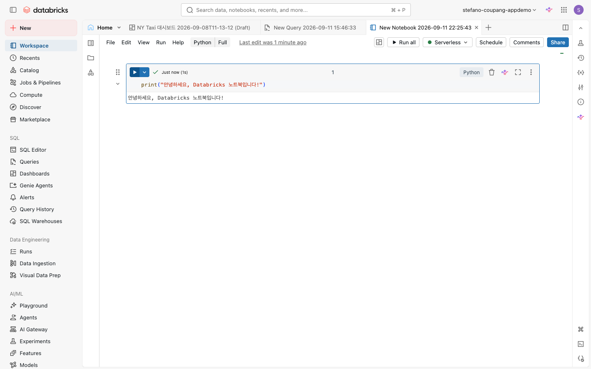

⬅️ [이전: 테이블·Volume·RBAC/ABAC](./06-tables-volumes-rbac-abac.md) | 🏠 [목차](../README.md) | [다음: Lakeflow Connect로 S3 가져오기](./08-lakeflow-connect-s3.md) ➡️

---

# 07. 노트북 & S3 파일 읽기

> **이 실습에서 배우는 것** — Databricks 노트북을 생성하고 컴퓨트에 연결한 뒤, 매직 커맨드와 `display()` 함수를 사용해 샘플 데이터를 읽고 탐색합니다. 또한 외부 S3 파일에 접근하는 세 가지 방법(DBFS 샘플 데이터, 공개 S3, Unity Catalog External Location)을 이해합니다.

| 항목 | 내용 |
|---|---|
| 예상 소요 시간 | 약 30분 |
| 난이도 | 초급 |
| 사전 준비 | Databricks 워크스페이스 로그인, [05. 컴퓨트 유형](./05-compute.md) 실습 완료 권장 |
| 필요 권한 | 없음(워크스페이스 접속 권한만 있으면 됩니다) |

---

## 학습 목표

- 새 노트북을 만들고 클러스터 또는 서버리스 컴퓨트에 연결할 수 있다.
- 셀을 실행하고, `%sql`, `%python`, `%md` 매직 커맨드를 활용할 수 있다.
- `display()` 함수로 DataFrame을 표·차트로 출력할 수 있다.
- `/databricks-datasets/` 내장 데이터를 Spark로 읽어 탐색할 수 있다.
- 고객 자체 S3 버킷 접근을 위한 **Unity Catalog External Location** 개념을 설명할 수 있다.

---

## 개념 먼저 이해하기

### 노트북(Notebook)이란?

노트북은 코드·텍스트·시각화 결과를 한 화면에서 작성하고 실행할 수 있는 인터랙티브 문서입니다. Databricks 노트북은 Python, SQL, Scala, R을 **한 파일 안에서** 섞어 쓸 수 있다는 점이 특징입니다.

```
┌──────────────────────────────────────────────────┐
│  노트북 (Notebook)                                │
│  ┌──────────────────────────────┐                 │
│  │  셀 1: %md  → 마크다운 텍스트 │                 │
│  ├──────────────────────────────┤                 │
│  │  셀 2: Python → 데이터 읽기   │                 │
│  ├──────────────────────────────┤                 │
│  │  셀 3: %sql → SQL 쿼리       │                 │
│  └──────────────────────────────┘                 │
│              ⬇  컴퓨트(Cluster/Serverless)에서 실행 │
└──────────────────────────────────────────────────┘
```

### 셀 언어와 매직 커맨드

노트북에는 기본 언어(생성 시 선택)가 있고, 셀 첫 줄에 **매직 커맨드**를 적으면 해당 셀만 다른 언어로 실행됩니다.

| 매직 커맨드 | 설명 |
|---|---|
| `%python` | 해당 셀을 Python으로 실행 |
| `%sql` | 해당 셀을 SQL로 실행. 결과는 `_sqldf` 변수에도 저장됨 |
| `%md` | 해당 셀을 마크다운 텍스트로 렌더링 |
| `%r` | R로 실행 |
| `%scala` | Scala로 실행 |
| `%fs` | DBFS(Databricks File System) 파일 탐색 |

### S3 파일 접근 방법 비교

| 방법 | 언제 사용? | 권한 필요 |
|---|---|---|
| `/databricks-datasets/`(DBFS) | 워크스페이스 내장 샘플 데이터 탐색 | 없음 |
| 공개 S3 경로(`s3://...`) | 인증 없이 접근 가능한 공개 버킷 | AWS 버킷 정책에 따라 다름 |
| Unity Catalog External Location | 회사 소유의 S3 버킷(인증 필요) | 메타스토어 관리자의 사전 구성 필요 |

---

## 따라 하기 (Step-by-step)

### 1단계: 노트북 만들기

1. 왼쪽 사이드바에서 **+ New** 버튼을 클릭합니다.

   <!-- 스크린샷 예정: ../assets/screenshots/07-notebooks/01-new-button.png (+ New 버튼 위치) -->
   *📸 캡처 안내: 왼쪽 사이드바 상단의 "+ New" 버튼과 드롭다운 메뉴가 보이도록 캡처합니다.*

2. 드롭다운 메뉴에서 **Notebook**을 선택합니다.

   <!-- 스크린샷 예정: ../assets/screenshots/07-notebooks/02-select-notebook.png (Notebook 선택) -->
   *📸 캡처 안내: "+ New" 드롭다운에서 "Notebook" 항목이 하이라이트된 상태를 캡처합니다.*

3. 새 노트북이 열립니다. 화면 상단의 제목("Untitled Notebook")을 클릭하여 **`onboarding_my_first_notebook`** 으로 변경합니다.

   <!-- 스크린샷 예정: ../assets/screenshots/07-notebooks/03-rename-notebook.png (노트북 제목 변경) -->
   *📸 캡처 안내: 노트북 상단 제목 편집 상태를 캡처합니다. 제목이 편집 가능한 입력 필드로 바뀐 모습이 나오도록 합니다.*

> 💡 노트북은 기본적으로 홈 폴더(Workspace > Users > 내 계정)에 저장됩니다. 저장 위치를 바꾸려면 **File > Move to** 메뉴를 사용합니다.

---

### 2단계: 컴퓨트(Compute) 연결

노트북의 코드를 실행하려면 반드시 컴퓨트를 연결해야 합니다.

1. 노트북 상단 오른쪽의 **Connect** 버튼(또는 현재 연결된 컴퓨트 이름)을 클릭합니다.

   <!-- 스크린샷 예정: ../assets/screenshots/07-notebooks/04-connect-compute.png (Connect 버튼) -->
   *📸 캡처 안내: 노트북 툴바 오른쪽의 "Connect" 버튼 또는 컴퓨트 선택 드롭다운이 보이도록 캡처합니다.*

2. 드롭다운에서 연결할 컴퓨트를 선택합니다.

   | 선택지 | 설명 |
   |---|---|
   | **Serverless** | 가장 빠르게 시작됨. 인프라 관리 불필요. 초심자에게 권장. |
   | **기존 클러스터** | 이미 실행 중인 클러스터가 있으면 선택 |
   | **Create new cluster** | 새 클러스터를 직접 구성 |

   > 💡 서버리스 컴퓨트가 활성화된 워크스페이스에서는 **Serverless**를 선택하는 것이 가장 빠릅니다. 클러스터는 시작 시간이 1~5분 소요될 수 있습니다.

   <!-- 스크린샷 예정: ../assets/screenshots/07-notebooks/05-select-compute.png (컴퓨트 선택 드롭다운) -->
   *📸 캡처 안내: 컴퓨트 선택 드롭다운에 Serverless 및 기존 클러스터 목록이 보이도록 캡처합니다.*

3. 선택 후 노트북 상단에 연결된 컴퓨트 이름이 표시되면 준비 완료입니다.

---

### 3단계: 첫 Python 셀 실행

1. 노트북에 자동으로 생성된 첫 번째 셀을 클릭합니다.
2. 아래 코드를 입력합니다.

   ```python
   print("안녕하세요, Databricks 노트북입니다!")
   ```

3. 셀 왼쪽의 ▶ 버튼을 클릭하거나 **Shift + Enter** 를 눌러 실행합니다.

   
   *노트북 셀을 실행하는 방법 — 셀 왼쪽 상단 실행 버튼의 드롭다운(Run cell · Run all above · Run all below). 실행하면 셀 아래에 출력이 표시됩니다.*

4. 셀 아래에 출력 결과가 표시됩니다.

> 💡 **Shift + Enter**: 현재 셀 실행 후 다음 셀로 이동  
> **Ctrl + Enter** (Mac: **Cmd + Enter**): 현재 셀만 실행

---

### 4단계: 매직 커맨드 (%md, %sql) 사용

#### 4-1. 마크다운 셀 만들기 (%md)

1. 셀 하단의 **+** 버튼을 클릭하거나 현재 셀에서 **Shift + Enter**로 새 셀을 추가합니다.
2. 아래 내용을 입력합니다.

   ```
   %md
   ## NYC 택시 데이터 분석
   - 데이터 출처: Databricks 내장 샘플(`samples.nyctaxi.trips`)
   - 실습 목적: 노트북의 기본 사용법 익히기
   ```

3. 셀을 실행하면 마크다운이 **렌더링**되어 읽기 쉬운 텍스트로 변환됩니다.

   <!-- 스크린샷 예정: ../assets/screenshots/07-notebooks/07-markdown-cell.png (마크다운 셀 렌더링) -->
   *📸 캡처 안내: %md 셀이 실행된 후 헤더와 불릿 목록이 렌더링된 결과를 캡처합니다.*

#### 4-2. SQL 셀 실행하기 (%sql)

1. 새 셀을 추가하고 아래 코드를 입력합니다.

   ```sql
   %sql
   SELECT
       pickup_zip,
       COUNT(*) AS trip_count,
       ROUND(AVG(fare_amount), 2) AS avg_fare
   FROM samples.nyctaxi.trips
   GROUP BY pickup_zip
   ORDER BY trip_count DESC
   LIMIT 10
   ```

2. 셀을 실행합니다.

   <!-- 스크린샷 예정: ../assets/screenshots/07-notebooks/09-sql-magic.png (%sql 셀 실행 결과) -->
   *📸 캡처 안내: %sql 셀 실행 결과로 표 형태의 데이터가 출력된 화면을 캡처합니다.*

> 💡 `samples.nyctaxi.trips`는 Databricks가 제공하는 **내장 샘플 테이블**입니다. Unity Catalog의 `samples` 카탈로그에 항상 존재하므로 별도 생성 없이 바로 쿼리할 수 있습니다.

---

### 5단계: display() 함수로 DataFrame 탐색

`display()` 함수는 Spark DataFrame을 **표 또는 차트**로 시각화하는 Databricks 전용 함수입니다. 일반 `print()`보다 훨씬 강력합니다.

새 셀에 아래 코드를 입력하고 실행합니다.

```python
# samples 카탈로그의 NYC Taxi 데이터를 DataFrame으로 읽기
df = spark.read.table("samples.nyctaxi.trips")

# display()로 인터랙티브 테이블 출력
display(df)
```

<!-- 스크린샷 예정: ../assets/screenshots/07-notebooks/09-display-table.png (display() 결과 표) -->
*📸 캡처 안내: display(df) 실행 결과로 인터랙티브 표가 출력된 화면을 캡처합니다. 상단의 "Table", "+" 탭과 행/열이 보이도록 합니다.*

실행 결과 테이블 위쪽에 **+ (차트 추가)** 아이콘이 있습니다. 클릭하면 막대그래프·꺾은선 그래프 등 다양한 시각화를 바로 생성할 수 있습니다.

```python
# 데이터 일부만 출력하는 예시
display(df.limit(5))

# 특정 컬럼만 선택하는 예시
display(df.select("pickup_zip", "fare_amount", "trip_distance").limit(10))
```

---

### 6단계: /databricks-datasets/ 파일 읽기 (DBFS, S3 백엔드)

`/databricks-datasets/`는 Databricks가 워크스페이스마다 제공하는 **내장 샘플 데이터 모음**입니다. 내부적으로 AWS S3에 저장되어 있으며, 별도 인증 없이 바로 읽을 수 있습니다.

#### 6-1. 사용 가능한 데이터셋 목록 확인

```python
# %fs 매직으로 디렉터리 내용 조회
```

새 셀에 아래와 같이 입력합니다.

```
%fs
ls /databricks-datasets/
```

<!-- 스크린샷 예정: ../assets/screenshots/07-notebooks/10-fs-ls.png (%fs ls 결과) -->
*📸 캡처 안내: %fs ls /databricks-datasets/ 실행 결과로 폴더 목록이 표시된 화면을 캡처합니다.*

#### 6-2. CSV 파일 읽어서 탐색

아래 코드를 새 셀에 입력하고 실행합니다.

```python
# 다이아몬드 데이터셋(CSV) 읽기
# /databricks-datasets/ 경로는 DBFS(내부적으로 AWS S3 백엔드)를 사용합니다.
df_diamonds = spark.read.csv(
    "/databricks-datasets/Rdatasets/data-001/csv/ggplot2/diamonds.csv",
    header=True,       # 첫 행을 헤더로 사용
    inferSchema=True   # 데이터 타입 자동 추론
)

print(f"총 행 수: {df_diamonds.count()}")
display(df_diamonds)
```

<!-- 스크린샷 예정: ../assets/screenshots/07-notebooks/11-diamonds-display.png (diamonds 데이터 출력) -->
*📸 캡처 안내: 다이아몬드 데이터셋의 첫 행들과 컬럼(carat, cut, color, clarity, depth, table, price)이 보이는 display() 결과를 캡처합니다.*

#### 6-3. JSON 파일 읽기 예시

```python
# 항공편 데이터(JSON) 읽기
df_flights = spark.read.json(
    "/databricks-datasets/asa/planes/"
)

display(df_flights)
```

---

### 7단계: 공개 S3 경로 직접 읽기 (패턴 소개)

Unity Catalog 설정 없이, **공개(Public) 접근이 허용된 S3 버킷**은 아래 패턴으로 바로 읽을 수 있습니다.

```python
# 공개 S3 경로 읽기 패턴
# ⚠️ 아래는 패턴 설명용 예시입니다. 실제 실행하려면 접근 가능한 버킷 경로로 교체하세요.

# CSV 파일 읽기
# df = spark.read.csv(
#     "s3://your-public-bucket/path/to/file.csv",
#     header=True,
#     inferSchema=True
# )
# display(df)

# JSON 파일 읽기
# df = spark.read.json("s3://your-public-bucket/path/to/data/")
# display(df)

# Parquet 파일 읽기 (가장 빠름)
# df = spark.read.parquet("s3://your-public-bucket/path/to/data/")
# display(df)
```

> 💡 공개 S3 버킷의 경우 AWS 버킷 정책에서 `s3:GetObject` 권한이 `AllUsers`에게 허용되어 있어야 합니다. 인증이 필요한 사내 S3 버킷은 다음 단계의 Unity Catalog External Location을 사용하세요.

---

### 8단계: 고객 자체 S3 접근 — Unity Catalog External Location (개념)

회사 소유의 S3 버킷(인증 필요)에 접근하려면 **Storage Credential + External Location** 구성이 필요합니다. 이는 초심자가 직접 설정하기보다 **메타스토어 관리자**가 사전에 구성해주는 항목입니다.

```
고객 S3 버킷 접근 흐름
┌──────────────────────────────────────────────────────────────┐
│  1. 관리자: Storage Credential 생성 (IAM Role/Access Key 등)  │
│  2. 관리자: External Location 생성 (S3 경로 + Credential 연결) │
│  3. 사용자: External Location 경로에서 파일 읽기               │
└──────────────────────────────────────────────────────────────┘
```

**External Location이 설정된 후 사용자는 아래처럼 읽을 수 있습니다.**

```python
# External Location이 s3://company-bucket/data/ 를 가리킨다면:
df = spark.read.parquet("s3://company-bucket/data/sales/")
display(df)

# 또는 Unity Catalog Volume을 통해 접근 (권장):
df = spark.read.parquet("/Volumes/my_catalog/my_schema/my_volume/sales/")
display(df)
```

> 💡 Unity Catalog에서는 External Location 기반의 **Volume**을 만들어 사용하는 것을 권장합니다. Volume을 사용하면 거버넌스(권한 관리, 감사 로그)가 자동으로 적용됩니다.

자세한 설정 방법은 공식 문서를 참고하거나, 메타스토어 관리자에게 문의하세요.

---

## 자주 겪는 문제 / 팁 💡

| 문제 | 해결 방법 |
|---|---|
| "No cluster attached" 오류 | 노트북 상단 **Connect** 버튼을 클릭하여 컴퓨트를 연결하세요. |
| 클러스터 시작이 너무 느림 | 서버리스(Serverless) 컴퓨트를 사용하면 즉시 시작됩니다. |
| `%sql` 셀 결과가 DataFrame으로 필요할 때 | `%sql` 실행 후 다음 Python 셀에서 `_sqldf` 변수로 결과를 사용할 수 있습니다. |
| `display()` 대신 `show()` 를 썼더니 표가 예쁘지 않음 | Databricks에서는 `show()` 대신 항상 `display(df)` 를 사용하세요. |
| 파일 경로를 모르겠음 | `%fs ls /databricks-datasets/` 로 하위 폴더를 탐색하세요. |
| 노트북을 다른 사람과 공유하고 싶음 | 오른쪽 상단 **Share** 버튼을 클릭해 이메일 또는 그룹으로 공유합니다. |

---

## 공식 문서 링크 📚

- [Databricks 노트북 관리 (생성·이름 변경·복제)](https://docs.databricks.com/aws/en/notebooks/notebooks-manage)
- [노트북 실행 (Run All, 단축키)](https://docs.databricks.com/aws/en/notebooks/run-notebook)
- [노트북 코드 작성 (매직 커맨드 전체 목록)](https://docs.databricks.com/aws/en/notebooks/notebooks-code)
- [서버리스 컴퓨트 연결](https://docs.databricks.com/aws/en/compute/serverless/)
- [파일 다루기 — 클라우드 오브젝트 스토리지 포함](https://docs.databricks.com/aws/en/files/)
- [Unity Catalog 클라우드 스토리지 연결 (External Location · Storage Credential)](https://docs.databricks.com/aws/en/connect/unity-catalog/cloud-storage/)

---

## 다음 단계 ➡️

- [08. Lakeflow Connect로 S3 데이터 가져오기](./08-lakeflow-connect-s3.md) — 코드 없이 UI로 S3 파일을 Unity Catalog 테이블로 적재하는 관리형 인제스트를 배웁니다.
