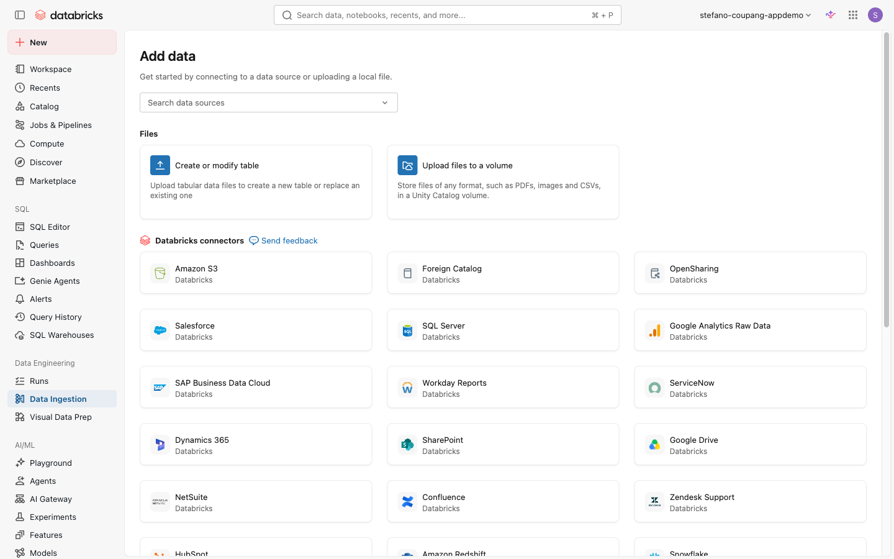
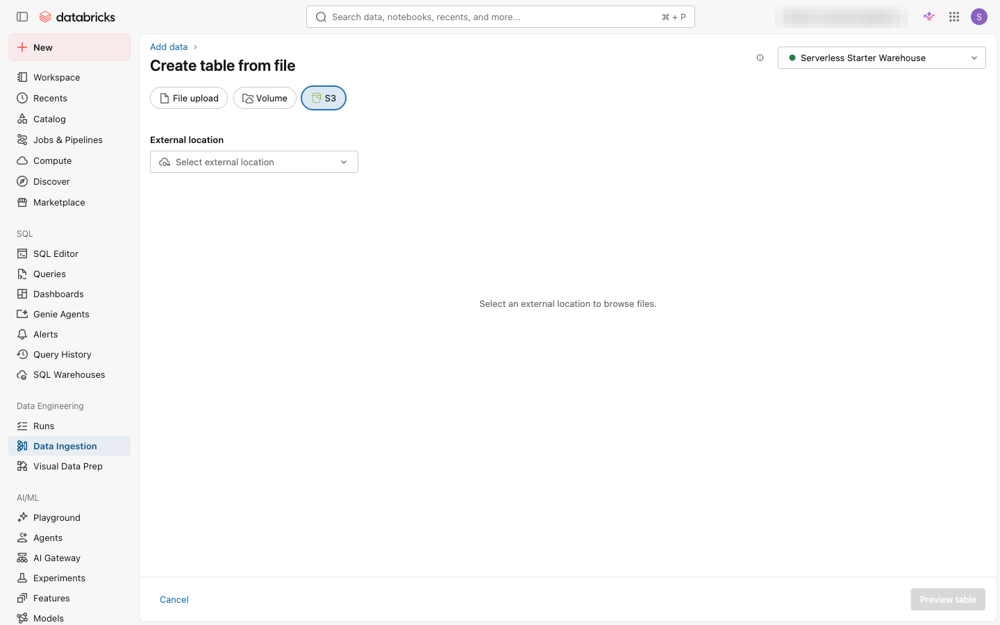

⬅️ [이전: 노트북 & S3 파일 읽기](./07-notebooks.md) | 🏠 [목차](../README.md) | [다음: SQL 작성·저장 & 스니펫](./09-sql.md) ➡️

---

# 08. Lakeflow Connect로 S3 파일을 Unity Catalog 테이블로 가져오기

> **이 실습에서 배우는 것** — 코드 없이 UI만으로 S3의 파일을 탐색하고, Unity Catalog 관리형 Delta 테이블로 만들어 봅니다. Lakeflow Connect의 파일 인제스트(Add data) 기능을 사용합니다.

| 항목 | 내용 |
|---|---|
| 예상 소요 시간 | 약 15분 |
| 난이도 | 입문 |
| 사전 준비 | 06 실습 완료, S3 버킷에 대한 Unity Catalog External Location 구성 완료, SQL Warehouse 사용 가능 |
| 필요 권한 | External Location에 대한 READ FILES 권한, SQL Warehouse 접근 권한, 대상 스키마에 CREATE TABLE 권한 |

---

## 학습 목표

- Databricks Add data UI를 통해 S3 파일을 Unity Catalog 테이블로 가져오는 전체 흐름을 설명할 수 있다.
- External Location(외부 위치)이 무엇인지 설명하고, Lakeflow Connect 파일 인제스트에서 어떻게 활용되는지 이해한다.
- 07 실습(노트북에서 S3 직접 읽기)과 이번 방법의 차이점을 구분한다.

---

## 개념 먼저 이해하기

### 07 실습과 무엇이 다른가요?

| 비교 항목 | 07 실습 (노트북에서 S3 읽기) | 08 실습 (Lakeflow Connect Add data) |
|---|---|---|
| 방법 | Python/SQL 코드 작성 | UI 클릭만으로 진행 |
| 결과 | 메모리 상의 DataFrame(임시) | Unity Catalog 관리형 Delta 테이블(영구 저장) |
| 재사용성 | 노트북을 다시 실행해야 함 | 테이블이 생성되면 누구나 즉시 조회 가능 |
| 거버넌스 | 개별 코드에서 접근 제어 | Unity Catalog의 RBAC/ABAC 자동 적용 |
| 적합한 상황 | 탐색적 분석, 프로토타이핑 | 반복적으로 사용하는 테이블을 공식 등록할 때 |

### External Location(외부 위치)이란?

**External Location**은 Unity Catalog에서 클라우드 스토리지(S3 버킷 등)의 특정 경로에 접근 권한을 부여하는 객체입니다. S3 버킷 경로와 IAM 역할(Storage Credential)을 묶어 놓은 것으로, 코드에 AWS 자격증명을 직접 넣지 않아도 Unity Catalog 거버넌스 안에서 안전하게 S3에 접근할 수 있게 해줍니다.

> 💡 **External Location이 없으면 이 실습을 진행할 수 없습니다.** 메타스토어 관리자에게 해당 S3 버킷에 대한 External Location 생성을 요청하거나, Catalog Explorer > **External Locations** 에서 직접 생성하세요(메타스토어 관리자 권한 필요). 외부 볼륨 개념은 [06 실습(테이블·Volume·RBAC/ABAC)](./06-tables-volumes-rbac-abac.md)을, 노트북에서 S3를 직접 읽는 방법은 [07 실습(노트북 & S3 파일 읽기)](./07-notebooks.md)를 참고하세요.

### Lakeflow Connect 파일 인제스트

**Lakeflow Connect**는 Databricks의 관리형 데이터 인제스트(Ingestion) 플랫폼입니다. 로컬 파일 업로드, 클라우드 오브젝트 스토리지(S3, ADLS, GCS), SaaS 앱(Salesforce, Workday 등), 데이터베이스 CDC 등 다양한 소스에서 Unity Catalog 테이블로 데이터를 가져올 수 있습니다.

이번 실습에서는 S3의 파일을 **UI 클릭만으로** 탐색하고 관리형 Delta 테이블로 만드는 **파일 인제스트** 기능을 사용합니다.

---

## 전제 조건 확인

이 실습을 시작하기 전에 다음 항목이 모두 준비되어 있는지 확인하세요.

| 항목 | 확인 방법 |
|---|---|
| SQL Warehouse | 왼쪽 사이드바 **SQL Warehouses** → 상태가 Running 또는 Starting인 웨어하우스 존재 |
| S3 External Location | 왼쪽 사이드바 **Catalog** → **External Locations** 탭에서 대상 S3 경로가 등록되어 있는지 확인 |
| READ FILES 권한 | External Location 상세 > **Permissions** 에서 본인 사용자/그룹에 READ FILES 권한 확인 |
| 대상 카탈로그·스키마 | 테이블을 저장할 카탈로그와 스키마 준비 (06 실습에서 생성한 `main.onboarding_training` 사용 가능) |

---

## 따라 하기 (Step-by-step)

### 1단계: Add data 페이지 진입

S3에서 데이터를 가져오려면 먼저 **Data Ingestion** 메뉴로 진입합니다.

**방법 A — 왼쪽 사이드바 이용**

1. 왼쪽 사이드바에서 **Data Ingestion** 아이콘을 클릭합니다 (화살표·연결 모양의 아이콘).

**방법 B — + New 메뉴 이용**

1. 왼쪽 상단의 **+ New** 버튼을 클릭합니다.
2. 드롭다운에서 **Add or upload data** 를 선택합니다.

두 방법 모두 **Add data** 페이지로 이동합니다.


*Databricks connectors에서 Amazon S3 선택*

> 💡 **Add data 페이지**에는 다양한 데이터 소스 옵션이 있습니다. **Upload files to a volume**(로컬 파일 업로드), **Databricks connectors**(Amazon S3, SaaS 앱 등), **Partner connectors** 등이 보입니다. 이번 실습에서는 **Databricks connectors** 섹션의 **Amazon S3** 를 사용합니다.

---

### 2단계: Amazon S3 커넥터 선택 및 설정 화면 열기

1. **Add data** 페이지의 **Databricks connectors** 섹션에서 **Amazon S3** 를 클릭합니다.
2. **Create table from file** 화면이 열립니다.
3. 상단 탭에서 **S3** 가 선택되어 있는지 확인합니다.
4. 오른쪽 상단의 **SQL Warehouse** 드롭다운에서 사용할 웨어하우스를 선택합니다.


*Create table from file의 S3 탭, External location 선택 화면*

> ⚠️ **SQL Warehouse를 먼저 선택하세요.** Warehouse를 선택해야 External Location 드롭다운에 목록이 표시되고 파일을 탐색할 수 있습니다.

---

### 3단계: External Location 선택 및 파일 찾기

1. **External location** 드롭다운을 클릭합니다.
2. 이 워크스페이스에 등록된 External Location 목록이 표시됩니다. 대상 S3 경로에 해당하는 External Location을 선택합니다.

   <!-- 스크린샷 예정: ../assets/screenshots/08-lakeflow-connect/03-external-location-select.png (External Location 선택) -->
   *📸 캡처 안내: External location 드롭다운이 펼쳐지고 등록된 External Location 목록에서 하나를 선택하는 화면.*

3. External Location을 선택하면 해당 S3 경로의 파일·폴더 목록이 아래에 표시됩니다.
4. 가져올 파일 또는 폴더를 클릭하여 선택합니다.

   <!-- 스크린샷 예정: ../assets/screenshots/08-lakeflow-connect/04-file-browse.png (파일/폴더 찾기) -->
   *📸 캡처 안내: External Location 하위의 S3 폴더/파일 목록이 표시되고, 특정 파일 또는 폴더를 선택하는 화면.*

> 💡 **폴더를 선택하면** 해당 폴더 안의 모든 파일이 자동으로 포함됩니다. 같은 형식(CSV, JSON 등)의 파일 여러 개를 한꺼번에 가져올 때 유용합니다.
>
> **지원 파일 형식**: CSV, TSV, JSON, Parquet, Avro, ORC 등

---

### 4단계: 테이블 미리보기 및 대상 설정

1. 파일을 선택하면 오른쪽 또는 하단 **Preview** 영역에서 데이터 샘플을 확인할 수 있습니다.
2. **Preview table** 버튼을 클릭하여 샘플 데이터와 컬럼 이름·데이터 타입을 확인합니다.

   <!-- 스크린샷 예정: ../assets/screenshots/08-lakeflow-connect/05-preview-table.png (테이블 미리보기) -->
   *📸 캡처 안내: Preview table 클릭 후 S3 파일의 샘플 데이터가 표 형태로 표시된 화면. 컬럼 이름과 데이터 타입이 보이도록 캡처.*

3. 필요하면 컬럼 이름이나 데이터 타입을 수정합니다.
4. 화면 하단의 **Destination** 섹션에서 테이블을 저장할 위치를 지정합니다.

   | 항목 | 설명 | 예시 |
   |---|---|---|
   | **Catalog** | 대상 카탈로그 | `main` |
   | **Schema** | 대상 스키마 | `onboarding_training` |
   | **Table name** | 생성할 테이블 이름 | `s3_import_demo` |

---

### 5단계: 테이블 생성 및 결과 확인

1. 설정을 모두 확인한 후 **Create table** 버튼을 클릭합니다.
2. 잠시 기다리면 테이블 생성이 완료됩니다.

   <!-- 스크린샷 예정: ../assets/screenshots/08-lakeflow-connect/06-table-created.png (테이블 생성 완료) -->
   *📸 캡처 안내: "Table created successfully" 메시지 또는 생성된 테이블의 Catalog Explorer 상세 페이지로 이동한 화면.*

3. 생성된 테이블은 Unity Catalog에 **관리형 Delta 테이블**로 등록됩니다. SQL 편집기에서 바로 쿼리할 수 있습니다.

```sql
-- 생성된 테이블 조회
SELECT * FROM main.onboarding_training.s3_import_demo LIMIT 10;
```

> 💡 이 테이블은 [06 실습](./06-tables-volumes-rbac-abac.md)에서 배운 RBAC/ABAC 권한 제어가 즉시 적용되는 관리형 테이블입니다. Catalog Explorer에서 Permissions 탭을 통해 그룹 권한을 바로 설정할 수 있습니다.

---

## 자주 겪는 문제 / 팁 💡

- **External Location 목록이 비어 있을 때**: SQL Warehouse를 선택했는지 확인하세요. Warehouse를 선택해야 External Location 목록이 로드됩니다.
- **"Create new external location" 안내가 보일 때**: 대상 S3 경로가 External Location으로 등록되지 않은 것입니다. 메타스토어 관리자에게 External Location 생성을 요청하거나, Catalog Explorer > **External Locations** 에서 직접 생성하세요(메타스토어 관리자 권한 필요).
- **CSV 파일 미리보기가 깨질 때**: 헤더가 없거나 인코딩(UTF-8, EUC-KR 등)이 맞지 않으면 미리보기가 올바르지 않게 보일 수 있습니다. 설정에서 **First row is header** 옵션과 인코딩을 확인하세요.
- **"Operation not allowed" 권한 오류**: External Location에 대한 `READ FILES` 권한이 없을 때 발생합니다. 메타스토어 관리자에게 해당 External Location의 Permissions 탭에서 권한 추가를 요청하세요.
- **탐색과 등록을 나눠서 사용하기**: S3 파일을 먼저 노트북에서 탐색·분석해 보고([07 실습](./07-notebooks.md)), 확정된 스키마로 이 Add data UI를 통해 공식 테이블로 등록하는 두 단계 접근을 추천합니다.

---

## 공식 문서 링크 📚

- [Lakeflow Connect란? (What is Lakeflow Connect?)](https://docs.databricks.com/aws/en/ingestion/overview.html) — Lakeflow Connect 개요 및 지원 소스 목록
- [External Location을 사용한 데이터 로드 (Load data using a Unity Catalog external location)](https://docs.databricks.com/aws/en/ingestion/cloud-object-storage/add-data-external-locations.html) — Add data UI로 S3 파일을 Unity Catalog 테이블로 가져오는 단계별 가이드 (확인됨)
- [클라우드 오브젝트 스토리지에서 데이터 인제스트 (Ingest data from cloud object storage)](https://docs.databricks.com/aws/en/ingestion/cloud-object-storage/index.html) — Auto Loader, COPY INTO 등 클라우드 스토리지 인제스트 옵션 비교 (확인됨)
- [Unity Catalog 클라우드 스토리지 연결 (Connect to cloud object storage using Unity Catalog)](https://docs.databricks.com/aws/en/connect/unity-catalog/external-locations.html) — External Location 및 Storage Credential 개념과 생성 방법 (확인됨)

---

## 다음 단계 ➡️

- [09. SQL 작성·저장 & 스니펫](./09-sql.md) — SQL 편집기로 쿼리를 작성하고 저장하는 방법을 배웁니다.

---

⬅️ [이전: 노트북 & S3 파일 읽기](./07-notebooks.md) | 🏠 [목차](../README.md) | [다음: SQL 작성·저장 & 스니펫](./09-sql.md) ➡️
