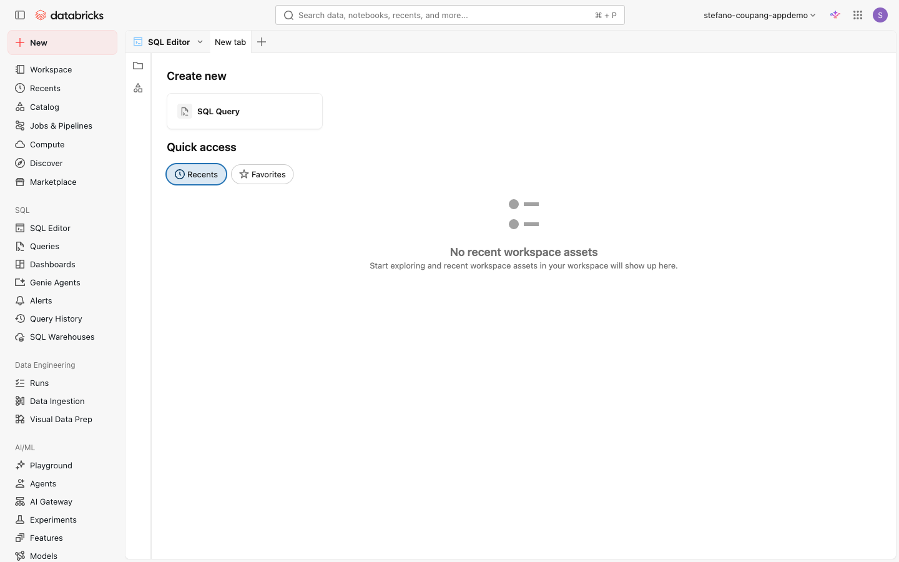

⬅️ [이전: Lakeflow Connect로 S3 가져오기](./08-lakeflow-connect-s3.md) | 🏠 [목차](../README.md) | [다음: Job & 스케줄](./10-jobs.md) ➡️

---

# 09. SQL 작성·저장 & 스니펫

> **이 실습에서 배우는 것** — Databricks SQL 편집기에서 SQL Warehouse에 연결하고 쿼리를 작성·실행·저장합니다. 또한 자주 쓰는 SQL 조각을 **스니펫(Query Snippet)**으로 등록하여 자동완성으로 불러오는 방법을 익힙니다.

| 항목 | 내용 |
|---|---|
| 예상 소요 시간 | 약 25분 |
| 난이도 | 초급 |
| 사전 준비 | Databricks 워크스페이스 로그인, SQL Warehouse가 하나 이상 존재할 것 |
| 필요 권한 | SQL Warehouse 사용 권한(CAN USE), 쿼리 저장 및 스니펫 생성은 일반 사용자도 가능 |

---

## 학습 목표

- SQL 편집기를 열고 SQL Warehouse에 연결할 수 있다.
- SQL 쿼리를 작성·실행하고 결과를 확인할 수 있다.
- 쿼리에 이름을 붙여 저장하고 나중에 다시 열 수 있다.
- 폴더 기반 쿼리 관리와 공유 개념을 이해할 수 있다.
- 자주 쓰는 SQL 조각을 스니펫으로 등록하고 자동완성으로 사용할 수 있다.

---

## 개념 먼저 이해하기

### SQL 편집기(SQL Editor)란?

SQL 편집기는 Databricks SQL의 전용 쿼리 작성 도구입니다. 노트북 없이도 SQL을 바로 실행할 수 있으며, 결과를 표와 차트로 확인하고 쿼리를 저장·공유할 수 있습니다.

```
┌─────────────────────────────────────────────────────────────┐
│  SQL 편집기(SQL Editor)                                      │
│  ┌─────────────────┐   ┌─────────────────────────────────┐  │
│  │  왼쪽 패널       │   │  쿼리 편집 영역                  │  │
│  │  - 스키마 브라우저│   │  SELECT * FROM ...              │  │
│  │  - 저장된 쿼리   │   │                                 │  │
│  │  - 파일 탐색기   │   │  ▶ Run (Ctrl+Enter)             │  │
│  └─────────────────┘   └─────────────────────────────────┘  │
│                         ┌─────────────────────────────────┐  │
│                         │  결과(Results)                   │  │
│                         │  표 / 차트 / 다운로드             │  │
│                         └─────────────────────────────────┘  │
│  컴퓨트: [SQL Warehouse 선택 ▼]                              │
└─────────────────────────────────────────────────────────────┘
```

### SQL Warehouse vs 클러스터

| 항목 | SQL Warehouse | 범용 클러스터(All-Purpose) |
|---|---|---|
| 주 용도 | SQL 쿼리, 대시보드, BI 도구 | 노트북, 파이프라인, ML |
| 시작 속도 | 빠름(Serverless는 즉시) | 보통 1~5분 |
| 비용 단위 | DBU(쿼리 처리 중만 과금) | DBU(클러스터 실행 전체) |
| 멀티 사용자 | 여러 사용자 동시 사용 가능 | 기본적으로 1인 |

### 저장된 쿼리(Saved Queries)

SQL 편집기에서 작성한 쿼리는 Databricks 워크스페이스에 파일처럼 저장됩니다. 폴더로 정리하고, 다른 팀원과 공유할 수 있습니다.

### 스니펫(Query Snippet)이란?

스니펫은 **자주 반복해서 쓰는 SQL 조각**을 "트리거(단축키 단어)"와 함께 저장해두는 기능입니다. 쿼리를 작성할 때 트리거 단어를 입력하면 자동완성으로 전체 SQL 코드가 삽입됩니다.

**예시**
- 트리거: `join_orders` → 삽입되는 코드: `LEFT JOIN orders ON customers.id = orders.customer_id`
- 트리거: `date_filter` → 삽입되는 코드: `WHERE date >= '${1:시작일}' AND date <= '${2:종료일}'`

---

## 따라 하기 (Step-by-step)

### 1단계: SQL 편집기 열기

1. 왼쪽 사이드바에서 **SQL Editor** 아이콘(코드 편집기 모양)을 클릭합니다.

   > 💡 아이콘 명칭이 화면에 표시되지 않는 경우, 사이드바 아이콘에 마우스를 올려 툴팁을 확인하세요.

   <!-- 스크린샷 예정: ../assets/screenshots/09-sql/01-sql-editor-icon.png (SQL Editor 아이콘) -->
   *📸 캡처 안내: 왼쪽 사이드바에서 SQL Editor 아이콘이 하이라이트된 상태를 캡처합니다.*

2. SQL 편집기 화면이 열립니다. 처음 열 경우 빈 쿼리 탭이 나타납니다.

   
   *📸 캡처 안내: SQL 편집기의 전체 레이아웃(왼쪽 패널 + 쿼리 편집 영역 + 컴퓨트 선택 드롭다운)이 보이도록 전체 화면을 캡처합니다.*

---

### 2단계: SQL Warehouse 연결

SQL 편집기에서 쿼리를 실행하려면 **SQL Warehouse**에 연결해야 합니다.

1. 편집기 상단(또는 우측 상단)의 컴퓨트 선택 드롭다운을 클릭합니다. (화면에서 실제 명칭 확인)

   <!-- 스크린샷 예정: ../assets/screenshots/09-sql/03-warehouse-dropdown.png (SQL Warehouse 선택 드롭다운) -->
   *📸 캡처 안내: 쿼리 편집 영역 위쪽 또는 오른쪽에 있는 SQL Warehouse 선택 드롭다운이 열린 상태를 캡처합니다. 사용 가능한 웨어하우스 목록이 보여야 합니다.*

2. 사용 가능한 SQL Warehouse 목록에서 하나를 선택합니다.

   | 상태 | 설명 |
   |---|---|
   | **Running** (초록 점) | 현재 실행 중. 즉시 사용 가능 |
   | **Stopped** (회색 점) | 중지됨. 선택 시 자동으로 시작됨(시간 소요) |
   | **Starting** | 시작 중 |

   > 💡 서버리스 SQL Warehouse는 시작 시간이 매우 빠릅니다. 목록에 "Serverless"가 포함된 웨어하우스가 있으면 우선 선택하세요.

3. SQL Warehouse가 선택되면 편집기가 쿼리를 받을 준비가 됩니다.

---

### 3단계: 첫 쿼리 작성 및 실행

1. 쿼리 편집 영역을 클릭하고 아래 SQL을 입력합니다.

   ```sql
   SELECT
       pickup_zip,
       COUNT(*)                      AS trip_count,
       ROUND(AVG(fare_amount), 2)    AS avg_fare,
       ROUND(AVG(trip_distance), 2)  AS avg_distance
   FROM samples.nyctaxi.trips
   GROUP BY pickup_zip
   ORDER BY trip_count DESC
   LIMIT 20
   ```

   <!-- 스크린샷 예정: ../assets/screenshots/09-sql/04-write-query.png (쿼리 입력 화면) -->
   *📸 캡처 안내: SQL 편집 영역에 위 쿼리가 입력된 상태를 캡처합니다. 자동완성 제안이 보이면 더 좋습니다.*

2. **Run** 버튼을 클릭하거나 **Ctrl + Enter** (Mac: **Cmd + Enter**)를 눌러 쿼리를 실행합니다.

   <!-- 스크린샷 예정: ../assets/screenshots/09-sql/05-run-button.png (Run 버튼) -->
   *📸 캡처 안내: Run 버튼(파란 삼각형 아이콘)이 쿼리 편집기 상단에 보이도록 캡처합니다.*

3. 실행이 완료되면 하단에 결과가 표 형태로 나타납니다.

   <!-- 스크린샷 예정: ../assets/screenshots/09-sql/06-query-result.png (쿼리 결과 표) -->
   *📸 캡처 안내: 쿼리 실행 완료 후 하단 결과 영역에 pickup_zip, trip_count, avg_fare, avg_distance 컬럼이 있는 표가 보이도록 캡처합니다.*

---

### 4단계: 결과 확인 및 시각화

결과 테이블 위쪽의 탭에서 다양한 방법으로 데이터를 확인할 수 있습니다.

- **Table**: 표 형태로 결과 확인. 컬럼 정렬·필터 가능.
- **+ (Add visualization)**: 막대그래프, 꺾은선, 파이차트 등 시각화 추가.
- **Download**: CSV 또는 TSV로 결과 다운로드.

시각화를 추가해 봅니다.

1. 결과 영역에서 **+** 탭을 클릭합니다.
2. **Visualization type**에서 **Bar**를 선택합니다.
3. **X Column**에 `pickup_zip`, **Y Column**에 `trip_count`를 설정합니다.
4. 막대그래프가 표시됩니다.

   <!-- 스크린샷 예정: ../assets/screenshots/09-sql/07-visualization.png (막대그래프 시각화) -->
   *📸 캡처 안내: 막대그래프 시각화가 결과 영역에 표시된 화면을 캡처합니다. X축에 pickup_zip, Y축에 trip_count가 보여야 합니다.*

---

### 5단계: 쿼리 저장하기

작성한 쿼리에 이름을 붙여 저장합니다.

1. 편집기 상단의 쿼리 제목 부분을 클릭합니다. 기본값은 **"New query"** 입니다.

   <!-- 스크린샷 예정: ../assets/screenshots/09-sql/08-query-title.png (쿼리 제목 클릭) -->
   *📸 캡처 안내: 쿼리 탭 또는 상단의 "New query" 제목이 편집 가능한 상태(커서가 표시된 입력 필드)로 바뀐 화면을 캡처합니다.*

2. 제목을 **`onboarding_nyc_taxi_by_zipcode`** 로 입력하고 Enter를 누릅니다.

3. 쿼리는 자동 저장됩니다. 저장 상태는 제목 옆의 아이콘(화면에서 실제 명칭 확인)으로 확인할 수 있습니다.

   <!-- 스크린샷 예정: ../assets/screenshots/09-sql/09-saved-query-name.png (저장된 쿼리 이름) -->
   *📸 캡처 안내: 쿼리 제목이 "onboarding_nyc_taxi_by_zipcode"로 변경된 상태를 캡처합니다.*

> 💡 Databricks SQL 편집기는 **자동 저장(autosave)** 기능이 있어 별도로 저장 버튼을 누르지 않아도 주기적으로 저장됩니다. 이름을 지정해 두면 나중에 다시 찾기 쉽습니다.

---

### 6단계: 저장된 쿼리 다시 열기

다음에 이 쿼리를 다시 열고 싶을 때 두 가지 방법이 있습니다.

#### 방법 A: 사이드바 Queries 목록에서 열기

1. 왼쪽 패널에서 **Queries** 탭을 클릭합니다. (화면에서 실제 탭 명칭 확인)
2. 목록에서 `onboarding_nyc_taxi_by_zipcode` 를 클릭합니다.

   <!-- 스크린샷 예정: ../assets/screenshots/09-sql/10-queries-list.png (Queries 목록) -->
   *📸 캡처 안내: 왼쪽 패널의 Queries 탭이 열려 있고, 저장된 쿼리 목록에 방금 저장한 쿼리가 보이는 화면을 캡처합니다.*

#### 방법 B: Workspace 파일 브라우저에서 열기

저장된 쿼리는 워크스페이스 파일로도 관리됩니다.

1. 왼쪽 사이드바에서 **Workspace** 아이콘을 클릭합니다.
2. **Home** 또는 내 사용자 폴더로 이동하면 저장한 쿼리 파일이 보입니다.
3. 파일을 클릭하면 SQL 편집기에서 열립니다.

---

### 7단계: 폴더로 정리하고 공유하기

팀이 여러 쿼리를 관리할 때는 **폴더(Folder)**를 만들어 정리하고 **권한을 설정해 공유**할 수 있습니다.

#### 폴더 만들기

1. **Workspace** 탐색기에서 원하는 위치를 마우스 오른쪽 클릭합니다.
2. **Create > Folder**를 선택합니다.
3. 폴더 이름을 입력합니다(예: `onboarding_training`).
4. 쿼리 파일을 드래그하거나, **이동(Move)** 메뉴로 폴더 안에 넣습니다.

#### 쿼리 공유

1. 공유할 쿼리 파일을 마우스 오른쪽 클릭합니다.
2. **Permissions**를 선택합니다.
3. 팀원 이메일 또는 그룹을 입력하고 권한 수준을 설정합니다.

   | 권한 수준 | 설명 |
   |---|---|
   | **Can View** | 쿼리 보기·실행만 가능 |
   | **Can Run** | 쿼리 실행 가능 |
   | **Can Edit** | 쿼리 수정 가능 |
   | **Can Manage** | 권한 설정 포함 전체 관리 |

   <!-- 스크린샷 예정: ../assets/screenshots/09-sql/11-share-permissions.png (권한 설정 다이얼로그) -->
   *📸 캡처 안내: 쿼리 권한 설정(Permissions) 다이얼로그가 열려 있고 팀원 추가 입력 필드가 보이는 화면을 캡처합니다.*

> 💡 **Run as Viewer / Run as Owner**: 쿼리를 공유할 때 "Run as viewer"는 다른 사용자가 자신의 권한으로 실행하고, "Run as owner"는 쿼리 소유자의 권한으로 실행됩니다. 민감한 데이터에는 신중히 선택하세요.

---

### 8단계: 쿼리 스니펫 만들기

스니펫은 자주 반복해서 쓰는 SQL 조각을 트리거 단어와 함께 저장하는 기능입니다.

#### 스니펫 관리 화면 열기

1. SQL 편집기 오른쪽 상단 또는 편집기 내의 **⋮ (더보기/kebab 메뉴)** 버튼을 클릭합니다. (화면에서 실제 아이콘 위치 확인)
2. 메뉴에서 **View** 를 클릭합니다.
3. **Query snippets** 를 선택합니다.

   <!-- 스크린샷 예정: ../assets/screenshots/09-sql/12-snippets-menu.png (Query snippets 메뉴) -->
   *📸 캡처 안내: SQL 편집기의 더보기(⋮) 메뉴가 열려 있고 "View" 하위에 "Query snippets" 항목이 보이는 화면을 캡처합니다.*

4. **Query Snippets** 관리 페이지가 열립니다.

   <!-- 스크린샷 예정: ../assets/screenshots/09-sql/13-snippets-page.png (Query Snippets 관리 화면) -->
   *📸 캡처 안내: Query Snippets 관리 화면 전체를 캡처합니다. "Create query snippet" 버튼이 보여야 합니다.*

#### 첫 번째 스니펫 만들기

1. **Create query snippet** 버튼을 클릭합니다.

2. 아래와 같이 입력합니다.

   | 필드 | 입력값 | 설명 |
   |---|---|---|
   | **Replace** | `nyc_top_zip` | 편집기에서 입력할 **트리거 단어** |
   | **Description** | NYC 택시 상위 우편번호 조회 | 스니펫 설명 (선택) |
   | **Snippet** | 아래 SQL 참고 | 삽입될 실제 SQL 코드 |

   **Snippet** 필드에 입력할 SQL:
   ```sql
   SELECT
       pickup_zip,
       COUNT(*)                   AS trip_count,
       ROUND(AVG(fare_amount), 2) AS avg_fare
   FROM samples.nyctaxi.trips
   GROUP BY pickup_zip
   ORDER BY trip_count DESC
   LIMIT ${1:상위 몇 개};
   ```

   <!-- 스크린샷 예정: ../assets/screenshots/09-sql/14-create-snippet-form.png (스니펫 생성 폼) -->
   *📸 캡처 안내: "Create query snippet" 다이얼로그 또는 폼이 열려 있고 Replace, Description, Snippet 필드가 모두 채워진 상태를 캡처합니다.*

3. **Create** 버튼을 클릭하여 저장합니다.

#### 두 번째 스니펫 만들기 (삽입 포인트 활용)

`${}` 문법으로 **삽입 포인트(insertion point)**를 지정하면, 스니펫 삽입 후 Tab 키로 빈칸을 순서대로 채울 수 있습니다.

다시 **Create query snippet**을 클릭하고 아래와 같이 입력합니다.

| 필드 | 입력값 |
|---|---|
| **Replace** | `date_range` |
| **Description** | 날짜 범위 필터 WHERE 절 |
| **Snippet** | 아래 SQL |

```sql
WHERE ${1:날짜컬럼} BETWEEN '${2:시작일 YYYY-MM-DD}' AND '${3:종료일 YYYY-MM-DD}'
```

> 💡 `${1:...}`, `${2:...}`, `${3:...}` 는 삽입 포인트입니다. 스니펫이 삽입된 후 Tab 키를 누르면 `${1}` → `${2}` → `${3}` 순으로 커서가 이동합니다. 콜론(`:`) 뒤의 텍스트는 기본 플레이스홀더로 표시됩니다.

---

### 9단계: 스니펫 사용하기

1. SQL 편집기의 빈 쿼리 탭으로 돌아옵니다.
2. 편집 영역에서 트리거 단어 **`nyc_top_zip`** 을 입력하기 시작합니다.

   <!-- 스크린샷 예정: ../assets/screenshots/09-sql/15-snippet-autocomplete.png (자동완성에 스니펫 표시) -->
   *📸 캡처 안내: 편집기에서 "nyc_top_zip"을 입력하는 중 자동완성 드롭다운에 등록한 스니펫이 표시된 화면을 캡처합니다.*

3. 자동완성 목록에 스니펫이 나타나면 **Enter** 또는 **Tab** 으로 선택합니다.

   > 💡 자동완성이 보이지 않으면 **Ctrl + Space** (Mac: **Cmd + Space**)를 눌러 강제로 자동완성 창을 열 수 있습니다.

4. 스니펫의 전체 SQL 코드가 편집기에 삽입됩니다.

   <!-- 스크린샷 예정: ../assets/screenshots/09-sql/16-snippet-inserted.png (스니펫 삽입 결과) -->
   *📸 캡처 안내: 스니펫이 삽입되어 전체 SQL 코드가 편집기에 나타난 화면을 캡처합니다. `${1:상위 몇 개}` 부분이 하이라이트된 상태면 이상적입니다.*

5. `${1:상위 몇 개}` 부분이 선택된 상태에서 원하는 숫자(예: `10`)를 입력하고 쿼리를 실행합니다.

   ```sql
   SELECT
       pickup_zip,
       COUNT(*)                   AS trip_count,
       ROUND(AVG(fare_amount), 2) AS avg_fare
   FROM samples.nyctaxi.trips
   GROUP BY pickup_zip
   ORDER BY trip_count DESC
   LIMIT 10;
   ```

6. **Run** 버튼 또는 **Ctrl + Enter**로 실행합니다.

   <!-- 스크린샷 예정: ../assets/screenshots/09-sql/17-snippet-result.png (스니펫 쿼리 실행 결과) -->
   *📸 캡처 안내: 스니펫으로 완성된 쿼리의 실행 결과가 표 형태로 표시된 화면을 캡처합니다.*

---

## 자주 겪는 문제 / 팁 💡

| 문제 | 해결 방법 |
|---|---|
| SQL Warehouse가 목록에 없음 | 워크스페이스 관리자에게 SQL Warehouse 생성 또는 사용 권한 부여를 요청하세요. |
| Warehouse가 Stopped 상태 | 선택하면 자동 시작됩니다. 서버리스가 아닌 경우 1~5분 소요될 수 있습니다. |
| 쿼리 실행 중 "Permission denied" 오류 | 해당 카탈로그/스키마/테이블에 `SELECT` 권한이 있는지 확인하세요. `samples` 카탈로그는 보통 기본 허용입니다. |
| 스니펫이 자동완성에 나타나지 않음 | **Ctrl + Space**로 강제로 자동완성 창을 열거나, 트리거 단어를 더 입력해 보세요. |
| 쿼리 저장 위치를 모르겠음 | Workspace 탐색기 → 내 계정 폴더 또는 홈에서 찾을 수 있습니다. |
| 다른 사람이 저장한 쿼리를 못 찾겠음 | Workspace → 해당 사용자 폴더를 탐색하거나, 권한을 요청하세요. |
| 쿼리 결과가 최대 64,000행까지만 표시됨 | 이는 SQL 편집기의 정상 동작입니다. 전체 데이터는 스파크/노트북에서 처리하거나 다운로드 버튼을 사용하세요. |

---

## 공식 문서 링크 📚

- [Databricks SQL 편집기 — 새 편집기 개요](https://docs.databricks.com/aws/en/sql/user/sql-editor/)
- [새 SQL 편집기에서 쿼리 작성하기](https://docs.databricks.com/aws/en/sql/user/sql-editor/write-queries)
- [SQL Warehouse 연결 및 사용](https://docs.databricks.com/aws/en/compute/sql-warehouse/)
- [저장된 쿼리 관리 (열기·폴더·권한·공유)](https://docs.databricks.com/aws/en/sql/user/queries/)
- [쿼리 스니펫 만들기 및 사용](https://docs.databricks.com/aws/en/sql/user/queries/query-snippets)

---

## 다음 단계 ➡️

- [10. Job & 스케줄](./10-jobs.md) — Lakeflow Job을 만들고 스케줄을 설정해 쿼리와 노트북을 자동으로 실행하는 방법을 배웁니다.
