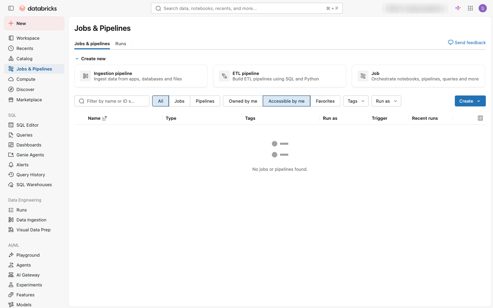
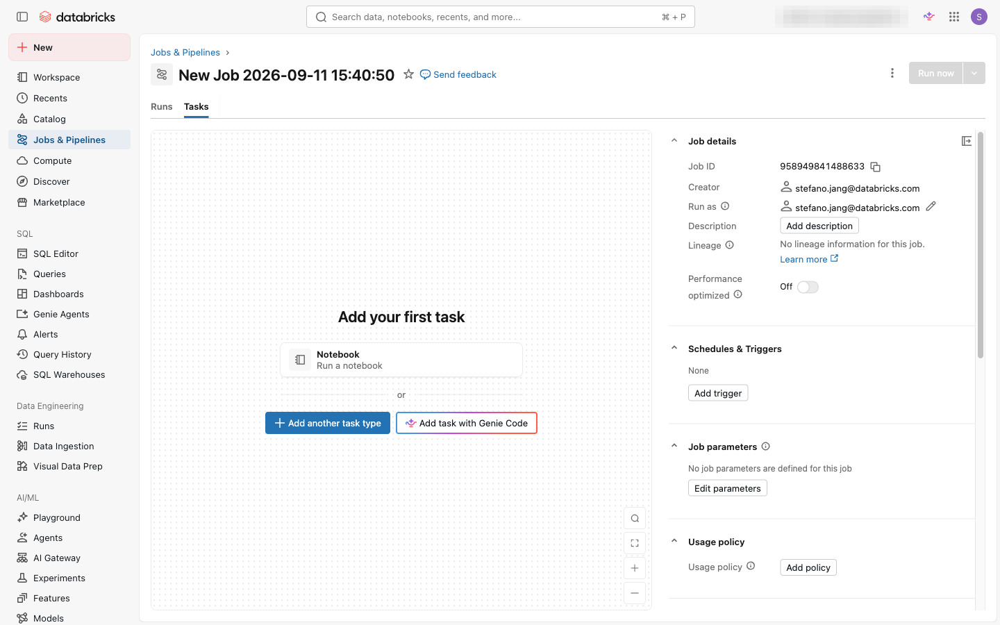
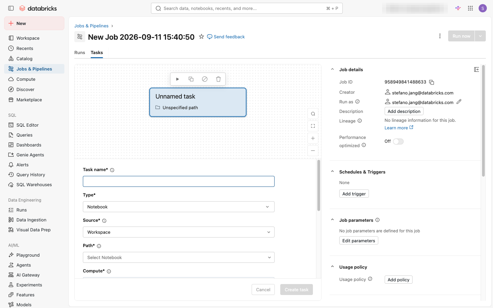
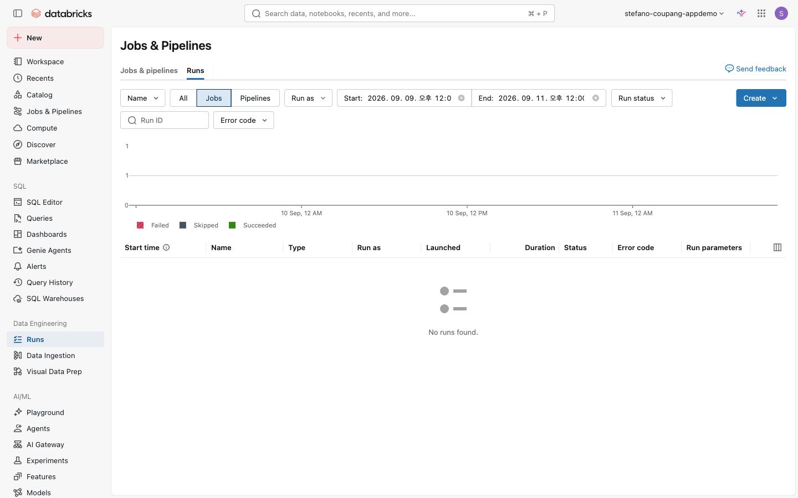

⬅️ [이전: SQL 작성·저장 & 스니펫](./09-sql.md) | 🏠 [목차](../README.md) | [다음: AI/BI 대시보드 — 시각화 & 퍼블리싱](./11-dashboards.md) ➡️

---

# 10. Lakeflow Jobs — 태스크 & 스케줄

> **이 실습에서 배우는 것** — Databricks의 워크플로 자동화 도구인 Lakeflow Jobs를 사용해 노트북을 태스크로 등록하고, 수동으로 실행한 뒤 결과·로그를 확인합니다. 이어서 주기적으로 자동 실행되도록 스케줄을 설정하고, 완료/실패 시 이메일 알림을 받도록 구성합니다.

| 항목 | 내용 |
|---|---|
| 예상 소요 시간 | 약 30분 |
| 난이도 | 초급 |
| 사전 준비 | 워크스페이스 로그인, 07 실습(노트북) 완료 |
| 필요 권한 | Can Use 이상의 워크스페이스 권한, 사용할 컴퓨트에 대한 접근 권한 |

---

## 학습 목표

- Lakeflow Jobs의 핵심 개념(Job, 태스크, 태스크 의존성, 트리거, 알림)을 설명할 수 있다.
- UI에서 Job을 생성하고 노트북 태스크를 추가할 수 있다.
- 수동 실행(Run now) 후 실행 결과와 로그를 확인할 수 있다.
- 주기적 스케줄(매일, 매주 등)과 cron 표현식으로 자동 실행을 예약할 수 있다.
- 성공·실패 시 이메일 알림을 설정할 수 있다.

---

## 개념 먼저 이해하기

### Lakeflow Jobs란?

**Lakeflow Jobs**는 Databricks의 워크플로 자동화(Workflow Automation) 도구입니다. 데이터 파이프라인, 노트북, SQL, 파이프라인 등 여러 작업을 하나의 흐름으로 묶어 정해진 시간에 자동 실행하거나, 다른 시스템과 연동해 트리거할 수 있습니다.

| 개념 | 설명 |
|---|---|
| **Job(잡)** | 하나 이상의 태스크를 포함하는 실행 단위. 스케줄과 알림이 Job 레벨에서 설정됩니다. |
| **Task(태스크)** | Job 내에서 실제 작업을 수행하는 단위. 노트북·파이썬 스크립트·SQL·파이프라인 등 다양한 유형을 지원합니다. |
| **태스크 의존성** | 태스크 A가 완료된 뒤 태스크 B가 실행되도록 순서를 지정할 수 있습니다(방향성 비순환 그래프, DAG). |
| **트리거(Trigger)** | Job이 언제 실행될지를 결정합니다. 수동 실행·주기 스케줄·파일 도착·연속 실행 등을 지원합니다. |
| **Run(런)** | Job이 한 번 실행된 인스턴스. 성공·실패·실행 중 등의 상태와 로그가 기록됩니다. |
| **알림(Notification)** | Job 실행의 시작·성공·실패 시 이메일, Slack, Teams 등으로 알림을 보낼 수 있습니다. |

### 언제 Lakeflow Jobs를 쓰나요?

```
매일 오전 6시 원본 데이터 수집
        ↓ (태스크 1)
데이터 정제 및 집계
        ↓ (태스크 2)
대시보드용 집계 테이블 업데이트
        ↓ (태스크 3)
담당자에게 완료 이메일 발송 📧
```

이처럼 **반복적으로 실행해야 하는 데이터 파이프라인**을 자동화할 때 사용합니다.

---

## 따라 하기 (Step-by-step)

> **사전 확인**: 07 실습에서 저장한 노트북이 워크스페이스에 있는지 확인합니다. 노트북이 없다면 아래 "대체 노트북 준비" 단계를 먼저 진행하세요.

---

### [대체] 실습용 노트북이 없다면 — 간단히 만들기

07 실습에서 만든 노트북이 없거나 다른 경로에 저장된 경우, 아래 단계로 빠르게 새 노트북을 만들어 두세요.

1. 왼쪽 사이드바에서 **새로 만들기(+)** 아이콘을 클릭하고 **노트북(Notebook)** 을 선택합니다.
2. 노트북 이름을 `onboarding-job-notebook` 으로 지정합니다.
3. 언어를 **Python** 으로 선택하고 첫 번째 셀에 아래 코드를 붙여넣습니다.

```python
# NYC 택시 데이터 조회 실습 (Job 태스크용)
from pyspark.sql.functions import count, avg, round

df = spark.table("samples.nyctaxi.trips")

result = (
    df.groupBy("pickup_zip")
      .agg(
          count("*").alias("trip_count"),
          round(avg("fare_amount"), 2).alias("avg_fare")
      )
      .orderBy("trip_count", ascending=False)
      .limit(10)
)

result.show()
print("✅ Job 태스크 실행 완료!")
```

4. 셀을 실행해 정상 동작을 확인한 뒤 노트북을 저장합니다(`Ctrl+S` 또는 `Cmd+S`).
5. 노트북 경로를 메모해 둡니다. 화면 상단에 표시된 경로(예: `/Users/your@email.com/onboarding-job-notebook`)를 복사합니다.

---

### 1단계: Lakeflow Jobs 화면 열기

1. 왼쪽 사이드바에서 **워크플로(Workflows)** 아이콘을 클릭합니다.

2. **잡(Jobs)** 탭이 기본으로 열립니다. 기존에 생성된 Job 목록이 표시됩니다.

   
   *Jobs & Pipelines 화면 — 상단 "Create new"(Ingestion pipeline · ETL pipeline · Job) 카드와 잡·파이프라인 목록, 우측 "Create" 버튼.*

---

### 2단계: 새 Job 생성

1. 오른쪽 상단의 **잡 만들기(Create job)** 버튼을 클릭합니다.

2. Job 편집 화면이 열립니다. 화면 상단에서 Job 이름 필드를 클릭하고 이름을 입력합니다.

   ```
   onboarding-nyctaxi-job
   ```

   
   *새 잡 화면 — 상단의 잡 이름과 우측 Job details(Job ID·Creator·Run as·트리거·파라미터), 가운데 "Add your first task"의 Notebook 태스크 추가.*

> 💡 **팁**: Job 이름에는 영문, 숫자, 하이픈을 사용하세요. 한글도 지원되지만 외부 시스템 연동 시 문제가 생길 수 있습니다.

---

### 3단계: 노트북 태스크 추가

새 Job을 만들면 자동으로 첫 번째 태스크 설정 패널이 열립니다.

1. **태스크 이름(Task name)** 필드에 이름을 입력합니다.

   ```
   analyze-nyctaxi-data
   ```

2. **유형(Type)** 드롭다운이 **노트북(Notebook)** 으로 기본 설정되어 있는지 확인합니다. 다른 유형이 선택되어 있다면 드롭다운을 열어 **Notebook** 을 선택합니다.

3. **원본(Source)** 항목에서 **워크스페이스(Workspace)** 를 선택합니다.

4. **경로(Path)** 필드 오른쪽의 **찾아보기(Browse)** 아이콘을 클릭합니다.

   
   *태스크 설정 패널 — Task name, Type(Notebook), Source(Workspace), Path(Select Notebook), Compute 필드와 Create task/Cancel 버튼.*

5. 파일 탐색 창에서 07 실습에서 저장한 노트북(또는 방금 만든 `onboarding-job-notebook`)을 찾아 선택하고 **확인(Confirm)** 을 클릭합니다.

---

### 4단계: 컴퓨트(Compute) 지정

태스크를 실행할 컴퓨트를 지정합니다.

1. 태스크 설정 패널에서 **클러스터(Cluster)** 섹션을 찾습니다.

2. 드롭다운을 클릭하고 다음 중 하나를 선택합니다.

   | 선택지 | 설명 |
   |---|---|
   | **서버리스(Serverless)** | Databricks가 자동으로 컴퓨트를 관리. 가장 간단하며 추천. |
   | **잡 컴퓨트(Job compute)** | Job 전용 클러스터를 새로 생성(Job 완료 후 자동 종료). |
   | **기존 클러스터 사용** | 이미 실행 중인 대화형 클러스터를 사용. 실습 환경에서 편리. |

   > 💡 **추천**: 초심자는 **서버리스(Serverless)** 를 선택하세요. 클러스터 설정 없이 바로 실행됩니다. 서버리스가 보이지 않으면 기존 대화형 클러스터를 선택합니다.

3. 태스크 설정이 완료되면 **태스크 저장(Save task)** 또는 **만들기(Create)** 버튼을 클릭합니다.

   태스크가 저장되면 Job 캔버스에 태스크 박스가 표시됩니다.

---

### 5단계: 수동 실행 (Run now)

1. Job 편집 화면 오른쪽 상단의 **지금 실행(Run now)** 버튼을 클릭합니다.

2. 실행이 시작되면 화면 하단 또는 상단에 실행 상태 알림이 나타납니다. **실행 상세 보기(View run)** 링크를 클릭하거나, 왼쪽 상단 탭에서 **실행(Runs)** 탭을 클릭합니다.

---

### 6단계: 실행 결과 및 로그 확인

1. **실행(Runs)** 탭에서 방금 시작된 실행 항목을 클릭합니다. 상태가 **실행 중(Running)** 이라면 완료될 때까지 잠시 기다립니다.

   
   *Jobs & Pipelines의 "Runs" 탭 — 실행 상태(Failed·Skipped·Succeeded) 타임라인 차트와 기간 필터, 실행 목록 영역.*

2. 실행 상세 화면에서 다음 정보를 확인합니다.

   | 확인 항목 | 위치 |
   |---|---|
   | 전체 상태 (성공/실패) | 화면 상단 배지 |
   | 실행 시작·종료 시간 | 상단 타임스탬프 |
   | 태스크별 상태 | 캔버스 내 태스크 박스 색상(초록=성공, 빨강=실패) |
   | 출력 로그 | 태스크 박스 클릭 후 로그 패널 |

3. 태스크 박스를 클릭하면 오른쪽에 **태스크 실행 세부 정보** 패널이 열립니다. **로그 보기(View Logs)** 또는 **출력(Output)** 링크를 클릭해 노트북 실행 결과를 확인합니다.

> 💡 **실패했다면?** 태스크 박스가 빨간색이면 클릭 후 "Error" 메시지를 확인하세요. 가장 많은 원인은 노트북 경로 오류, 컴퓨트 권한 부족입니다. 아래 "자주 겪는 문제" 섹션을 참고하세요.

---

### 7단계: 스케줄 설정 (주기적 자동 실행)

수동 실행이 성공했다면 이제 자동 실행 스케줄을 설정합니다.

1. **태스크(Tasks)** 탭 옆의 **스케줄(Schedules & Triggers)** 탭을 클릭합니다.

2. **스케줄 추가(Add schedule)** 또는 **트리거 추가(Add trigger)** 버튼을 클릭합니다.

3. **트리거 유형(Trigger type)** 에서 **예약됨(Scheduled)** 을 선택합니다.

4. 스케줄 설정 옵션이 두 가지 방식으로 제공됩니다.

   **방법 A — 간단 설정 (Simple)**: 드롭다운과 숫자 입력으로 주기를 지정합니다.

   | 설정 필드 | 예시 값 | 설명 |
   |---|---|---|
   | 반복 주기(Repeat every) | `1` | 반복 횟수 |
   | 단위(Unit) | `Days` | 일/시/분 등 |
   | 시작 시각(Start time) | `06:00` | 실행 시각 |
   | 시간대(Timezone) | `Asia/Seoul` | 한국 표준시 |

   **방법 B — Cron 표현식 (Advanced)**: **Cron 구문 표시(Show Cron Syntax)** 체크박스를 선택하면 Quartz Cron 형식으로 직접 입력할 수 있습니다.

   | Cron 예시 | 의미 |
   |---|---|
   | `0 0 6 * * ?` | 매일 오전 6시 |
   | `0 0 9 ? * MON-FRI` | 평일(월~금) 오전 9시 |
   | `0 0 0/2 * * ?` | 2시간마다 |

5. 설정을 완료했으면 **저장(Save)** 버튼을 클릭합니다.

   스케줄이 저장되면 Job 화면 상단에 다음 예약 실행 시각이 표시됩니다.

---

### 8단계 (선택): 이메일 알림 설정

Job 실행 결과를 이메일로 받도록 설정합니다.

1. 상단에서 **알림(Notifications)** 탭 또는 **편집(Edit)** 메뉴에서 **알림 추가(Add notification)** 를 선택합니다.

   > 탭 위치는 워크스페이스 버전에 따라 다를 수 있습니다. 보이지 않으면 Job 세부 설정 페이지 상단을 확인하세요.

2. **알림 추가(Add notification)** 창에서 다음을 설정합니다.

   | 설정 | 값 |
   |---|---|
   | 대상(Destination) | **이메일(Email)** 선택 |
   | 이메일 주소 | 본인 이메일 주소 입력 |
   | 알림 시점 | **실패 시(On failure)** 체크 (권장) |

   선택적으로 **성공 시(On success)**, **시작 시(On start)** 도 체크할 수 있습니다.

3. **저장(Save)** 또는 **확인(Confirm)** 버튼을 클릭합니다.

> 💡 **팁**: 프로덕션 환경에서는 개인 이메일 대신 팀 배포 목록(Distribution list)이나 Slack 채널을 알림 대상으로 설정하는 것이 좋습니다. Databricks는 Slack, Microsoft Teams, PagerDuty 등 다양한 알림 채널을 지원합니다.

---

## 자주 겪는 문제 / 팁 💡

| 증상 | 원인 | 해결 방법 |
|---|---|---|
| 태스크가 **Failed** 로 표시됨 | 노트북 경로가 잘못되었거나 컴퓨트 권한 부족 | 로그에서 오류 메시지 확인. 노트북 경로를 재선택. |
| **서버리스(Serverless)** 옵션이 없음 | 워크스페이스에서 서버리스 미활성화 | 기존 대화형 클러스터를 선택하거나 관리자에게 서버리스 활성화 요청. |
| 스케줄을 설정했는데 실행이 안 됨 | Job이 **일시정지(Paused)** 상태 | Schedules 탭에서 스케줄 상태가 **활성(Active)** 인지 확인. 토글로 활성화. |
| 이메일 알림이 오지 않음 | 스팸 필터 또는 이메일 주소 오타 | 스팸 폴더 확인. 알림 설정에서 이메일 주소를 다시 확인. |
| Run now가 **Queued** 상태에서 멈춤 | 컴퓨트 시작 대기 중 | 잠시 기다리면 자동으로 시작됩니다(서버리스는 보통 30초 이내). |

---

## 공식 문서 링크 📚

- [Lakeflow Jobs 소개](https://docs.databricks.com/aws/en/jobs/) — Job, 태스크, 트리거 개념 전반
- [첫 번째 워크플로 만들기 (퀵스타트)](https://docs.databricks.com/aws/en/jobs/jobs-quickstart.html) — 단계별 Job 생성 튜토리얼
- [태스크 설정 및 편집](https://docs.databricks.com/aws/en/jobs/configure-task.html) — 태스크 유형별 상세 설정 방법
- [Lakeflow Jobs 모니터링](https://docs.databricks.com/aws/en/jobs/monitor.html) — 실행 결과, 로그, 히스토리 조회
- [스케줄 및 트리거 설정](https://docs.databricks.com/aws/en/jobs/triggers.html) — 트리거 유형 개요
- [Job 스케줄 설정 (Cron/주기)](https://docs.databricks.com/aws/en/jobs/scheduled.html) — Simple·Advanced(Cron) 스케줄 설정
- [Job 알림 설정](https://docs.databricks.com/aws/en/jobs/notifications.html) — 이메일·Slack·Teams 알림 구성

---

## 다음 단계 ➡️

- [다음: AI/BI 대시보드 — 시각화 & 퍼블리싱](./11-dashboards.md) — 집계 데이터를 AI/BI 대시보드로 시각화하고 공유하는 방법을 배웁니다.
