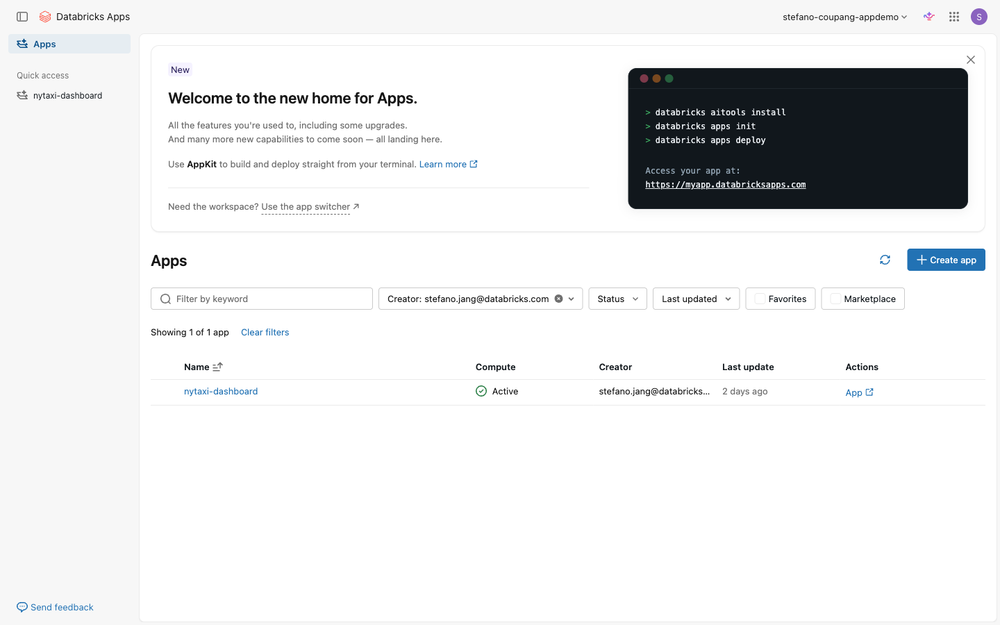
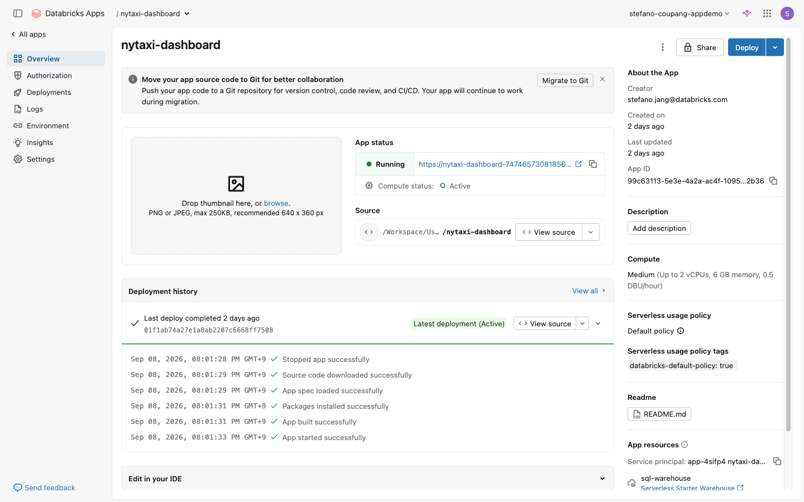

⬅️ [이전: 대시보드 & 퍼블리싱](./10-dashboards.md) | 🏠 [목차](../README.md) | [다음: Streamlit & Genie 데모](./12-streamlit-genie-demo.md) ➡️

---

# 11. Databricks Apps

> **이 실습에서 배우는 것** — Databricks 워크스페이스 안에서 Streamlit·Gradio 같은 데이터 앱을 외부 서버 없이 직접 배포하고 실행하는 방법을 익힙니다.

| 항목 | 내용 |
|---|---|
| 예상 소요 시간 | 약 20분 |
| 난이도 | 입문 |
| 사전 준비 | 워크스페이스 로그인, 10. 대시보드 실습 완료 권장 |
| 필요 권한 | 워크스페이스 사용자(앱 생성 권한은 관리자에게 문의) |

---

## 학습 목표

- Databricks Apps의 개념과 기존 앱 배포 방식과의 차이점 이해
- UI에서 템플릿을 선택해 앱을 생성하고 배포하기
- 앱 실행 상태(Running) 확인 및 앱 URL 접속하기
- 앱에 SQL Warehouse 등 리소스를 연결하는 개념 이해
- 앱 접근 권한 관리 기본 개념 이해

---

## 개념 먼저 이해하기

### Databricks Apps란?

Databricks Apps는 **워크스페이스 내에서 데이터·AI 애플리케이션을 직접 호스팅**할 수 있는 플랫폼 기능입니다. 별도 서버나 클라우드 인프라를 준비하지 않아도 되고, 워크스페이스의 데이터 거버넌스(Unity Catalog)·인증(OAuth)·SQL 실행 환경이 그대로 적용됩니다.

> **서버리스(Serverless) 방식**: 앱이 실행될 때만 컴퓨트 비용이 발생하며, 사용한 시간만큼 과금됩니다.

### 지원 프레임워크

| 언어 | 지원 프레임워크 |
|---|---|
| Python | Streamlit, Dash, Gradio |
| Node.js | React, Angular, Svelte, Express |

### 기존 방식 vs Databricks Apps

| 비교 항목 | 기존 방식 | Databricks Apps |
|---|---|---|
| 인프라 준비 | EC2·VM 등 별도 서버 필요 | 불필요 (서버리스) |
| 인증/보안 | 직접 구현 필요 | OAuth 자동 적용 |
| 데이터 접근 | 별도 연결 설정 필요 | Unity Catalog·SQL Warehouse 직접 연결 |
| 배포 복잡도 | 컨테이너 빌드·배포 파이프라인 필요 | 코드 업로드만으로 배포 |
| 권한 관리 | 별도 구현 | 워크스페이스 권한 재사용 |

### 앱의 구성 요소

앱이 동작하려면 다음 세 파일이 기본입니다.

```
app.py           # 앱 실행 진입점 (예: Streamlit 코드)
app.yaml         # 앱 설정 (리소스 연결, 권한 등)
requirements.txt # Python 패키지 의존성
```

---

## 따라 하기 (Step-by-step)

### 1단계: Apps 화면 열기

1. 워크스페이스([https://fe-sandbox-stefano-coupang-appdemo.cloud.databricks.com](https://fe-sandbox-stefano-coupang-appdemo.cloud.databricks.com))에 로그인합니다.
2. 왼쪽 사이드바에서 **앱(Apps)** 아이콘을 클릭합니다.

   > 💡 사이드바에 Apps 아이콘이 보이지 않으면 사이드바 하단의 더 보기(⋯) 메뉴 또는 **컴퓨트(Compute)** 항목 아래에서 찾아보세요. 워크스페이스 설정에 따라 위치가 다를 수 있습니다.

   
   *📸 캡처 안내: 워크스페이스 왼쪽 사이드바에서 Apps 아이콘을 클릭한 뒤 Apps 목록 화면이 표시된 상태를 캡처합니다. 사이드바에서 어떤 아이콘이 선택되어 있는지 보이도록 캡처하세요.*

### 2단계: 새 앱 만들기 시작

1. Apps 목록 화면 우측 상단 또는 중앙의 **+ Create app** 버튼을 클릭합니다.

   
   *📸 캡처 안내: Apps 목록 화면 전체를 캡처합니다. "Create app" 버튼의 위치가 잘 보이도록 합니다.*

### 3단계: 앱 템플릿 선택

1. 앱 생성 창에 여러 템플릿이 표시됩니다. 아래 목록에서 원하는 프레임워크를 선택하세요.
   - **Streamlit** 계열 템플릿 (Python, 데이터 시각화에 적합)
   - **Gradio Hello World** (간단한 AI 데모용)
   - **React** 계열 (Node.js, 인터랙티브 웹 앱용)
   - 그 외 다양한 커뮤니티 템플릿
2. 이 실습에서는 **Gradio Hello World** (또는 화면에 표시된 Streamlit 템플릿)를 선택합니다.

   > 💡 어떤 템플릿을 선택해도 생성·배포 흐름은 동일합니다. 원하는 프레임워크로 선택하세요.

   
   *📸 캡처 안내: 앱 생성 창에서 템플릿 목록이 표시된 전체 화면을 캡처합니다. 선택한 템플릿이 강조(파란 테두리 등)된 상태로 캡처하면 좋습니다.*

### 4단계: 앱 이름 입력 및 생성

1. **App name** 입력란에 앱 이름을 입력합니다.
   - 규칙: **소문자(a–z), 숫자(0–9), 하이픈(-)만 허용**. 대문자·공백·밑줄 불가.
   - 예시: `my-first-app`, `streamlit-hello`
   - ⚠️ 앱 이름은 **생성 후 변경 불가**입니다. 신중하게 결정하세요.
2. (선택) **Description** 항목에 간단한 설명을 입력합니다.
3. 입력이 완료되면 **Create app** 버튼을 클릭합니다.

   
   *📸 캡처 안내: App name 입력란에 이름이 입력된 상태의 앱 생성 창을 캡처합니다. 이메일 주소 등 개인정보는 가리세요.*

### 5단계: 배포 완료 대기

1. **Create app** 클릭 후 Databricks가 자동으로 앱 컴퓨트를 프로비저닝하고 배포를 시작합니다.
2. 앱 상세 페이지에서 상태가 다음 순서로 변합니다:

   ```
   Deploying... → Starting... → Running
   ```

3. 상태가 **Running**으로 바뀌면 배포가 완료된 것입니다. (보통 1~3분 소요)

   
   *📸 캡처 안내: 앱 상세 페이지에서 "Deploying" 또는 "Starting" 상태가 표시된 화면을 캡처합니다. URL 상단의 앱 이름이 보이도록 합니다.*

   
   *📸 캡처 안내: 앱 상태가 "Running"으로 변경된 화면을 캡처합니다. 앱 URL 링크와 상태 배지가 잘 보이도록 합니다.*

### 6단계: 앱 URL로 접속

1. 앱 상세 페이지 상단에 표시된 **앱 URL**을 클릭합니다.
   - URL 형식 예시: `https://<앱이름>-<워크스페이스ID>.cloud.databricks.com`
2. 새 탭에서 앱이 열립니다. 템플릿의 기본 화면이 표시되면 배포가 성공한 것입니다.

   
   *📸 캡처 안내: 앱 URL을 클릭하여 열린 앱 화면(새 탭)을 캡처합니다. 배포된 Streamlit/Gradio 앱의 기본 UI가 표시된 상태로 캡처하세요.*

---

## 앱 리소스 연결 (개념)

실제 업무용 앱은 데이터베이스나 SQL Warehouse에 연결해야 합니다. Databricks Apps에서는 **app.yaml** 파일에 리소스를 선언하거나, 앱 생성 시 **App resources** 설정에서 연결할 수 있습니다.

### 연결 가능한 리소스 종류

| 리소스 유형 | 설명 |
|---|---|
| SQL Warehouse | Databricks SQL 실행 엔진. 앱에서 SQL 쿼리를 실행할 때 사용 |
| Unity Catalog | 테이블·파일 접근 권한 관리 |
| Databricks Secrets | API 키·패스워드 등 민감 정보를 안전하게 저장 |

> 💡 앱은 자체 **서비스 프린시펄(Service Principal)**로 동작합니다. 이 서비스 프린시펄에게 필요한 Unity Catalog 권한이나 SQL Warehouse 사용 권한을 별도로 부여해야 합니다. 권한 설정은 관리자에게 문의하세요.

### app.yaml 리소스 선언 예시

```yaml
# app.yaml 예시 — SQL Warehouse 리소스 연결
resources:
  - name: my-sql-warehouse
    sql_warehouse:
      id: <SQL_WAREHOUSE_ID>
      permission: CAN_USE
```

---

## 앱 권한 관리 (개념)

앱을 배포하면 **누가 이 앱에 접속할 수 있는지**를 설정해야 합니다. Databricks Apps는 워크스페이스의 OAuth 인증을 그대로 사용합니다.

| 권한 수준 | 할 수 있는 것 |
|---|---|
| Can View | 앱에 접속하여 읽기 전용으로 사용 |
| Can Manage | 앱 설정 변경, 재배포, 삭제 |

- 앱 상세 페이지 → **Permissions** 탭에서 사용자·그룹별 권한을 설정할 수 있습니다.
- (화면에서 실제 탭 명칭 확인)

---

## 자주 겪는 문제 / 팁 💡

- **앱 이름 오류**: 대문자·공백·밑줄이 포함되면 생성이 거부됩니다. `my-app-01`처럼 소문자와 하이픈만 사용하세요.
- **앱 이름 변경 불가**: 이름이 앱 URL의 일부가 됩니다. 생성 전에 신중하게 정하세요. 이름을 바꾸려면 앱을 삭제하고 새로 만들어야 합니다.
- **배포가 오래 걸릴 때**: 서버리스 컴퓨트가 처음 프로비저닝될 때 3~5분이 걸릴 수 있습니다. 페이지를 새로고침하면 상태를 확인할 수 있습니다.
- **앱에 접속이 안 될 때**: 앱 상태가 Running인지 확인하고, 접속 권한(Can View 이상)이 있는지 관리자에게 문의하세요.
- **SQL 쿼리가 실행 안 될 때**: 앱의 서비스 프린시펄에 SQL Warehouse CAN_USE 권한과 Unity Catalog 테이블 접근 권한이 있는지 확인하세요.
- **개발 팁**: 앱 코드를 수정하면 앱 상세 페이지에서 재배포(Redeploy) 버튼을 눌러 반영할 수 있습니다.

---

## 공식 문서 링크 📚

- [Databricks Apps 개요](https://docs.databricks.com/aws/en/dev-tools/databricks-apps/index.html) — Apps 플랫폼 전체 개요 및 하위 문서 목록
- [앱 시작하기 (Get started)](https://docs.databricks.com/aws/en/dev-tools/databricks-apps/get-started.html) — 템플릿으로 첫 앱 만들기 공식 가이드
- [커스텀 앱 만들기](https://docs.databricks.com/aws/en/dev-tools/databricks-apps/create-custom-app.html) — 처음부터 커스텀 앱 생성 및 app.yaml 설정 방법

---

## 다음 단계 ➡️

- [12. Streamlit & Genie 데모 (시청용)](./12-streamlit-genie-demo.md) — Genie 자연어 데이터 질의 기능을 데모 영상으로 확인합니다.
