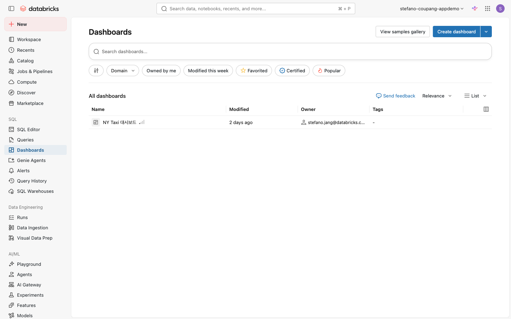
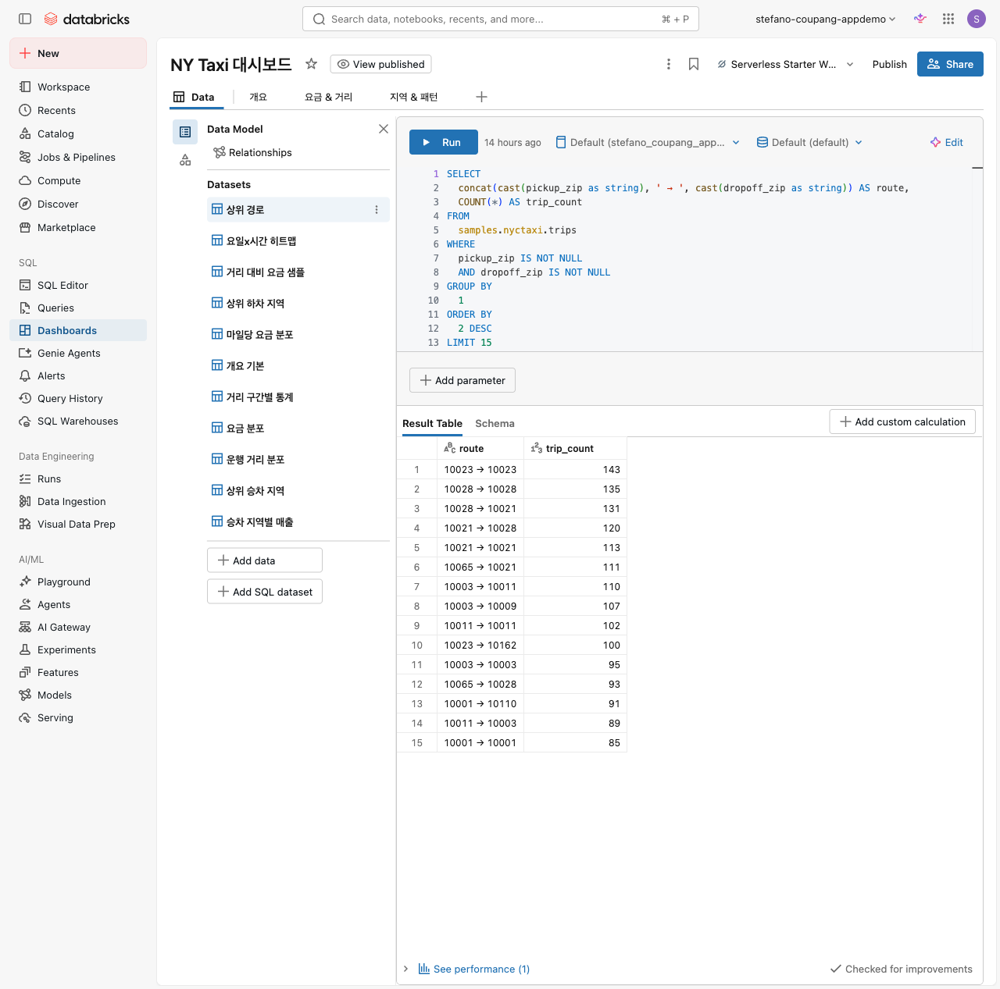
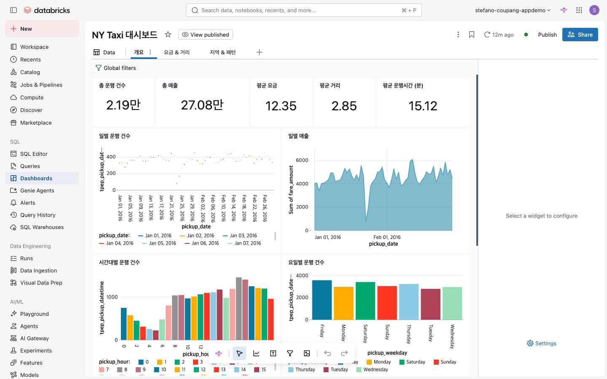
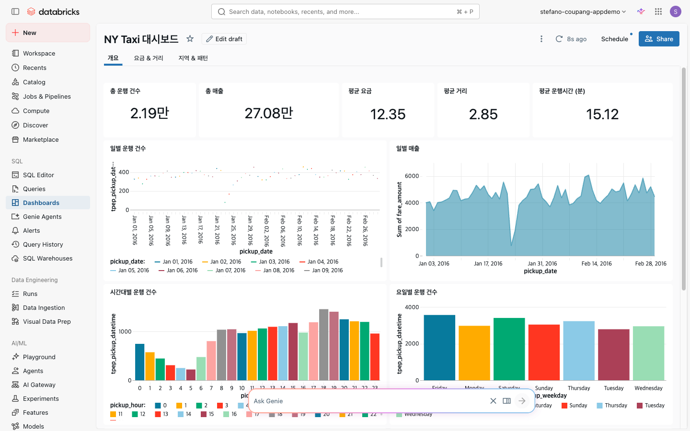

⬅️ [이전: Lakeflow Jobs — 태스크 & 스케줄](./10-jobs.md) | 🏠 [목차](../README.md) | [다음: Databricks Apps](./12-apps.md) ➡️

---

# 11. AI/BI 대시보드 — 시각화 & 퍼블리싱

> **이 실습에서 배우는 것** — Databricks의 최신 대시보드 도구인 AI/BI 대시보드를 사용해 데이터를 시각화하고 게시합니다. SQL 쿼리로 데이터셋을 정의하고, 막대 차트·선 차트·카운터 위젯을 추가한 뒤 필터를 달아 대화형 대시보드를 만듭니다. 완성된 대시보드를 게시하고 동료와 공유하는 방법까지 배웁니다.

| 항목 | 내용 |
|---|---|
| 예상 소요 시간 | 약 35분 |
| 난이도 | 초급 |
| 사전 준비 | 워크스페이스 로그인, SQL 웨어하우스 사용 가능 |
| 필요 권한 | Can Use 이상의 워크스페이스 권한, `samples` 카탈로그 읽기 권한 |

---

## 학습 목표

- Databricks AI/BI 대시보드의 구조(데이터셋, 캔버스, 위젯)를 설명할 수 있다.
- SQL 쿼리로 데이터셋을 정의하고 대시보드에 연결할 수 있다.
- 막대 차트, 선 차트, 카운터(Counter) 위젯을 추가하고 설정할 수 있다.
- 드롭다운·날짜 범위 필터를 추가해 대화형 대시보드를 만들 수 있다.
- 대시보드를 게시(Publish)하고 사용자/그룹과 공유할 수 있다.

---

## 개념 먼저 이해하기

### AI/BI 대시보드란?

**AI/BI 대시보드**는 Databricks의 최신 대시보드 도구입니다. 레거시 SQL 대시보드와 다르며, AI 기반 작성 지원, 풍부한 시각화 라이브러리, 게시 및 권한 관리 기능을 갖추고 있습니다.

> ⚠️ **주의**: Databricks에는 "레거시 SQL 대시보드"도 존재합니다. 이 실습은 최신 **AI/BI 대시보드** 기준입니다. 메뉴에서 "대시보드(Dashboards)" 를 선택하면 AI/BI 대시보드로 이동합니다.

### 대시보드의 3가지 핵심 구성 요소

| 구성 요소 | 설명 |
|---|---|
| **데이터셋(Dataset)** | SQL 쿼리 또는 테이블을 기반으로 정의된 데이터 소스. 여러 위젯이 하나의 데이터셋을 공유할 수 있습니다. |
| **캔버스(Canvas)** | 차트, 텍스트, 필터 등 위젯을 배치하는 작업 공간. 드래그 앤 드롭으로 레이아웃을 구성합니다. |
| **위젯(Widget)** | 캔버스에 배치하는 개별 요소. 차트(막대, 선, 파이 등), 카운터, 텍스트, 필터, 이미지 등 다양한 유형이 있습니다. |

### 대시보드 작업 흐름

```
새 대시보드 생성
       ↓
데이터 탭에서 SQL 쿼리로 데이터셋 정의
       ↓
캔버스 탭으로 전환 → 위젯 추가
       ↓
차트 유형·축·색상 설정
       ↓
필터 위젯 추가 → 차트에 연결
       ↓
게시(Publish) → 공유 링크 전달
```

---

## 따라 하기 (Step-by-step)

이 실습에서는 `samples.nyctaxi.trips` 데이터를 사용해 뉴욕 택시 운행 현황 대시보드를 만듭니다.

---

### 1단계: 새 AI/BI 대시보드 생성

1. 왼쪽 사이드바에서 **대시보드(Dashboards)** 아이콘을 클릭합니다.

   
   *📸 캡처 안내: 왼쪽 사이드바에서 "Dashboards" 아이콘(격자 또는 차트 모양)이 선택된 상태.*

2. 대시보드 목록 페이지가 열립니다. 오른쪽 상단의 **만들기(Create dashboard)** 버튼을 클릭합니다.

   
   *📸 캡처 안내: 대시보드 목록 화면. 오른쪽 상단 "Create dashboard" 버튼을 강조.*

3. 새 대시보드 편집 화면이 열립니다. 화면 상단의 대시보드 이름 필드를 클릭하고 이름을 입력합니다.

   ```
   NYC 택시 운행 현황
   ```

   
   *📸 캡처 안내: 대시보드 편집 화면 상단. 이름 필드에 "NYC 택시 운행 현황"이 입력된 상태.*

---

### 2단계: 데이터셋(SQL 쿼리) 추가

1. 화면 왼쪽 상단에서 **데이터(Data)** 탭을 클릭합니다.

   
   *📸 캡처 안내: "Data" 탭이 선택된 대시보드 편집 화면.*

2. **SQL 데이터셋 추가(Add SQL dataset)** 또는 **데이터 추가(Add data)** 버튼을 클릭합니다.

   
   *📸 캡처 안내: Data 탭의 "Add SQL dataset" 버튼을 강조.*

3. SQL 편집기가 열립니다. 데이터셋 이름을 `pickup_zip_stats` 로 변경한 뒤, 아래 SQL을 입력합니다.

   ```sql
   SELECT
     pickup_zip,
     COUNT(*) AS trip_count,
     ROUND(AVG(fare_amount), 2) AS avg_fare,
     ROUND(AVG(trip_distance), 2) AS avg_distance
   FROM samples.nyctaxi.trips
   GROUP BY pickup_zip
   ORDER BY trip_count DESC
   LIMIT 20
   ```

   
   *📸 캡처 안내: SQL 편집기에 위 쿼리가 입력된 상태. 데이터셋 이름 "pickup_zip_stats"가 표시되도록.*

4. **실행(Run)** 버튼(▷ 아이콘)을 클릭해 쿼리 결과를 확인합니다. 결과 테이블이 아래에 표시되면 정상입니다.

   
   *📸 캡처 안내: SQL 쿼리 실행 후 하단에 결과 테이블(pickup_zip, trip_count, avg_fare, avg_distance 컬럼)이 표시된 상태.*

5. **저장(Save)** 버튼을 클릭해 데이터셋을 저장합니다.

6. 같은 방법으로 두 번째 데이터셋을 추가합니다. **데이터 추가(Add data)** 를 다시 클릭하고 이름을 `daily_trips` 로 설정한 뒤 아래 SQL을 입력합니다.

   ```sql
   SELECT
     DATE(tpep_pickup_datetime) AS pickup_date,
     COUNT(*) AS daily_trip_count,
     ROUND(SUM(fare_amount), 0) AS daily_revenue
   FROM samples.nyctaxi.trips
   WHERE tpep_pickup_datetime IS NOT NULL
   GROUP BY pickup_date
   ORDER BY pickup_date
   ```

   실행하여 결과를 확인한 뒤 저장합니다.

   
   *📸 캡처 안내: "daily_trips" 데이터셋 쿼리 결과가 표시된 상태. 날짜와 건수, 매출 컬럼이 보이도록.*

> 💡 **팁**: 데이터셋은 대시보드의 "재료"입니다. 하나의 데이터셋을 여러 차트에서 동시에 사용할 수 있습니다.

---

### 3단계: 막대 차트 위젯 추가

1. 상단에서 **캔버스(Canvas)** 탭을 클릭합니다.

   
   *📸 캡처 안내: "Canvas" 탭이 선택된 대시보드 편집 화면.*

2. 캔버스 빈 공간 어디서나 클릭하거나, 상단 메뉴의 **추가(+)** 버튼을 클릭해 위젯 추가 메뉴를 엽니다.

3. **시각화(Visualization)** 를 선택합니다.

   
   *📸 캡처 안내: 위젯 추가 팝업 또는 메뉴. "Visualization" 옵션이 강조된 상태.*

4. 위젯 설정 패널이 오른쪽에 열립니다. 다음과 같이 설정합니다.

   | 설정 항목 | 값 |
   |---|---|
   | **데이터셋(Dataset)** | `pickup_zip_stats` |
   | **시각화 유형(Visualization type)** | **막대(Bar)** |
   | **X축(X axis)** | `pickup_zip` |
   | **Y축(Y axis)** | `trip_count` |

   
   *📸 캡처 안내: 오른쪽 위젯 설정 패널. Dataset, Visualization type(Bar), X axis, Y axis 필드가 설정된 상태.*

5. 제목 필드에 `픽업 구역별 운행 건수` 를 입력합니다.

6. 캔버스에 막대 차트가 표시됩니다.

   
   *📸 캡처 안내: 캔버스에 막대 차트가 표시된 상태. 구역별 운행 건수가 막대로 나타나도록.*

---

### 4단계: 선 차트 & 카운터 위젯 추가

#### 선 차트 (일별 운행 건수 추이)

1. 캔버스 빈 공간에서 **추가(+)** → **시각화(Visualization)** 를 다시 선택합니다.

2. 새 위젯 설정 패널에서 다음과 같이 설정합니다.

   | 설정 항목 | 값 |
   |---|---|
   | **데이터셋(Dataset)** | `daily_trips` |
   | **시각화 유형(Visualization type)** | **선(Line)** |
   | **X축(X axis)** | `pickup_date` |
   | **Y축(Y axis)** | `daily_trip_count` |

3. 제목을 `일별 운행 건수 추이` 로 입력합니다.

   
   *📸 캡처 안내: 선 차트 위젯 설정 패널. Line 유형이 선택된 상태.*

   
   *📸 캡처 안내: 캔버스에 선 차트가 추가된 상태. 날짜별 운행 건수 추이가 선으로 표시.*

#### 카운터 (총 운행 건수 요약)

1. 캔버스에 **추가(+)** → **시각화(Visualization)** 를 선택합니다.

2. 데이터셋을 `daily_trips` 로 선택합니다.

3. **시각화 유형** 드롭다운을 클릭하고 목록에서 **카운터(Counter)** 를 선택합니다.

4. **값(Value)** 필드에 `daily_trip_count` 를 선택합니다.

5. **집계(Aggregation)** 를 **합계(Sum)** 으로 설정합니다.

6. 제목을 `총 운행 건수` 로 입력합니다.

   
   *📸 캡처 안내: Counter 유형이 선택된 위젯 설정 패널. Value = daily_trip_count, Aggregation = Sum.*

   
   *📸 캡처 안내: 캔버스에 카운터 위젯이 추가된 상태. 총 건수가 큰 숫자로 표시.*

> 💡 **캔버스 정리 팁**: 위젯 모서리를 드래그해 크기를 조절하고, 위젯을 드래그해 원하는 위치로 이동할 수 있습니다. 카운터와 요약 수치는 대시보드 상단에 배치하는 것이 좋습니다.

---

### 5단계: 필터 추가

필터를 추가하면 대시보드 뷰어가 직접 데이터 범위를 조절할 수 있어 대화형(Interactive) 대시보드가 됩니다.

1. 캔버스 빈 공간에서 **추가(+)** 를 클릭하고 **필터(Filter)** 를 선택합니다.

   
   *📸 캡처 안내: 위젯 추가 메뉴에서 "Filter" 옵션이 강조된 상태.*

2. 필터 위젯이 캔버스에 추가되고 오른쪽에 필터 설정 패널이 열립니다.

3. 다음과 같이 설정합니다.

   | 설정 항목 | 값 |
   |---|---|
   | **필터 유형(Filter type)** | **날짜 범위(Date range picker)** |
   | **제목(Title)** | `날짜 범위 선택` |
   | **데이터셋 및 열** | `daily_trips` 데이터셋의 `pickup_date` 열 |

   
   *📸 캡처 안내: 필터 설정 패널. "Date range picker" 유형이 선택되고 daily_trips.pickup_date에 연결된 상태.*

4. **필터 저장** 후, 선 차트 위젯을 클릭하고 설정 패널에서 **필터(Filters)** 섹션을 찾아 방금 만든 날짜 필터를 연결합니다.

   > 위젯의 필터 연결 위치는 화면에서 직접 확인하세요(화면에서 실제 명칭 확인).

   
   *📸 캡처 안내: 선 차트 위젯 설정 패널에서 날짜 필터가 연결된 상태.*

5. 캔버스에서 날짜 범위 필터를 조작해 보면 연결된 차트가 함께 변경되는 것을 확인할 수 있습니다.

   
   *📸 캡처 안내: 날짜 범위 필터를 선택했을 때 선 차트 데이터가 필터링된 상태.*

---

### 6단계: 게시 (Publish)

대시보드를 초안(Draft) 상태에서 게시(Published) 상태로 전환합니다. 게시된 대시보드만 다른 사용자가 볼 수 있습니다.

1. 화면 오른쪽 상단의 **게시(Publish)** 버튼을 클릭합니다.

   
   *📸 캡처 안내: 대시보드 편집 화면 오른쪽 상단의 "Publish" 버튼을 강조.*

2. 게시 옵션 대화 상자가 열립니다. **데이터 권한(Data credentials)** 설정이 표시됩니다.

   | 옵션 | 설명 |
   |---|---|
   | **뷰어 자격 증명(Viewer credentials)** | 대시보드를 보는 사람의 데이터 접근 권한으로 쿼리 실행. 뷰어가 접근할 수 없는 데이터는 표시 안 됨. |
   | **내장 자격 증명(Embedded credentials)** | 게시자의 자격 증명으로 데이터 접근. 뷰어가 해당 데이터에 직접 접근 권한이 없어도 볼 수 있음. |

   > 💡 **팁**: 실습 환경에서는 **뷰어 자격 증명(Viewer credentials)** 을 선택합니다. 프로덕션에서는 보안 정책에 따라 결정합니다.

   
   *📸 캡처 안내: 게시 옵션 대화 상자. "Viewer credentials" 옵션이 선택된 상태.*

3. **게시(Publish)** 버튼을 클릭합니다.

4. 대시보드가 게시되면 편집 모드에서 뷰어 모드로 전환됩니다. 상단에 "게시됨(Published)" 배지가 표시됩니다.

   
   *📸 캡처 안내: 게시된 대시보드 뷰어 화면. 상단에 "Published" 또는 관련 표시가 보이도록.*

---

### 7단계: 공유 및 권한 설정

1. 화면 오른쪽 상단의 **공유(Share)** 버튼 또는 **...** 메뉴에서 **공유(Share)** 를 선택합니다.

   
   *📸 캡처 안내: 오른쪽 상단 "Share" 버튼이 강조된 게시된 대시보드 화면.*

2. 공유 대화 상자가 열립니다. 사용자 또는 그룹을 검색해 추가하고 권한 수준을 지정합니다.

   | 권한 수준 | 가능한 작업 |
   |---|---|
   | **뷰어(Can view)** | 게시된 대시보드 조회만 가능 |
   | **실행(Can run)** | 필터 조작 및 데이터 새로 고침 가능 |
   | **편집(Can edit)** | 대시보드 내용 수정 가능 |
   | **관리(Can manage)** | 권한 설정 및 삭제 포함 모든 작업 가능 |

   
   *📸 캡처 안내: 공유 대화 상자. 사용자 검색 필드와 권한 드롭다운이 보이도록. 이메일 주소는 마스킹.*

3. 이메일 주소 또는 그룹명을 입력하고 권한 수준을 선택한 뒤 **추가(Add)** 버튼을 클릭합니다.

4. 워크스페이스 전체에 공개하려면 **계정 내 모든 사람(Anyone in my account can view)** 옵션을 활성화할 수도 있습니다.

5. **완료(Done)** 를 클릭해 공유 설정을 저장합니다.

   
   *📸 캡처 안내: 공유 설정이 완료된 대화 상자. 추가된 사용자/그룹 목록과 권한 수준이 표시된 상태.*

> 💡 **공유 링크 복사**: 공유 대화 상자에서 **링크 복사(Copy link)** 버튼을 클릭하면 대시보드 URL을 클립보드에 복사할 수 있습니다. 이 링크를 이메일이나 Slack으로 전달하세요.

---

## 자주 겪는 문제 / 팁 💡

| 증상 | 원인 | 해결 방법 |
|---|---|---|
| 데이터셋 실행 시 "Permission denied" 오류 | `samples` 카탈로그 읽기 권한 없음 | 관리자에게 `samples` 카탈로그 USE 및 SELECT 권한 요청. |
| 차트가 표시되지 않고 "No data" 메시지 | 쿼리 결과가 없거나 필터 범위 문제 | SQL 쿼리를 직접 실행해 데이터 존재 여부 확인. 필터 범위를 넓게 설정. |
| 게시(Publish) 버튼이 비활성화됨 | 편집 권한 부족 또는 미저장 데이터셋 | 데이터셋을 모두 저장했는지 확인. 본인이 대시보드 소유자인지 확인. |
| 공유한 동료가 "No data"를 봄 | "뷰어 자격 증명" 선택 시 뷰어가 데이터 접근 권한 없음 | 뷰어에게 `samples` 카탈로그 접근 권한 부여. 또는 "내장 자격 증명" 사용 검토. |
| 필터가 차트에 적용되지 않음 | 필터와 차트가 연결되지 않음 | 차트 위젯 설정 패널 → Filters 섹션에서 필터 항목을 체크. |
| Counter 위젯에 이상한 값이 표시됨 | 집계 설정 오류 | Counter 설정에서 Aggregation을 "Sum" 또는 "Count"로 정확히 설정. |

---

## 공식 문서 링크 📚

- [AI/BI 대시보드 소개](https://docs.databricks.com/aws/en/dashboards/) — 대시보드 전반 개요 및 기능 목록
- [대시보드 만들기 튜토리얼](https://docs.databricks.com/aws/en/dashboards/tutorials/create-dashboard.html) — 데이터셋·시각화·필터·게시 단계별 가이드
- [대시보드 작성(Author dashboards)](https://docs.databricks.com/aws/en/dashboards/manage/) — 대시보드 생성·편집·페이지 관리
- [데이터셋 생성 및 관리](https://docs.databricks.com/aws/en/dashboards/manage/data-modeling/datasets.html) — SQL 쿼리·테이블 기반 데이터셋 정의 방법
- [대시보드 시각화](https://docs.databricks.com/aws/en/dashboards/manage/visualizations/) — 차트 유형·축·색상·포맷 설정
- [대시보드 필터 사용](https://docs.databricks.com/aws/en/dashboards/manage/filters/) — 전역·페이지·위젯 수준 필터 설정
- [대시보드 게시 및 공유](https://docs.databricks.com/aws/en/dashboards/share/share.html) — 게시 옵션, 권한 수준, 계정 전체 공유
- [대시보드 업데이트 예약 및 구독](https://docs.databricks.com/aws/en/dashboards/share/schedule-subscribe.html) — 자동 새로 고침 및 이메일 구독 설정

---

## 다음 단계 ➡️

- [다음: Databricks Apps](./12-apps.md) — Databricks Apps를 사용해 웹 애플리케이션을 만들고 배포하는 방법을 배웁니다.
