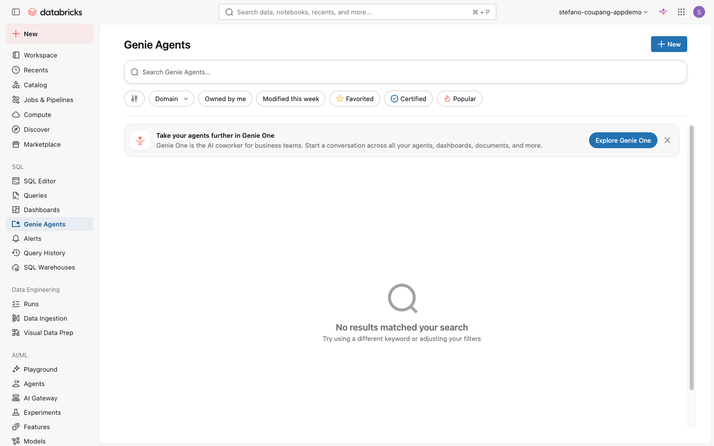
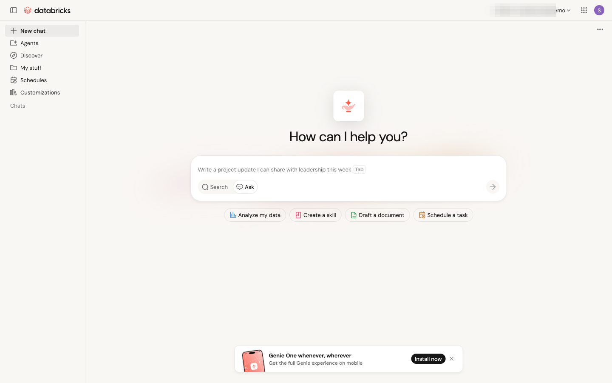

⬅️ [이전: Databricks Apps](./12-apps.md) | 🏠 [목차](../README.md) | [다음: Snowflake vs Databricks Q&A](./14-snowflake-qa.md) ➡️

---

# 13. Streamlit + Genie 데모 (시청용)

> **이 섹션에서 배우는 것** — 직접 따라 하는 실습이 아닌 **데모 영상 시청** 섹션입니다. Databricks Genie가 자연어로 데이터 질문에 답하고 앱·대시보드 제작을 어떻게 돕는지 영상을 통해 확인합니다.

| 항목 | 내용 |
|---|---|
| 예상 소요 시간 | 약 10분 (영상 시청) |
| 난이도 | 입문 |
| 사전 준비 | 없음 — 영상 시청만 합니다 |
| 필요 권한 | 없음 |

---

## 학습 목표

- Databricks Genie의 자연어 데이터 질의 개념 이해
- Genie One, Genie Agents, Genie Code 세 구성 요소의 역할 구분
- Databricks Assistant(Genie Code)와 Genie One의 차이점 이해
- 고객 환경에서 Genie를 어떻게 활용할 수 있는지 데모를 통해 확인

---

## 개념 먼저 이해하기

### Genie란?

Databricks **Genie**는 자연어(한국어·영어 등)로 데이터에 질문하면 SQL을 자동으로 생성하고 결과를 반환하는 AI 기반 데이터 질의 환경입니다. "지난달 매출이 가장 높은 카테고리는?" 같은 질문을 입력하면 Genie가 Unity Catalog에 연결된 데이터를 검색해 답변을 제공합니다.

Genie 생태계는 세 가지 구성 요소로 이루어져 있습니다.

| 구성 요소 | 대상 | 역할 |
|---|---|---|
| **Genie One** | 비즈니스 사용자 | 자연어로 데이터를 검색·질문하고 대시보드를 탐색하는 통합 인터페이스 |
| **Genie Agents** | 데이터 팀 | 도메인별 신뢰 데이터·지표·비즈니스 규칙을 설정해 Genie One의 답변 품질을 높이는 환경 (구 AI/BI Genie Spaces) |
| **Genie Code** | 개발자·기술 사용자 | 워크스페이스 내에서 코드 작성·설명·디버깅을 돕는 AI 코딩 어시스턴트 (구 Databricks Assistant) |

> 💡 세 제품 모두 Unity Catalog로 관리되는 데이터 위에서 동작하므로, 거버넌스 정책이 자동으로 적용됩니다.

아래는 실제 워크스페이스에서 볼 수 있는 Genie 화면입니다.

*Genie Agents: 데이터별 자연어 질의 에이전트 목록*

*Genie One: 워크스페이스 전체 데이터에 자연어로 질문*

### Genie Code(Databricks Assistant)와 Genie One의 차이

초심자가 자주 혼동하는 두 기능을 간단히 비교합니다.

| 비교 항목 | Genie Code (구 Databricks Assistant) | Genie One |
|---|---|---|
| 주 사용자 | 개발자·데이터 엔지니어 | 비즈니스 사용자·분석가 |
| 사용 위치 | 노트북·SQL 편집기 내 AI 어시스턴트 패널 | 독립 데이터 질의 인터페이스 |
| 주요 기능 | 코드 자동완성, 쿼리 설명, 디버그 도움 | 자연어로 데이터 질문 → SQL 생성 → 결과 반환 |
| 데이터 연결 | 열린 노트북·쿼리 컨텍스트 기반 | Genie Agent가 구성한 신뢰 데이터소스 기반 |

> ℹ️ 공식 문서 기준으로 과거의 **AI/BI Genie Spaces** 제품명은 현재 **Genie Agents**로, **Databricks Assistant**는 **Genie Code**로 명칭이 변경되었습니다.

### 이 데모에서 다루는 내용

아래 영상은 Streamlit으로 만든 앱과 Genie를 연결해, 비즈니스 사용자가 자연어 질문만으로 원하는 데이터 답변을 받는 시나리오를 보여줍니다.

> ⚠️ **참고 사항**: 교육 환경(`coupang-appdemo` 워크스페이스)에서는 Genie 기능을 직접 실행하기 위한 별도 설정이 필요합니다. 이 섹션은 **기능의 우수성을 확인하는 데모 시청 목적**으로 제공됩니다. 실제 고객 프로젝트에서 Genie를 도입할 때 참고 자료로 활용하세요.

---

## 데모 영상 시청

아래 썸네일을 클릭하면 YouTube 데모 영상이 재생됩니다.

*📸 캡처 안내: `assets/screenshots/13-streamlit-genie/` 폴더에 위 유튜브 썸네일 이미지 플레이스홀더를 `01-demo-thumbnail.png`로 저장해 두세요. 실제 썸네일은 `https://img.youtube.com/vi/BYxOr2479Kg/maxresdefault.jpg` 에서 다운로드할 수 있습니다.*

---

## 데모에서 확인할 포인트

데모를 시청하면서 다음 항목을 특별히 주목해 보세요.

1. **자연어 질문 입력** — SQL을 직접 쓰지 않고 비즈니스 언어로 질문한다
2. **자동 SQL 생성** — Genie가 내부적으로 SQL을 생성하고 실행하는 과정
3. **결과 표시 방식** — 표, 차트 등 다양한 형태로 결과가 시각화되는 방식
4. **신뢰 데이터소스** — Genie Agent(Genie Spaces)가 데이터 품질과 보안을 보장하는 구조

---

## 자주 겪는 문제 / 팁 💡

- **Genie를 직접 사용하려면**: 워크스페이스 관리자가 Genie Agents를 설정하고 관련 권한을 부여해야 합니다. 개인이 바로 켤 수 있는 기능이 아닙니다.
- **Genie Code(노트북 AI 어시스턴트)는 이미 사용 가능**: 노트북이나 SQL 편집기 우측에 있는 AI 어시스턴트 패널은 별도 설정 없이 바로 사용할 수 있습니다. 이것이 Genie Code(구 Databricks Assistant)입니다.
- **가격**: Genie 관련 기능의 과금 정책(무료 프로모션·사용량 기반 과금 등)은 시점에 따라 바뀝니다. **정확한 최신 요율은 반드시 공식 페이지에서 확인하세요** → [Databricks 가격](https://www.databricks.com/product/pricing) · [Genie 문서](https://docs.databricks.com/aws/en/genie/). (이 교재의 특정 날짜·요율 언급은 참고용이며 실제와 다를 수 있습니다.)
- **'AI/BI Genie'라는 표현**: 이전 버전 문서·블로그에서 자주 등장하던 이름입니다. 현재 공식 명칭은 'Genie' 또는 'Genie Agents'입니다.

---

## 공식 문서 링크 📚

- [Genie 개요](https://docs.databricks.com/aws/en/genie/index.html) — Genie One, Genie Agents, Genie Code 전체 개요 및 하위 문서 목록

---

## 다음 단계 ➡️

- [14. Snowflake vs Databricks Q&A](./14-snowflake-qa.md) — Snowflake를 사용해 본 경험이 있다면 자주 묻는 질문들을 정리한 섹션입니다.
